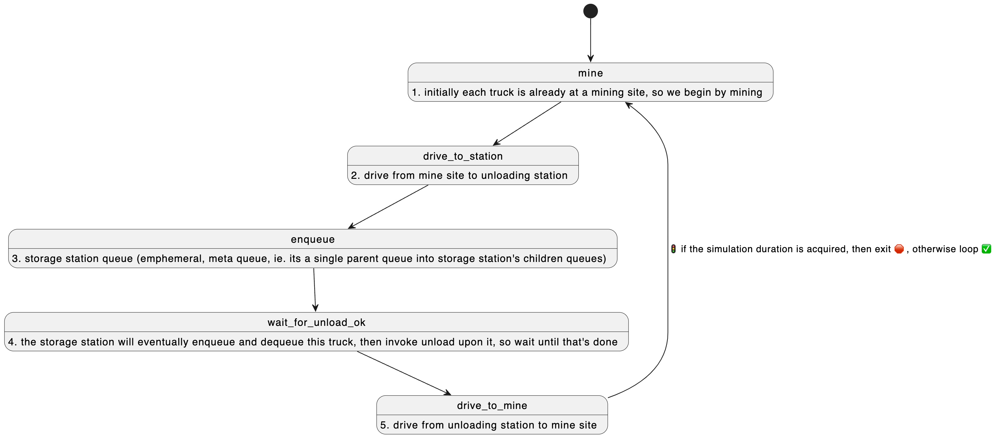
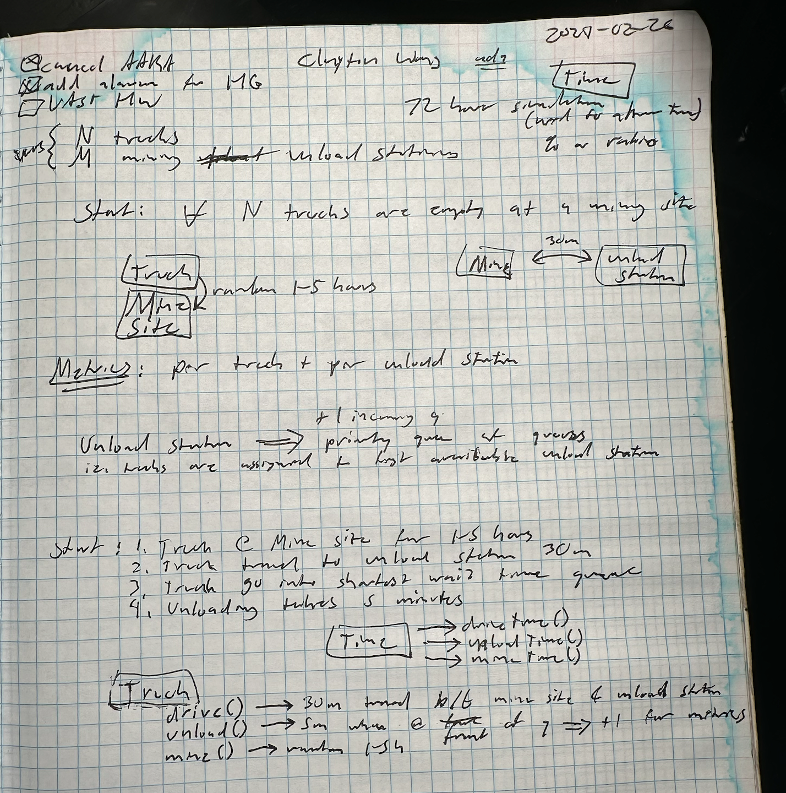
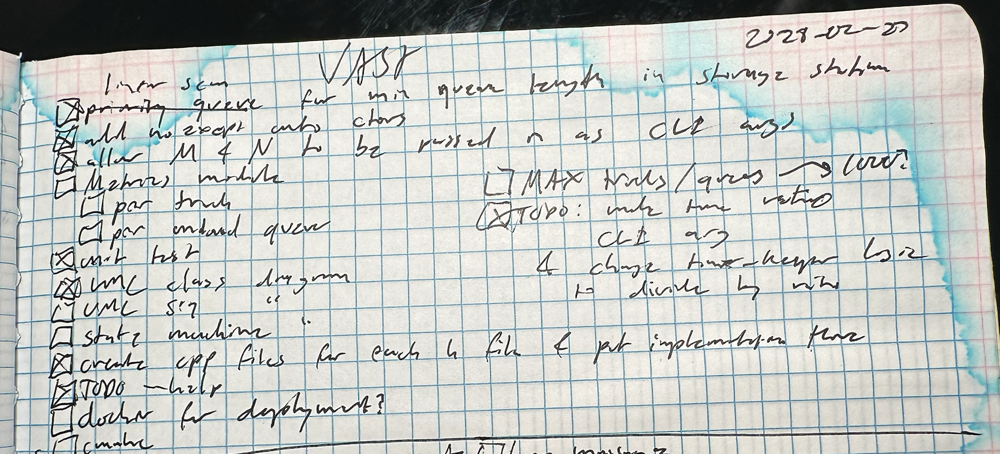
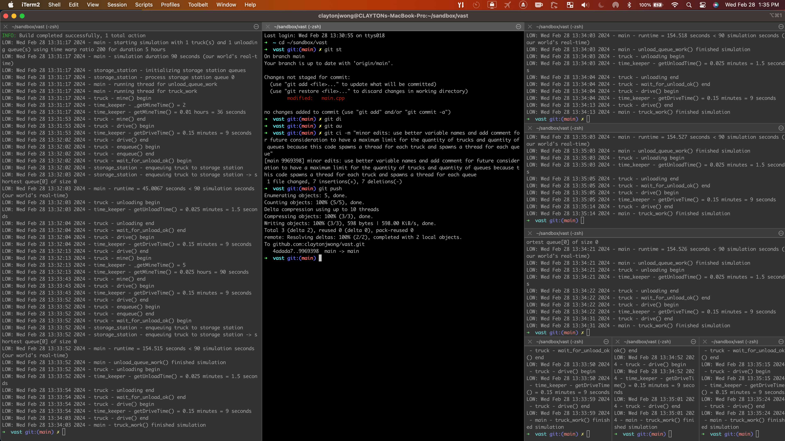
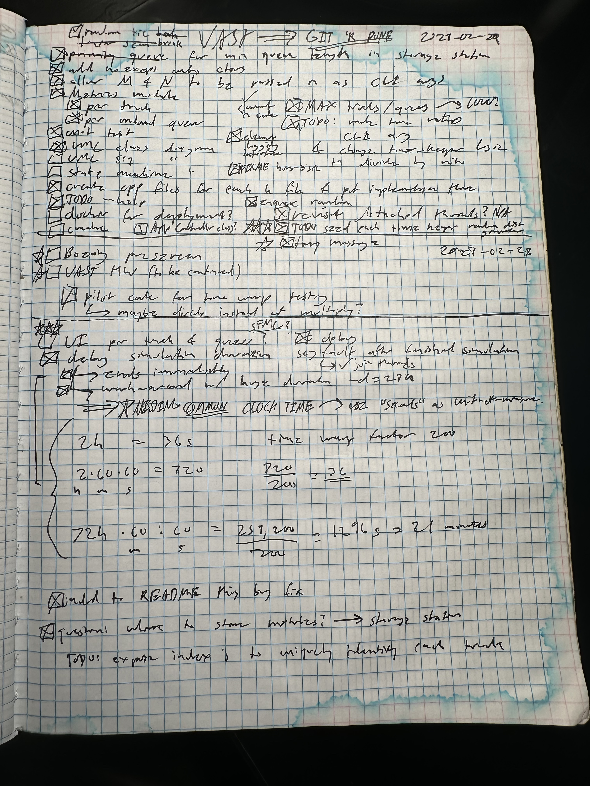

# Bazel Build + Run
```
bazel build :vast && ./bazel-bin/vast -t=1 -q=1 -r=200 -d=5
```

# Bazel Build Requirements

* C++20 toolchain
* https://bazel.build/

# Bazel Help
```
➜  vast git:(main) ✗ ./bazel-bin/vast -h
🛰️  V A S T  H E L I U M - 3  M O O N  M I N E  🌘 ⛏️
Version: 1.0
Usage: vast [options...]
Options:
    -t, --trucks           Quantity of mining trucks (Required)
    -q, --queues           Quantity of unloading queues (Required)
    -r, --ratio            Time warp ratio (example: -r=2 is 2x speed) (Required)
    -d, --duration         Simulation duration in hours (Required)
    -h, --help             Shows this page
    --starwars             May the force be with you
```

## Example: 2-hour simulation time as 1-hour real-world time

The time warp ratio `-r=2` makes the simulation twice as fast as the real-world time.  Thus when the simulation duration is set to 2-hours, ie. `-d=2`, then those 2-hours in the simulation occur over 1-hour in the real-world's time.

```
bazel build :vast && ./bazel-bin/vast -t=1 -q=1 -r=2 -d=2
```


# CMake Build + Run

```
➜  vast git:(main) ✗ cmake . && cmake --build . && ./cmake-bin/vast -t=1 -q=1 -r=200 -d=5
➜  vast git:(main) ✗ cmake . && cmake --build .
-- The C compiler identification is AppleClang 14.0.3.14030022
-- The CXX compiler identification is AppleClang 14.0.3.14030022
-- Detecting C compiler ABI info
-- Detecting C compiler ABI info - done
-- Check for working C compiler: /Applications/Xcode.app/Contents/Developer/Toolchains/XcodeDefault.xctoolchain/usr/bin/cc - skipped
-- Detecting C compile features
-- Detecting C compile features - done
-- Detecting CXX compiler ABI info
-- Detecting CXX compiler ABI info - done
-- Check for working CXX compiler: /Applications/Xcode.app/Contents/Developer/Toolchains/XcodeDefault.xctoolchain/usr/bin/c++ - skipped
-- Detecting CXX compile features
-- Detecting CXX compile features - done
/Applications/Xcode.app/Contents/Developer/Toolchains/XcodeDefault.xctoolchain/usr/bin/cc
/Applications/Xcode.app/Contents/Developer/Toolchains/XcodeDefault.xctoolchain/usr/bin/c++
-- Configuring done
-- Generating done
-- Build files have been written to: /Users/claytonjwong/sandbox/vast
[ 12%] Building CXX object CMakeFiles/time_keeper.dir/time_keeper.cpp.o
[ 25%] Linking CXX static library libtime_keeper.a
[ 25%] Built target time_keeper
[ 37%] Building CXX object CMakeFiles/truck.dir/truck.cpp.o
[ 50%] Linking CXX static library libtruck.a
[ 50%] Built target truck
[ 62%] Building CXX object CMakeFiles/storage_station.dir/storage_station.cpp.o
[ 75%] Linking CXX static library libstorage_station.a
[ 75%] Built target storage_station
[ 87%] Building CXX object CMakeFiles/vast.dir/main.cpp.o
[100%] Linking CXX executable cmake-bin/vast
[100%] Built target vast
```

# CMake Build Requirements

* C++17 toolchain
* https://cmake.org/

# CMake Help
```
➜  vast git:(main) ✗ ./cmake-bin/vast -h
🛰️  V A S T  H E L I U M - 3  M O O N  M I N E  🌘 ⛏️
Version: 1.0
Usage: vast [options...]
Options:
    -t, --trucks           Quantity of mining trucks (Required)
    -q, --queues           Quantity of unloading queues (Required)
    -r, --ratio            Time warp ratio (example: -r=2 is 2x speed) (Required)
    -d, --duration         Simulation duration in hours (Required)
    -h, --help             Shows this page
    --starwars             May the force be with you
```

# Class Diagram


# Truck State Diagram



# Unit Tests
```
bazel test --test_output=all //:all
```

# Cleanup
```
bazel clean --expunge --async
```

# 3rd Party Dependencies

* https://github.com/jamolnng/argparse

# 👍 First Try (Day 1) - Monday 2024-02-26

## Whiteboard


```
➜  vast git:(main) bazel build :vast && ./bazel-bin/vast
INFO: Analyzed target //:main (0 packages loaded, 0 targets configured).
INFO: Found 1 target...
Target //:main up-to-date:
  bazel-bin/main
INFO: Elapsed time: 0.074s, Critical Path: 0.00s
INFO: 1 process: 1 internal.
INFO: Build completed successfully, 1 total action
LOW: Mon Feb 26 18:13:07 2024 - main - starting simulation
LOW: Mon Feb 26 18:13:07 2024 - storage_station - initializing storage station queues
LOW: Mon Feb 26 18:13:07 2024 - main - running thread for unload_queue_work
LOW: Mon Feb 26 18:13:07 2024 - main - joining thread for truck_work
LOW: Mon Feb 26 18:13:07 2024 - main - running thread for truck_work
LOW: Mon Feb 26 18:13:07 2024 - truck - mine() begin
LOW: Mon Feb 26 18:13:07 2024 - time_keeper - _getMineTime() = 2
LOW: Mon Feb 26 22:26:46 2024 - truck - mine() end
LOW: Mon Feb 26 22:26:46 2024 - truck - drive() begin
LOW: Tue Feb 27 00:11:03 2024 - truck - drive() end
LOW: Tue Feb 27 00:11:03 2024 - truck - enqueue() begin
libc++abi: terminating due to uncaught exception of type std::__1::bad_weak_ptr: bad_weak_ptr
[1]    51564 abort      ./bazel-bin/main
```

# 🤘 Second Try (Day 2) - Tuesday 2024-02-27



* Bug fix for `bad_weak_ptr`: in the `truck_work` thread function, the `Truck` was constructed on the stack rather than a `shared_ptr` on the heap, thus the reference count reached `0` when `shared_from_this()` was invoked.
  * https://github.com/claytonjwong/vast/commit/f3f3271240e6bbcc604046f9f2bb968e6a3416ca#diff-608d8de3fba954c50110b6d7386988f27295de845e9d7174e40095ba5efcf1bbR38
* Bug fix for `Truck` state machine getting "stuck" after unloading, which was due to missing notification for the condition variable.
  * https://github.com/claytonjwong/vast/commit/f3f3271240e6bbcc604046f9f2bb968e6a3416ca#diff-d8a3ca271a5803643a10c4f9c007adb5f746c0ea1e004672ec6f3863bc679590R32

```
LOW: Tue Feb 27 09:45:24 2024 - main - starting simulation
LOW: Tue Feb 27 09:45:24 2024 - storage_station - initializing storage station queues
LOW: Tue Feb 27 09:45:24 2024 - main - running thread for unload_queue_work
LOW: Tue Feb 27 09:45:24 2024 - main - running thread for truck_work
LOW: Tue Feb 27 09:45:24 2024 - truck - mine() begin
LOW: Tue Feb 27 09:45:24 2024 - time_keeper - _getMineTime() = 2
LOW: Tue Feb 27 09:45:24 2024 - time_keeper - getMineTime() raw time = 0.01
LOW: Tue Feb 27 09:45:24 2024 - time_keeper - getMineTime() = 0
LOW: Tue Feb 27 09:45:24 2024 - truck - mine() end
LOW: Tue Feb 27 09:45:24 2024 - truck - drive() begin
LOW: Tue Feb 27 09:45:24 2024 - time_keeper - getDriveTime() raw time = 0.15
LOW: Tue Feb 27 09:45:24 2024 - time_keeper - getDriveTime() = 0
LOW: Tue Feb 27 09:45:24 2024 - truck - drive() end
LOW: Tue Feb 27 09:45:24 2024 - truck - enqueue() begin
LOW: Tue Feb 27 09:45:24 2024 - truck - enqueue() end
LOW: Tue Feb 27 09:45:24 2024 - storage_station - enqueuing truck to storage station
LOW: Tue Feb 27 09:45:24 2024 - truck - wait_for_unload_ok() begin
LOW: Tue Feb 27 09:45:24 2024 - truck - unloading begin
LOW: Tue Feb 27 09:45:24 2024 - time_keeper - getUnloadTime() raw time = 0.025
LOW: Tue Feb 27 09:45:24 2024 - time_keeper - getUnloadTime() = 0
LOW: Tue Feb 27 09:45:24 2024 - truck - unloading end
LOW: Tue Feb 27 09:45:24 2024 - truck - wait_for_unload_ok() end
LOW: Tue Feb 27 09:45:24 2024 - truck - drive() begin
LOW: Tue Feb 27 09:45:24 2024 - time_keeper - getDriveTime() raw time = 0.15
LOW: Tue Feb 27 09:45:24 2024 - time_keeper - getDriveTime() = 0
LOW: Tue Feb 27 09:45:24 2024 - truck - drive() end
LOW: Tue Feb 27 09:45:24 2024 - truck - mine() begin
LOW: Tue Feb 27 09:45:24 2024 - time_keeper - _getMineTime() = 5
LOW: Tue Feb 27 09:45:24 2024 - time_keeper - getMineTime() raw time = 0.025
LOW: Tue Feb 27 09:45:24 2024 - time_keeper - getMineTime() = 0
LOW: Tue Feb 27 09:45:24 2024 - truck - mine() end
LOW: Tue Feb 27 09:45:24 2024 - truck - drive() begin
LOW: Tue Feb 27 09:45:24 2024 - time_keeper - getDriveTime() raw time = 0.15
LOW: Tue Feb 27 09:45:24 2024 - time_keeper - getDriveTime() = 0
LOW: Tue Feb 27 09:45:24 2024 - truck - drive() end
LOW: Tue Feb 27 09:45:24 2024 - truck - enqueue() begin
LOW: Tue Feb 27 09:45:24 2024 - truck - enqueue() end
LOW: Tue Feb 27 09:45:24 2024 - storage_station - enqueuing truck to storage station
LOW: Tue Feb 27 09:45:24 2024 - truck - wait_for_unload_ok() begin
LOW: Tue Feb 27 09:45:24 2024 - truck - unloading begin
LOW: Tue Feb 27 09:45:24 2024 - time_keeper - getUnloadTime() raw time = 0.025
LOW: Tue Feb 27 09:45:24 2024 - time_keeper - getUnloadTime() = 0
LOW: Tue Feb 27 09:45:24 2024 - truck - unloading end
LOW: Tue Feb 27 09:45:24 2024 - truck - wait_for_unload_ok() end
LOW: Tue Feb 27 09:45:24 2024 - truck - drive() begin
LOW: Tue Feb 27 09:45:24 2024 - time_keeper - getDriveTime() raw time = 0.15
LOW: Tue Feb 27 09:45:24 2024 - time_keeper - getDriveTime() = 0
LOW: Tue Feb 27 09:45:24 2024 - truck - drive() end
LOW: Tue Feb 27 09:45:24 2024 - truck - mine() begin
LOW: Tue Feb 27 09:45:24 2024 - time_keeper - _getMineTime() = 1
LOW: Tue Feb 27 09:45:24 2024 - time_keeper - getMineTime() raw time = 0.005
LOW: Tue Feb 27 09:45:24 2024 - time_keeper - getMineTime() = 0
LOW: Tue Feb 27 09:45:24 2024 - truck - mine() end
LOW: Tue Feb 27 09:45:24 2024 - truck - drive() begin
LOW: Tue Feb 27 09:45:24 2024 - time_keeper - getDriveTime() raw time = 0.15
LOW: Tue Feb 27 09:45:24 2024 - time_keeper - getDriveTime() = 0
LOW: Tue Feb 27 09:45:24 2024 - truck - drive() end
LOW: Tue Feb 27 09:45:24 2024 - truck - enqueue() begin
LOW: Tue Feb 27 09:45:24 2024 - truck - enqueue() end
LOW: Tue Feb 27 09:45:24 2024 - storage_station - enqueuing truck to storage station
LOW: Tue Feb 27 09:45:24 2024 - truck - wait_for_unload_ok() begin
LOW: Tue Feb 27 09:45:24 2024 - truck - unloading begin
LOW: Tue Feb 27 09:45:24 2024 - time_keeper - getUnloadTime() raw time = 0.025
LOW: Tue Feb 27 09:45:24 2024 - time_keeper - getUnloadTime() = 0
LOW: Tue Feb 27 09:45:24 2024 - truck - unloading end
LOW: Tue Feb 27 09:45:24 2024 - truck - wait_for_unload_ok() end
LOW: Tue Feb 27 09:45:24 2024 - truck - drive() begin
LOW: Tue Feb 27 09:45:24 2024 - time_keeper - getDriveTime() raw time = 0.15
LOW: Tue Feb 27 09:45:24 2024 - time_keeper - getDriveTime() = 0
LOW: Tue Feb 27 09:45:24 2024 - truck - drive() end
LOW: Tue Feb 27 09:45:24 2024 - truck - mine() begin
LOW: Tue Feb 27 09:45:24 2024 - time_keeper - _getMineTime() = 3
LOW: Tue Feb 27 09:45:24 2024 - time_keeper - getMineTime() raw time = 0.015
LOW: Tue Feb 27 09:45:24 2024 - time_keeper - getMineTime() = 0
LOW: Tue Feb 27 09:45:24 2024 - truck - mine() end
LOW: Tue Feb 27 09:45:24 2024 - truck - drive() begin
LOW: Tue Feb 27 09:45:24 2024 - time_keeper - getDriveTime() raw time = 0.15
LOW: Tue Feb 27 09:45:24 2024 - time_keeper - getDriveTime() = 0
LOW: Tue Feb 27 09:45:24 2024 - truck - drive() end
LOW: Tue Feb 27 09:45:24 2024 - truck - enqueue() begin
LOW: Tue Feb 27 09:45:24 2024 - truck - enqueue() end
LOW: Tue Feb 27 09:45:24 2024 - storage_station - enqueuing truck to storage station
LOW: Tue Feb 27 09:45:24 2024 - truck - wait_for_unload_ok() begin
LOW: Tue Feb 27 09:45:24 2024 - truck - unloading begin
LOW: Tue Feb 27 09:45:24 2024 - time_keeper - getUnloadTime() raw time = 0.025
LOW: Tue Feb 27 09:45:24 2024 - time_keeper - getUnloadTime() = 0
LOW: Tue Feb 27 09:45:24 2024 - truck - unloading end
LOW: Tue Feb 27 09:45:24 2024 - truck - wait_for_unload_ok() end
LOW: Tue Feb 27 09:45:24 2024 - truck - drive() begin
LOW: Tue Feb 27 09:45:24 2024 - time_keeper - getDriveTime() raw time = 0.15
LOW: Tue Feb 27 09:45:24 2024 - time_keeper - getDriveTime() = 0
LOW: Tue Feb 27 09:45:24 2024 - truck - drive() end
LOW: Tue Feb 27 09:45:24 2024 - truck - mine() begin
LOW: Tue Feb 27 09:45:24 2024 - time_keeper - _getMineTime() = 1
LOW: Tue Feb 27 09:45:24 2024 - time_keeper - getMineTime() raw time = 0.005
LOW: Tue Feb 27 09:45:24 2024 - time_keeper - getMineTime() = 0
LOW: Tue Feb 27 09:45:24 2024 - truck - mine() end
LOW: Tue Feb 27 09:45:24 2024 - truck - drive() begin
LOW: Tue Feb 27 09:45:24 2024 - time_keeper - getDriveTime() raw time = 0.15
LOW: Tue Feb 27 09:45:24 2024 - time_keeper - getDriveTime() = 0
LOW: Tue Feb 27 09:45:24 2024 - truck - drive() end
LOW: Tue Feb 27 09:45:24 2024 - truck - enqueue() begin
LOW: Tue Feb 27 09:45:24 2024 - truck - enqueue() end
LOW: Tue Feb 27 09:45:24 2024 - storage_station - enqueuing truck to storage station
LOW: Tue Feb 27 09:45:24 2024 - truck - wait_for_unload_ok() begin
LOW: Tue Feb 27 09:45:24 2024 - truck - unloading begin
LOW: Tue Feb 27 09:45:24 2024 - time_keeper - getUnloadTime() raw time = 0.025
LOW: Tue Feb 27 09:45:24 2024 - time_keeper - getUnloadTime() = 0
LOW: Tue Feb 27 09:45:24 2024 - truck - unloading end
LOW: Tue Feb 27 09:45:24 2024 - truck - wait_for_unload_ok() end
LOW: Tue Feb 27 09:45:24 2024 - truck - drive() begin
LOW: Tue Feb 27 09:45:24 2024 - time_keeper - getDriveTime() raw time = 0.15
LOW: Tue Feb 27 09:45:24 2024 - time_keeper - getDriveTime() = 0
LOW: Tue Feb 27 09:45:24 2024 - truck - drive() end
LOW: Tue Feb 27 09:45:24 2024 - truck - mine() begin
LOW: Tue Feb 27 09:45:24 2024 - time_keeper - _getMineTime() = 1
LOW: Tue Feb 27 09:45:24 2024 - time_keeper - getMineTime() raw time = 0.005
LOW: Tue Feb 27 09:45:24 2024 - time_keeper - getMineTime() = 0
LOW: Tue Feb 27 09:45:24 2024 - truck - mine() end
LOW: Tue Feb 27 09:45:24 2024 - truck - drive() begin
LOW: Tue Feb 27 09:45:24 2024 - time_keeper - getDriveTime() raw time = 0.15
LOW: Tue Feb 27 09:45:24 2024 - time_keeper - getDriveTime() = 0
LOW: Tue Feb 27 09:45:24 2024 - truck - drive() end
LOW: Tue Feb 27 09:45:24 2024 - truck - enqueue() begin
LOW: Tue Feb 27 09:45:24 2024 - truck - enqueue() end
LOW: Tue Feb 27 09:45:24 2024 - storage_station - enqueuing truck to storage station
LOW: Tue Feb 27 09:45:24 2024 - truck - wait_for_unload_ok() begin
LOW: Tue Feb 27 09:45:24 2024 - truck - unloading begin
LOW: Tue Feb 27 09:45:24 2024 - time_keeper - getUnloadTime() raw time = 0.025
LOW: Tue Feb 27 09:45:24 2024 - time_keeper - getUnloadTime() = 0
LOW: Tue Feb 27 09:45:24 2024 - truck - unloading end
LOW: Tue Feb 27 09:45:24 2024 - truck - wait_for_unload_ok() end
LOW: Tue Feb 27 09:45:24 2024 - truck - drive() begin
LOW: Tue Feb 27 09:45:24 2024 - time_keeper - getDriveTime() raw time = 0.15
LOW: Tue Feb 27 09:45:24 2024 - time_keeper - getDriveTime() = 0
LOW: Tue Feb 27 09:45:24 2024 - truck - drive() end
LOW: Tue Feb 27 09:45:24 2024 - truck - mine() begin
LOW: Tue Feb 27 09:45:24 2024 - time_keeper - _getMineTime() = 3
LOW: Tue Feb 27 09:45:24 2024 - time_keeper - getMineTime() raw time = 0.015
LOW: Tue Feb 27 09:45:24 2024 - time_keeper - getMineTime() = 0
LOW: Tue Feb 27 09:45:24 2024 - truck - mine() end
LOW: Tue Feb 27 09:45:24 2024 - truck - drive() begin
LOW: Tue Feb 27 09:45:24 2024 - time_keeper - getDriveTime() raw time = 0.15
LOW: Tue Feb 27 09:45:24 2024 - time_keeper - getDriveTime() = 0
LOW: Tue Feb 27 09:45:24 2024 - truck - drive() end
LOW: Tue Feb 27 09:45:24 2024 - truck - enqueue() begin
LOW: Tue Feb 27 09:45:24 2024 - truck - enqueue() end
LOW: Tue Feb 27 09:45:24 2024 - storage_station - enqueuing truck to storage station
LOW: Tue Feb 27 09:45:24 2024 - truck - wait_for_unload_ok() begin
LOW: Tue Feb 27 09:45:24 2024 - truck - unloading begin
LOW: Tue Feb 27 09:45:24 2024 - time_keeper - getUnloadTime() raw time = 0.025
LOW: Tue Feb 27 09:45:24 2024 - time_keeper - getUnloadTime() = 0
LOW: Tue Feb 27 09:45:24 2024 - truck - unloading end
LOW: Tue Feb 27 09:45:24 2024 - truck - wait_for_unload_ok() end
LOW: Tue Feb 27 09:45:24 2024 - truck - drive() begin
LOW: Tue Feb 27 09:45:24 2024 - time_keeper - getDriveTime() raw time = 0.15
LOW: Tue Feb 27 09:45:24 2024 - time_keeper - getDriveTime() = 0
LOW: Tue Feb 27 09:45:24 2024 - truck - drive() end
LOW: Tue Feb 27 09:45:24 2024 - truck - mine() begin
LOW: Tue Feb 27 09:45:24 2024 - time_keeper - _getMineTime() = 3
LOW: Tue Feb 27 09:45:24 2024 - time_keeper - getMineTime() raw time = 0.015
LOW: Tue Feb 27 09:45:24 2024 - time_keeper - getMineTime() = 0
LOW: Tue Feb 27 09:45:24 2024 - truck - mine() end
LOW: Tue Feb 27 09:45:24 2024 - truck - drive() begin
LOW: Tue Feb 27 09:45:24 2024 - time_keeper - getDriveTime() raw time = 0.15
LOW: Tue Feb 27 09:45:24 2024 - time_keeper - getDriveTime() = 0
LOW: Tue Feb 27 09:45:24 2024 - truck - drive() end
LOW: Tue Feb 27 09:45:24 2024 - truck - enqueue() begin
LOW: Tue Feb 27 09:45:24 2024 - truck - enqueue() end
LOW: Tue Feb 27 09:45:24 2024 - storage_station - enqueuing truck to storage station
LOW: Tue Feb 27 09:45:24 2024 - truck - wait_for_unload_ok() begin
LOW: Tue Feb 27 09:45:24 2024 - truck - unloading begin
LOW: Tue Feb 27 09:45:24 2024 - time_keeper - getUnloadTime() raw time = 0.025
LOW: Tue Feb 27 09:45:24 2024 - time_keeper - getUnloadTime() = 0
LOW: Tue Feb 27 09:45:24 2024 - truck - unloading end
LOW: Tue Feb 27 09:45:24 2024 - truck - wait_for_unload_ok() end
LOW: Tue Feb 27 09:45:24 2024 - truck - drive() begin
LOW: Tue Feb 27 09:45:24 2024 - time_keeper - getDriveTime() raw time = 0.15
LOW: Tue Feb 27 09:45:24 2024 - time_keeper - getDriveTime() = 0
LOW: Tue Feb 27 09:45:24 2024 - truck - drive() end
LOW: Tue Feb 27 09:45:24 2024 - truck - mine() begin
LOW: Tue Feb 27 09:45:24 2024 - time_keeper - _getMineTime() = 3
LOW: Tue Feb 27 09:45:24 2024 - time_keeper - getMineTime() raw time = 0.015
LOW: Tue Feb 27 09:45:24 2024 - time_keeper - getMineTime() = 0
LOW: Tue Feb 27 09:45:24 2024 - truck - mine() end
LOW: Tue Feb 27 09:45:24 2024 - truck - drive() begin
LOW: Tue Feb 27 09:45:24 2024 - time_keeper - getDriveTime() raw time = 0.15
LOW: Tue Feb 27 09:45:24 2024 - time_keeper - getDriveTime() = 0
LOW: Tue Feb 27 09:45:24 2024 - truck - drive() end
LOW: Tue Feb 27 09:45:24 2024 - truck - enqueue() begin
LOW: Tue Feb 27 09:45:24 2024 - truck - enqueue() end
LOW: Tue Feb 27 09:45:24 2024 - storage_station - enqueuing truck to storage station
LOW: Tue Feb 27 09:45:24 2024 - truck - wait_for_unload_ok() begin
LOW: Tue Feb 27 09:45:24 2024 - truck - unloading begin
LOW: Tue Feb 27 09:45:24 2024 - time_keeper - getUnloadTime() raw time = 0.025
LOW: Tue Feb 27 09:45:24 2024 - time_keeper - getUnloadTime() = 0
LOW: Tue Feb 27 09:45:24 2024 - truck - unloading end
LOW: Tue Feb 27 09:45:24 2024 - truck - wait_for_unload_ok() end
LOW: Tue Feb 27 09:45:24 2024 - truck - drive() begin
LOW: Tue Feb 27 09:45:24 2024 - time_keeper - getDriveTime() raw time = 0.15
LOW: Tue Feb 27 09:45:24 2024 - time_keeper - getDriveTime() = 0
LOW: Tue Feb 27 09:45:24 2024 - truck - drive() end
LOW: Tue Feb 27 09:45:24 2024 - truck - mine() begin
LOW: Tue Feb 27 09:45:24 2024 - time_keeper - _getMineTime() = 5
LOW: Tue Feb 27 09:45:24 2024 - time_keeper - getMineTime() raw time = 0.025
LOW: Tue Feb 27 09:45:24 2024 - time_keeper - getMineTime() = 0
LOW: Tue Feb 27 09:45:24 2024 - truck - mine() end
LOW: Tue Feb 27 09:45:24 2024 - truck - drive() begin
LOW: Tue Feb 27 09:45:24 2024 - time_keeper - getDriveTime() raw time = 0.15
LOW: Tue Feb 27 09:45:24 2024 - time_keeper - getDriveTime() = 0
LOW: Tue Feb 27 09:45:24 2024 - truck - drive() end
LOW: Tue Feb 27 09:45:24 2024 - truck - enqueue() begin
LOW: Tue Feb 27 09:45:24 2024 - truck - enqueue() end
LOW: Tue Feb 27 09:45:24 2024 - storage_station - enqueuing truck to storage station
LOW: Tue Feb 27 09:45:24 2024 - truck - wait_for_unload_ok() begin
LOW: Tue Feb 27 09:45:24 2024 - truck - unloading begin
LOW: Tue Feb 27 09:45:24 2024 - time_keeper - getUnloadTime() raw time = 0.025
LOW: Tue Feb 27 09:45:24 2024 - time_keeper - getUnloadTime() = 0
LOW: Tue Feb 27 09:45:24 2024 - truck - unloading end
LOW: Tue Feb 27 09:45:24 2024 - truck - wait_for_unload_ok() end
LOW: Tue Feb 27 09:45:24 2024 - truck - drive() begin
LOW: Tue Feb 27 09:45:24 2024 - time_keeper - getDriveTime() raw time = 0.15
LOW: Tue Feb 27 09:45:24 2024 - time_keeper - getDriveTime() = 0
LOW: Tue Feb 27 09:45:24 2024 - truck - drive() end
LOW: Tue Feb 27 09:45:24 2024 - truck - mine() begin
LOW: Tue Feb 27 09:45:24 2024 - time_keeper - _getMineTime() = 1
LOW: Tue Feb 27 09:45:24 2024 - time_keeper - getMineTime() raw time = 0.005
LOW: Tue Feb 27 09:45:24 2024 - time_keeper - getMineTime() = 0
LOW: Tue Feb 27 09:45:24 2024 - truck - mine() end
LOW: Tue Feb 27 09:45:24 2024 - truck - drive() begin
LOW: Tue Feb 27 09:45:24 2024 - time_keeper - getDriveTime() raw time = 0.15
LOW: Tue Feb 27 09:45:24 2024 - time_keeper - getDriveTime() = 0
LOW: Tue Feb 27 09:45:24 2024 - truck - drive() end
LOW: Tue Feb 27 09:45:24 2024 - truck - enqueue() begin
LOW: Tue Feb 27 09:45:24 2024 - truck - enqueue() end
LOW: Tue Feb 27 09:45:24 2024 - storage_station - enqueuing truck to storage station
LOW: Tue Feb 27 09:45:24 2024 - truck - wait_for_unload_ok() begin
LOW: Tue Feb 27 09:45:24 2024 - truck - unloading begin
LOW: Tue Feb 27 09:45:24 2024 - time_keeper - getUnloadTime() raw time = 0.025
LOW: Tue Feb 27 09:45:24 2024 - time_keeper - getUnloadTime() = 0
LOW: Tue Feb 27 09:45:24 2024 - truck - unloading end
LOW: Tue Feb 27 09:45:24 2024 - truck - wait_for_unload_ok() end
LOW: Tue Feb 27 09:45:24 2024 - truck - drive() begin
LOW: Tue Feb 27 09:45:24 2024 - time_keeper - getDriveTime() raw time = 0.15
LOW: Tue Feb 27 09:45:24 2024 - time_keeper - getDriveTime() = 0
LOW: Tue Feb 27 09:45:24 2024 - truck - drive() end
LOW: Tue Feb 27 09:45:24 2024 - truck - mine() begin
LOW: Tue Feb 27 09:45:24 2024 - time_keeper - _getMineTime() = 3
LOW: Tue Feb 27 09:45:24 2024 - time_keeper - getMineTime() raw time = 0.015
LOW: Tue Feb 27 09:45:24 2024 - time_keeper - getMineTime() = 0
LOW: Tue Feb 27 09:45:24 2024 - truck - mine() end
LOW: Tue Feb 27 09:45:24 2024 - truck - drive() begin
LOW: Tue Feb 27 09:45:24 2024 - time_keeper - getDriveTime() raw time = 0.15
LOW: Tue Feb 27 09:45:24 2024 - time_keeper - getDriveTime() = 0
LOW: Tue Feb 27 09:45:24 2024 - truck - drive() end
LOW: Tue Feb 27 09:45:24 2024 - truck - enqueue() begin
LOW: Tue Feb 27 09:45:24 2024 - truck - enqueue() end
LOW: Tue Feb 27 09:45:24 2024 - storage_station - enqueuing truck to storage station
LOW: Tue Feb 27 09:45:24 2024 - truck - wait_for_unload_ok() begin
LOW: Tue Feb 27 09:45:24 2024 - truck - unloading begin
LOW: Tue Feb 27 09:45:24 2024 - time_keeper - getUnloadTime() raw time = 0.025
LOW: Tue Feb 27 09:45:24 2024 - time_keeper - getUnloadTime() = 0
LOW: Tue Feb 27 09:45:24 2024 - truck - unloading end
LOW: Tue Feb 27 09:45:24 2024 - truck - wait_for_unload_ok() end
LOW: Tue Feb 27 09:45:24 2024 - truck - drive() begin
LOW: Tue Feb 27 09:45:24 2024 - time_keeper - getDriveTime() raw time = 0.15
LOW: Tue Feb 27 09:45:24 2024 - time_keeper - getDriveTime() = 0
LOW: Tue Feb 27 09:45:24 2024 - truck - drive() end
LOW: Tue Feb 27 09:45:24 2024 - truck - mine() begin
LOW: Tue Feb 27 09:45:24 2024 - time_keeper - _getMineTime() = 1
LOW: Tue Feb 27 09:45:24 2024 - time_keeper - getMineTime() raw time = 0.005
LOW: Tue Feb 27 09:45:24 2024 - time_keeper - getMineTime() = 0
LOW: Tue Feb 27 09:45:24 2024 - truck - mine() end
LOW: Tue Feb 27 09:45:24 2024 - truck - drive() begin
LOW: Tue Feb 27 09:45:24 2024 - time_keeper - getDriveTime() raw time = 0.15
LOW: Tue Feb 27 09:45:24 2024 - time_keeper - getDriveTime() = 0
LOW: Tue Feb 27 09:45:24 2024 - truck - drive() end
LOW: Tue Feb 27 09:45:24 2024 - truck - enqueue() begin
LOW: Tue Feb 27 09:45:24 2024 - truck - enqueue() end
LOW: Tue Feb 27 09:45:24 2024 - storage_station - enqueuing truck to storage station
LOW: Tue Feb 27 09:45:24 2024 - truck - wait_for_unload_ok() begin
LOW: Tue Feb 27 09:45:24 2024 - truck - unloading begin
LOW: Tue Feb 27 09:45:24 2024 - time_keeper - getUnloadTime() raw time = 0.025
LOW: Tue Feb 27 09:45:24 2024 - time_keeper - getUnloadTime() = 0
LOW: Tue Feb 27 09:45:24 2024 - truck - unloading end
LOW: Tue Feb 27 09:45:24 2024 - truck - wait_for_unload_ok() end
LOW: Tue Feb 27 09:45:24 2024 - truck - drive() begin
LOW: Tue Feb 27 09:45:24 2024 - time_keeper - getDriveTime() raw time = 0.15
LOW: Tue Feb 27 09:45:24 2024 - time_keeper - getDriveTime() = 0
LOW: Tue Feb 27 09:45:24 2024 - truck - drive() end
LOW: Tue Feb 27 09:45:24 2024 - truck - mine() begin
LOW: Tue Feb 27 09:45:24 2024 - time_keeper - _getMineTime() = 2
LOW: Tue Feb 27 09:45:24 2024 - time_keeper - getMineTime() raw time = 0.01
LOW: Tue Feb 27 09:45:24 2024 - time_keeper - getMineTime() = 0
LOW: Tue Feb 27 09:45:24 2024 - truck - mine() end
LOW: Tue Feb 27 09:45:24 2024 - truck - drive() begin
LOW: Tue Feb 27 09:45:24 2024 - time_keeper - getDriveTime() raw time = 0.15
LOW: Tue Feb 27 09:45:24 2024 - time_keeper - getDriveTime() = 0
LOW: Tue Feb 27 09:45:24 2024 - truck - drive() end
LOW: Tue Feb 27 09:45:24 2024 - truck - enqueue() begin
LOW: Tue Feb 27 09:45:24 2024 - truck - enqueue() end
LOW: Tue Feb 27 09:45:24 2024 - storage_station - enqueuing truck to storage station
LOW: Tue Feb 27 09:45:24 2024 - truck - wait_for_unload_ok() begin
LOW: Tue Feb 27 09:45:24 2024 - truck - unloading begin
LOW: Tue Feb 27 09:45:24 2024 - time_keeper - getUnloadTime() raw time = 0.025
LOW: Tue Feb 27 09:45:24 2024 - time_keeper - getUnloadTime() = 0
LOW: Tue Feb 27 09:45:24 2024 - truck - unloading end
LOW: Tue Feb 27 09:45:24 2024 - truck - wait_for_unload_ok() end
LOW: Tue Feb 27 09:45:24 2024 - truck - drive() begin
LOW: Tue Feb 27 09:45:24 2024 - time_keeper - getDriveTime() raw time = 0.15
LOW: Tue Feb 27 09:45:24 2024 - time_keeper - getDriveTime() = 0
LOW: Tue Feb 27 09:45:24 2024 - truck - drive() end
LOW: Tue Feb 27 09:45:24 2024 - truck - mine() begin
LOW: Tue Feb 27 09:45:24 2024 - time_keeper - _getMineTime() = 4
LOW: Tue Feb 27 09:45:24 2024 - time_keeper - getMineTime() raw time = 0.02
LOW: Tue Feb 27 09:45:24 2024 - time_keeper - getMineTime() = 0
LOW: Tue Feb 27 09:45:24 2024 - truck - mine() end
LOW: Tue Feb 27 09:45:24 2024 - truck - drive() begin
LOW: Tue Feb 27 09:45:24 2024 - time_keeper - getDriveTime() raw time = 0.15
LOW: Tue Feb 27 09:45:24 2024 - time_keeper - getDriveTime() = 0
LOW: Tue Feb 27 09:45:24 2024 - truck - drive() end
LOW: Tue Feb 27 09:45:24 2024 - truck - enqueue() begin
LOW: Tue Feb 27 09:45:24 2024 - truck - enqueue() end
LOW: Tue Feb 27 09:45:24 2024 - storage_station - enqueuing truck to storage station
LOW: Tue Feb 27 09:45:24 2024 - truck - wait_for_unload_ok() begin
LOW: Tue Feb 27 09:45:24 2024 - truck - unloading begin
LOW: Tue Feb 27 09:45:24 2024 - time_keeper - getUnloadTime() raw time = 0.025
LOW: Tue Feb 27 09:45:24 2024 - time_keeper - getUnloadTime() = 0
LOW: Tue Feb 27 09:45:24 2024 - truck - unloading end
LOW: Tue Feb 27 09:45:24 2024 - truck - wait_for_unload_ok() end
LOW: Tue Feb 27 09:45:24 2024 - truck - drive() begin
LOW: Tue Feb 27 09:45:24 2024 - time_keeper - getDriveTime() raw time = 0.15
LOW: Tue Feb 27 09:45:24 2024 - time_keeper - getDriveTime() = 0
LOW: Tue Feb 27 09:45:24 2024 - truck - drive() end
LOW: Tue Feb 27 09:45:24 2024 - truck - mine() begin
LOW: Tue Feb 27 09:45:24 2024 - time_keeper - _getMineTime() = 1
LOW: Tue Feb 27 09:45:24 2024 - time_keeper - getMineTime() raw time = 0.005
LOW: Tue Feb 27 09:45:24 2024 - time_keeper - getMineTime() = 0
LOW: Tue Feb 27 09:45:24 2024 - truck - mine() end
LOW: Tue Feb 27 09:45:24 2024 - truck - drive() begin
LOW: Tue Feb 27 09:45:24 2024 - time_keeper - getDriveTime() raw time = 0.15
LOW: Tue Feb 27 09:45:24 2024 - time_keeper - getDriveTime() = 0
LOW: Tue Feb 27 09:45:24 2024 - truck - drive() end
LOW: Tue Feb 27 09:45:24 2024 - truck - enqueue() begin
LOW: Tue Feb 27 09:45:24 2024 - truck - enqueue() end
LOW: Tue Feb 27 09:45:24 2024 - storage_station - enqueuing truck to storage station
LOW: Tue Feb 27 09:45:24 2024 - truck - wait_for_unload_ok() begin
LOW: Tue Feb 27 09:45:24 2024 - truck - unloading begin
LOW: Tue Feb 27 09:45:24 2024 - time_keeper - getUnloadTime() raw time = 0.025
LOW: Tue Feb 27 09:45:24 2024 - time_keeper - getUnloadTime() = 0
LOW: Tue Feb 27 09:45:24 2024 - truck - unloading end
LOW: Tue Feb 27 09:45:24 2024 - truck - wait_for_unload_ok() end
LOW: Tue Feb 27 09:45:24 2024 - truck - drive() begin
LOW: Tue Feb 27 09:45:24 2024 - time_keeper - getDriveTime() raw time = 0.15
LOW: Tue Feb 27 09:45:24 2024 - time_keeper - getDriveTime() = 0
LOW: Tue Feb 27 09:45:24 2024 - truck - drive() end
LOW: Tue Feb 27 09:45:24 2024 - truck - mine() begin
LOW: Tue Feb 27 09:45:24 2024 - time_keeper - _getMineTime() = 4
LOW: Tue Feb 27 09:45:24 2024 - time_keeper - getMineTime() raw time = 0.02
LOW: Tue Feb 27 09:45:24 2024 - time_keeper - getMineTime() = 0
LOW: Tue Feb 27 09:45:24 2024 - truck - mine() end
LOW: Tue Feb 27 09:45:24 2024 - truck - drive() begin
LOW: Tue Feb 27 09:45:24 2024 - time_keeper - getDriveTime() raw time = 0.15
LOW: Tue Feb 27 09:45:24 2024 - time_keeper - getDriveTime() = 0
LOW: Tue Feb 27 09:45:24 2024 - truck - drive() end
LOW: Tue Feb 27 09:45:24 2024 - truck - enqueue() begin
LOW: Tue Feb 27 09:45:24 2024 - truck - enqueue() end
LOW: Tue Feb 27 09:45:24 2024 - storage_station - enqueuing truck to storage station
LOW: Tue Feb 27 09:45:24 2024 - truck - wait_for_unload_ok() begin
LOW: Tue Feb 27 09:45:24 2024 - truck - unloading begin
LOW: Tue Feb 27 09:45:24 2024 - time_keeper - getUnloadTime() raw time = 0.025
LOW: Tue Feb 27 09:45:24 2024 - time_keeper - getUnloadTime() = 0
LOW: Tue Feb 27 09:45:24 2024 - truck - unloading end
LOW: Tue Feb 27 09:45:24 2024 - truck - wait_for_unload_ok() end
LOW: Tue Feb 27 09:45:24 2024 - truck - drive() begin
LOW: Tue Feb 27 09:45:24 2024 - time_keeper - getDriveTime() raw time = 0.15
LOW: Tue Feb 27 09:45:24 2024 - time_keeper - getDriveTime() = 0
LOW: Tue Feb 27 09:45:24 2024 - truck - drive() end
LOW: Tue Feb 27 09:45:24 2024 - truck - mine() begin
LOW: Tue Feb 27 09:45:24 2024 - time_keeper - _getMineTime() = 1
LOW: Tue Feb 27 09:45:24 2024 - time_keeper - getMineTime() raw time = 0.005
LOW: Tue Feb 27 09:45:24 2024 - time_keeper - getMineTime() = 0
LOW: Tue Feb 27 09:45:24 2024 - truck - mine() end
LOW: Tue Feb 27 09:45:24 2024 - truck - drive() begin
LOW: Tue Feb 27 09:45:24 2024 - time_keeper - getDriveTime() raw time = 0.15
LOW: Tue Feb 27 09:45:24 2024 - time_keeper - getDriveTime() = 0
LOW: Tue Feb 27 09:45:24 2024 - truck - drive() end
LOW: Tue Feb 27 09:45:24 2024 - truck - enqueue() begin
LOW: Tue Feb 27 09:45:24 2024 - truck - enqueue() end
LOW: Tue Feb 27 09:45:24 2024 - storage_station - enqueuing truck to storage station
LOW: Tue Feb 27 09:45:24 2024 - truck - wait_for_unload_ok() begin
LOW: Tue Feb 27 09:45:24 2024 - truck - unloading begin
LOW: Tue Feb 27 09:45:24 2024 - time_keeper - getUnloadTime() raw time = 0.025
LOW: Tue Feb 27 09:45:24 2024 - time_keeper - getUnloadTime() = 0
LOW: Tue Feb 27 09:45:24 2024 - truck - unloading end
LOW: Tue Feb 27 09:45:24 2024 - truck - wait_for_unload_ok() end
LOW: Tue Feb 27 09:45:24 2024 - truck - drive() begin
LOW: Tue Feb 27 09:45:24 2024 - time_keeper - getDriveTime() raw time = 0.15
LOW: Tue Feb 27 09:45:24 2024 - time_keeper - getDriveTime() = 0
LOW: Tue Feb 27 09:45:24 2024 - truck - drive() end
LOW: Tue Feb 27 09:45:24 2024 - truck - mine() begin
LOW: Tue Feb 27 09:45:24 2024 - time_keeper - _getMineTime() = 4
LOW: Tue Feb 27 09:45:24 2024 - time_keeper - getMineTime() raw time = 0.02
LOW: Tue Feb 27 09:45:24 2024 - time_keeper - getMineTime() = 0
LOW: Tue Feb 27 09:45:24 2024 - truck - mine() end
LOW: Tue Feb 27 09:45:24 2024 - truck - drive() begin
LOW: Tue Feb 27 09:45:24 2024 - time_keeper - getDriveTime() raw time = 0.15
LOW: Tue Feb 27 09:45:24 2024 - time_keeper - getDriveTime() = 0
LOW: Tue Feb 27 09:45:24 2024 - truck - drive() end
LOW: Tue Feb 27 09:45:24 2024 - truck - enqueue() begin
LOW: Tue Feb 27 09:45:24 2024 - truck - enqueue() end
LOW: Tue Feb 27 09:45:24 2024 - storage_station - enqueuing truck to storage station
LOW: Tue Feb 27 09:45:24 2024 - truck - wait_for_unload_ok() begin
LOW: Tue Feb 27 09:45:24 2024 - truck - unloading begin
LOW: Tue Feb 27 09:45:24 2024 - time_keeper - getUnloadTime() raw time = 0.025
LOW: Tue Feb 27 09:45:24 2024 - time_keeper - getUnloadTime() = 0
LOW: Tue Feb 27 09:45:24 2024 - truck - unloading end
LOW: Tue Feb 27 09:45:24 2024 - truck - wait_for_unload_ok() end
LOW: Tue Feb 27 09:45:24 2024 - truck - drive() begin
LOW: Tue Feb 27 09:45:24 2024 - time_keeper - getDriveTime() raw time = 0.15
LOW: Tue Feb 27 09:45:24 2024 - time_keeper - getDriveTime() = 0
LOW: Tue Feb 27 09:45:24 2024 - truck - drive() end
LOW: Tue Feb 27 09:45:24 2024 - truck - mine() begin
LOW: Tue Feb 27 09:45:24 2024 - time_keeper - _getMineTime() = 2
LOW: Tue Feb 27 09:45:24 2024 - time_keeper - getMineTime() raw time = 0.01
LOW: Tue Feb 27 09:45:24 2024 - time_keeper - getMineTime() = 0
LOW: Tue Feb 27 09:45:24 2024 - truck - mine() end
LOW: Tue Feb 27 09:45:24 2024 - truck - drive() begin
LOW: Tue Feb 27 09:45:24 2024 - time_keeper - getDriveTime() raw time = 0.15
LOW: Tue Feb 27 09:45:24 2024 - time_keeper - getDriveTime() = 0
LOW: Tue Feb 27 09:45:24 2024 - truck - drive() end
LOW: Tue Feb 27 09:45:24 2024 - truck - enqueue() begin
LOW: Tue Feb 27 09:45:24 2024 - truck - enqueue() end
LOW: Tue Feb 27 09:45:24 2024 - storage_station - enqueuing truck to storage station
LOW: Tue Feb 27 09:45:24 2024 - truck - wait_for_unload_ok() begin
LOW: Tue Feb 27 09:45:24 2024 - truck - unloading begin
LOW: Tue Feb 27 09:45:24 2024 - time_keeper - getUnloadTime() raw time = 0.025
LOW: Tue Feb 27 09:45:24 2024 - time_keeper - getUnloadTime() = 0
LOW: Tue Feb 27 09:45:24 2024 - truck - unloading end
LOW: Tue Feb 27 09:45:24 2024 - truck - wait_for_unload_ok() end
LOW: Tue Feb 27 09:45:24 2024 - truck - drive() begin
LOW: Tue Feb 27 09:45:24 2024 - time_keeper - getDriveTime() raw time = 0.15
LOW: Tue Feb 27 09:45:24 2024 - time_keeper - getDriveTime() = 0
LOW: Tue Feb 27 09:45:24 2024 - truck - drive() end
LOW: Tue Feb 27 09:45:24 2024 - truck - mine() begin
LOW: Tue Feb 27 09:45:24 2024 - time_keeper - _getMineTime() = 4
LOW: Tue Feb 27 09:45:24 2024 - time_keeper - getMineTime() raw time = 0.02
LOW: Tue Feb 27 09:45:24 2024 - time_keeper - getMineTime() = 0
LOW: Tue Feb 27 09:45:24 2024 - truck - mine() end
LOW: Tue Feb 27 09:45:24 2024 - truck - drive() begin
LOW: Tue Feb 27 09:45:24 2024 - time_keeper - getDriveTime() raw time = 0.15
LOW: Tue Feb 27 09:45:24 2024 - time_keeper - getDriveTime() = 0
LOW: Tue Feb 27 09:45:24 2024 - truck - drive() end
LOW: Tue Feb 27 09:45:24 2024 - truck - enqueue() begin
LOW: Tue Feb 27 09:45:24 2024 - truck - enqueue() end
LOW: Tue Feb 27 09:45:24 2024 - storage_station - enqueuing truck to storage station
LOW: Tue Feb 27 09:45:24 2024 - truck - wait_for_unload_ok() begin
LOW: Tue Feb 27 09:45:24 2024 - truck - unloading begin
LOW: Tue Feb 27 09:45:24 2024 - time_keeper - getUnloadTime() raw time = 0.025
LOW: Tue Feb 27 09:45:24 2024 - time_keeper - getUnloadTime() = 0
LOW: Tue Feb 27 09:45:24 2024 - truck - unloading end
LOW: Tue Feb 27 09:45:24 2024 - truck - wait_for_unload_ok() end
LOW: Tue Feb 27 09:45:24 2024 - truck - drive() begin
LOW: Tue Feb 27 09:45:24 2024 - time_keeper - getDriveTime() raw time = 0.15
LOW: Tue Feb 27 09:45:24 2024 - time_keeper - getDriveTime() = 0
LOW: Tue Feb 27 09:45:24 2024 - truck - drive() end
LOW: Tue Feb 27 09:45:24 2024 - truck - mine() begin
LOW: Tue Feb 27 09:45:24 2024 - time_keeper - _getMineTime() = 3
LOW: Tue Feb 27 09:45:24 2024 - time_keeper - getMineTime() raw time = 0.015
LOW: Tue Feb 27 09:45:24 2024 - time_keeper - getMineTime() = 0
LOW: Tue Feb 27 09:45:24 2024 - truck - mine() end
LOW: Tue Feb 27 09:45:24 2024 - truck - drive() begin
LOW: Tue Feb 27 09:45:24 2024 - time_keeper - getDriveTime() raw time = 0.15
LOW: Tue Feb 27 09:45:24 2024 - time_keeper - getDriveTime() = 0
LOW: Tue Feb 27 09:45:24 2024 - truck - drive() end
LOW: Tue Feb 27 09:45:24 2024 - truck - enqueue() begin
LOW: Tue Feb 27 09:45:24 2024 - truck - enqueue() end
LOW: Tue Feb 27 09:45:24 2024 - storage_station - enqueuing truck to storage station
LOW: Tue Feb 27 09:45:24 2024 - truck - wait_for_unload_ok() begin
LOW: Tue Feb 27 09:45:24 2024 - truck - unloading begin
LOW: Tue Feb 27 09:45:24 2024 - time_keeper - getUnloadTime() raw time = 0.025
LOW: Tue Feb 27 09:45:24 2024 - time_keeper - getUnloadTime() = 0
LOW: Tue Feb 27 09:45:24 2024 - truck - unloading end
LOW: Tue Feb 27 09:45:24 2024 - truck - wait_for_unload_ok() end
LOW: Tue Feb 27 09:45:24 2024 - truck - drive() begin
LOW: Tue Feb 27 09:45:24 2024 - time_keeper - getDriveTime() raw time = 0.15
LOW: Tue Feb 27 09:45:24 2024 - time_keeper - getDriveTime() = 0
LOW: Tue Feb 27 09:45:24 2024 - truck - drive() end
LOW: Tue Feb 27 09:45:24 2024 - truck - mine() begin
LOW: Tue Feb 27 09:45:24 2024 - time_keeper - _getMineTime() = 3
LOW: Tue Feb 27 09:45:24 2024 - time_keeper - getMineTime() raw time = 0.015
LOW: Tue Feb 27 09:45:24 2024 - time_keeper - getMineTime() = 0
LOW: Tue Feb 27 09:45:24 2024 - truck - mine() end
LOW: Tue Feb 27 09:45:24 2024 - truck - drive() begin
LOW: Tue Feb 27 09:45:24 2024 - time_keeper - getDriveTime() raw time = 0.15
LOW: Tue Feb 27 09:45:24 2024 - time_keeper - getDriveTime() = 0
LOW: Tue Feb 27 09:45:24 2024 - truck - drive() end
LOW: Tue Feb 27 09:45:24 2024 - truck - enqueue() begin
LOW: Tue Feb 27 09:45:24 2024 - truck - enqueue() end
LOW: Tue Feb 27 09:45:24 2024 - truck - wait_for_unload_ok() begin
LOW: Tue Feb 27 09:45:24 2024 - storage_station - enqueuing truck to storage station
LOW: Tue Feb 27 09:45:24 2024 - truck - unloading begin
LOW: Tue Feb 27 09:45:24 2024 - time_keeper - getUnloadTime() raw time = 0.025
LOW: Tue Feb 27 09:45:24 2024 - time_keeper - getUnloadTime() = 0
LOW: Tue Feb 27 09:45:24 2024 - truck - unloading end
LOW: Tue Feb 27 09:45:24 2024 - truck - wait_for_unload_ok() end
LOW: Tue Feb 27 09:45:24 2024 - truck - drive() begin
LOW: Tue Feb 27 09:45:24 2024 - time_keeper - getDriveTime() raw time = 0.15
LOW: Tue Feb 27 09:45:24 2024 - time_keeper - getDriveTime() = 0
LOW: Tue Feb 27 09:45:24 2024 - truck - drive() end
LOW: Tue Feb 27 09:45:24 2024 - truck - mine() begin
LOW: Tue Feb 27 09:45:24 2024 - time_keeper - _getMineTime() = 5
LOW: Tue Feb 27 09:45:24 2024 - time_keeper - getMineTime() raw time = 0.025
LOW: Tue Feb 27 09:45:24 2024 - time_keeper - getMineTime() = 0
LOW: Tue Feb 27 09:45:24 2024 - truck - mine() end
LOW: Tue Feb 27 09:45:24 2024 - truck - drive() begin
LOW: Tue Feb 27 09:45:24 2024 - time_keeper - getDriveTime() raw time = 0.15
LOW: Tue Feb 27 09:45:24 2024 - time_keeper - getDriveTime() = 0
LOW: Tue Feb 27 09:45:24 2024 - truck - drive() end
LOW: Tue Feb 27 09:45:24 2024 - truck - enqueue() begin
LOW: Tue Feb 27 09:45:24 2024 - truck - enqueue() end
LOW: Tue Feb 27 09:45:24 2024 - storage_station - enqueuing truck to storage station
LOW: Tue Feb 27 09:45:24 2024 - truck - wait_for_unload_ok() begin
LOW: Tue Feb 27 09:45:24 2024 - truck - unloading begin
LOW: Tue Feb 27 09:45:24 2024 - time_keeper - getUnloadTime() raw time = 0.025
LOW: Tue Feb 27 09:45:24 2024 - time_keeper - getUnloadTime() = 0
LOW: Tue Feb 27 09:45:24 2024 - truck - unloading end
LOW: Tue Feb 27 09:45:24 2024 - truck - wait_for_unload_ok() end
LOW: Tue Feb 27 09:45:24 2024 - truck - drive() begin
LOW: Tue Feb 27 09:45:24 2024 - time_keeper - getDriveTime() raw time = 0.15
LOW: Tue Feb 27 09:45:24 2024 - time_keeper - getDriveTime() = 0
LOW: Tue Feb 27 09:45:24 2024 - truck - drive() end
LOW: Tue Feb 27 09:45:24 2024 - truck - mine() begin
LOW: Tue Feb 27 09:45:24 2024 - time_keeper - _getMineTime() = 4
LOW: Tue Feb 27 09:45:24 2024 - time_keeper - getMineTime() raw time = 0.02
LOW: Tue Feb 27 09:45:24 2024 - time_keeper - getMineTime() = 0
LOW: Tue Feb 27 09:45:24 2024 - truck - mine() end
LOW: Tue Feb 27 09:45:24 2024 - truck - drive() begin
LOW: Tue Feb 27 09:45:24 2024 - time_keeper - getDriveTime() raw time = 0.15
LOW: Tue Feb 27 09:45:24 2024 - time_keeper - getDriveTime() = 0
LOW: Tue Feb 27 09:45:24 2024 - truck - drive() end
LOW: Tue Feb 27 09:45:24 2024 - truck - enqueue() begin
LOW: Tue Feb 27 09:45:24 2024 - truck - enqueue() end
LOW: Tue Feb 27 09:45:24 2024 - storage_station - enqueuing truck to storage station
LOW: Tue Feb 27 09:45:24 2024 - truck - wait_for_unload_ok() begin
LOW: Tue Feb 27 09:45:24 2024 - truck - unloading begin
LOW: Tue Feb 27 09:45:24 2024 - time_keeper - getUnloadTime() raw time = 0.025
LOW: Tue Feb 27 09:45:24 2024 - time_keeper - getUnloadTime() = 0
LOW: Tue Feb 27 09:45:24 2024 - truck - unloading end
LOW: Tue Feb 27 09:45:24 2024 - truck - wait_for_unload_ok() end
LOW: Tue Feb 27 09:45:24 2024 - truck - drive() begin
LOW: Tue Feb 27 09:45:24 2024 - time_keeper - getDriveTime() raw time = 0.15
LOW: Tue Feb 27 09:45:24 2024 - time_keeper - getDriveTime() = 0
LOW: Tue Feb 27 09:45:24 2024 - truck - drive() end
LOW: Tue Feb 27 09:45:24 2024 - truck - mine() begin
LOW: Tue Feb 27 09:45:24 2024 - time_keeper - _getMineTime() = 3
LOW: Tue Feb 27 09:45:24 2024 - time_keeper - getMineTime() raw time = 0.015
LOW: Tue Feb 27 09:45:24 2024 - time_keeper - getMineTime() = 0
LOW: Tue Feb 27 09:45:24 2024 - truck - mine() end
LOW: Tue Feb 27 09:45:24 2024 - truck - drive() begin
LOW: Tue Feb 27 09:45:24 2024 - time_keeper - getDriveTime() raw time = 0.15
LOW: Tue Feb 27 09:45:24 2024 - time_keeper - getDriveTime() = 0
LOW: Tue Feb 27 09:45:24 2024 - truck - drive() end
LOW: Tue Feb 27 09:45:24 2024 - truck - enqueue() begin
LOW: Tue Feb 27 09:45:24 2024 - truck - enqueue() end
LOW: Tue Feb 27 09:45:24 2024 - truck - wait_for_unload_ok() begin
LOW: Tue Feb 27 09:45:24 2024 - storage_station - enqueuing truck to storage station
LOW: Tue Feb 27 09:45:24 2024 - truck - unloading begin
LOW: Tue Feb 27 09:45:24 2024 - time_keeper - getUnloadTime() raw time = 0.025
LOW: Tue Feb 27 09:45:24 2024 - time_keeper - getUnloadTime() = 0
LOW: Tue Feb 27 09:45:24 2024 - truck - unloading end
LOW: Tue Feb 27 09:45:24 2024 - truck - wait_for_unload_ok() end
LOW: Tue Feb 27 09:45:24 2024 - truck - drive() begin
LOW: Tue Feb 27 09:45:24 2024 - time_keeper - getDriveTime() raw time = 0.15
LOW: Tue Feb 27 09:45:24 2024 - time_keeper - getDriveTime() = 0
LOW: Tue Feb 27 09:45:24 2024 - truck - drive() end
LOW: Tue Feb 27 09:45:24 2024 - truck - mine() begin
LOW: Tue Feb 27 09:45:24 2024 - time_keeper - _getMineTime() = 4
LOW: Tue Feb 27 09:45:24 2024 - time_keeper - getMineTime() raw time = 0.02
LOW: Tue Feb 27 09:45:24 2024 - time_keeper - getMineTime() = 0
LOW: Tue Feb 27 09:45:24 2024 - truck - mine() end
LOW: Tue Feb 27 09:45:24 2024 - truck - drive() begin
LOW: Tue Feb 27 09:45:24 2024 - time_keeper - getDriveTime() raw time = 0.15
LOW: Tue Feb 27 09:45:24 2024 - time_keeper - getDriveTime() = 0
LOW: Tue Feb 27 09:45:24 2024 - truck - drive() end
LOW: Tue Feb 27 09:45:24 2024 - truck - enqueue() begin
LOW: Tue Feb 27 09:45:24 2024 - truck - enqueue() end
LOW: Tue Feb 27 09:45:24 2024 - storage_station - enqueuing truck to storage station
LOW: Tue Feb 27 09:45:24 2024 - truck - wait_for_unload_ok() begin
LOW: Tue Feb 27 09:45:24 2024 - truck - unloading begin
LOW: Tue Feb 27 09:45:24 2024 - time_keeper - getUnloadTime() raw time = 0.025
LOW: Tue Feb 27 09:45:24 2024 - time_keeper - getUnloadTime() = 0
LOW: Tue Feb 27 09:45:24 2024 - truck - unloading end
LOW: Tue Feb 27 09:45:24 2024 - truck - wait_for_unload_ok() end
LOW: Tue Feb 27 09:45:24 2024 - truck - drive() begin
LOW: Tue Feb 27 09:45:24 2024 - time_keeper - getDriveTime() raw time = 0.15
LOW: Tue Feb 27 09:45:24 2024 - time_keeper - getDriveTime() = 0
LOW: Tue Feb 27 09:45:24 2024 - truck - drive() end
LOW: Tue Feb 27 09:45:24 2024 - truck - mine() begin
LOW: Tue Feb 27 09:45:24 2024 - time_keeper - _getMineTime() = 5
LOW: Tue Feb 27 09:45:24 2024 - time_keeper - getMineTime() raw time = 0.025
LOW: Tue Feb 27 09:45:24 2024 - time_keeper - getMineTime() = 0
LOW: Tue Feb 27 09:45:24 2024 - truck - mine() end
LOW: Tue Feb 27 09:45:24 2024 - truck - drive() begin
LOW: Tue Feb 27 09:45:24 2024 - time_keeper - getDriveTime() raw time = 0.15
LOW: Tue Feb 27 09:45:24 2024 - time_keeper - getDriveTime() = 0
LOW: Tue Feb 27 09:45:24 2024 - truck - drive() end
LOW: Tue Feb 27 09:45:24 2024 - truck - enqueue() begin
LOW: Tue Feb 27 09:45:24 2024 - truck - enqueue() end
LOW: Tue Feb 27 09:45:24 2024 - storage_station - enqueuing truck to storage station
LOW: Tue Feb 27 09:45:24 2024 - truck - wait_for_unload_ok() begin
LOW: Tue Feb 27 09:45:24 2024 - truck - unloading begin
LOW: Tue Feb 27 09:45:24 2024 - time_keeper - getUnloadTime() raw time = 0.025
LOW: Tue Feb 27 09:45:24 2024 - time_keeper - getUnloadTime() = 0
LOW: Tue Feb 27 09:45:24 2024 - truck - unloading end
LOW: Tue Feb 27 09:45:24 2024 - truck - wait_for_unload_ok() end
LOW: Tue Feb 27 09:45:24 2024 - truck - drive() begin
LOW: Tue Feb 27 09:45:24 2024 - time_keeper - getDriveTime() raw time = 0.15
LOW: Tue Feb 27 09:45:24 2024 - time_keeper - getDriveTime() = 0
LOW: Tue Feb 27 09:45:24 2024 - truck - drive() end
LOW: Tue Feb 27 09:45:24 2024 - truck - mine() begin
LOW: Tue Feb 27 09:45:24 2024 - time_keeper - _getMineTime() = 3
LOW: Tue Feb 27 09:45:24 2024 - time_keeper - getMineTime() raw time = 0.015
LOW: Tue Feb 27 09:45:24 2024 - time_keeper - getMineTime() = 0
LOW: Tue Feb 27 09:45:24 2024 - truck - mine() end
LOW: Tue Feb 27 09:45:24 2024 - truck - drive() begin
LOW: Tue Feb 27 09:45:24 2024 - time_keeper - getDriveTime() raw time = 0.15
LOW: Tue Feb 27 09:45:24 2024 - time_keeper - getDriveTime() = 0
LOW: Tue Feb 27 09:45:24 2024 - truck - drive() end
LOW: Tue Feb 27 09:45:24 2024 - truck - enqueue() begin
LOW: Tue Feb 27 09:45:24 2024 - truck - enqueue() end
LOW: Tue Feb 27 09:45:24 2024 - storage_station - enqueuing truck to storage station
LOW: Tue Feb 27 09:45:24 2024 - truck - wait_for_unload_ok() begin
LOW: Tue Feb 27 09:45:24 2024 - truck - unloading begin
LOW: Tue Feb 27 09:45:24 2024 - time_keeper - getUnloadTime() raw time = 0.025
LOW: Tue Feb 27 09:45:24 2024 - time_keeper - getUnloadTime() = 0
LOW: Tue Feb 27 09:45:24 2024 - truck - unloading end
LOW: Tue Feb 27 09:45:24 2024 - truck - wait_for_unload_ok() end
LOW: Tue Feb 27 09:45:24 2024 - truck - drive() begin
LOW: Tue Feb 27 09:45:24 2024 - time_keeper - getDriveTime() raw time = 0.15
LOW: Tue Feb 27 09:45:24 2024 - time_keeper - getDriveTime() = 0
LOW: Tue Feb 27 09:45:24 2024 - truck - drive() end
LOW: Tue Feb 27 09:45:24 2024 - truck - mine() begin
LOW: Tue Feb 27 09:45:24 2024 - time_keeper - _getMineTime() = 1
LOW: Tue Feb 27 09:45:24 2024 - time_keeper - getMineTime() raw time = 0.005
LOW: Tue Feb 27 09:45:24 2024 - time_keeper - getMineTime() = 0
LOW: Tue Feb 27 09:45:24 2024 - truck - mine() end
LOW: Tue Feb 27 09:45:24 2024 - truck - drive() begin
LOW: Tue Feb 27 09:45:24 2024 - time_keeper - getDriveTime() raw time = 0.15
LOW: Tue Feb 27 09:45:24 2024 - time_keeper - getDriveTime() = 0
LOW: Tue Feb 27 09:45:24 2024 - truck - drive() end
LOW: Tue Feb 27 09:45:24 2024 - truck - enqueue() begin
LOW: Tue Feb 27 09:45:24 2024 - truck - enqueue() end
LOW: Tue Feb 27 09:45:24 2024 - storage_station - enqueuing truck to storage station
LOW: Tue Feb 27 09:45:24 2024 - truck - wait_for_unload_ok() begin
LOW: Tue Feb 27 09:45:24 2024 - truck - unloading begin
LOW: Tue Feb 27 09:45:24 2024 - time_keeper - getUnloadTime() raw time = 0.025
LOW: Tue Feb 27 09:45:24 2024 - time_keeper - getUnloadTime() = 0
LOW: Tue Feb 27 09:45:24 2024 - truck - unloading end
LOW: Tue Feb 27 09:45:24 2024 - truck - wait_for_unload_ok() end
LOW: Tue Feb 27 09:45:24 2024 - truck - drive() begin
LOW: Tue Feb 27 09:45:24 2024 - time_keeper - getDriveTime() raw time = 0.15
LOW: Tue Feb 27 09:45:24 2024 - time_keeper - getDriveTime() = 0
LOW: Tue Feb 27 09:45:24 2024 - truck - drive() end
LOW: Tue Feb 27 09:45:24 2024 - truck - mine() begin
LOW: Tue Feb 27 09:45:24 2024 - time_keeper - _getMineTime() = 3
LOW: Tue Feb 27 09:45:24 2024 - time_keeper - getMineTime() raw time = 0.015
LOW: Tue Feb 27 09:45:24 2024 - time_keeper - getMineTime() = 0
LOW: Tue Feb 27 09:45:24 2024 - truck - mine() end
LOW: Tue Feb 27 09:45:24 2024 - truck - drive() begin
LOW: Tue Feb 27 09:45:24 2024 - time_keeper - getDriveTime() raw time = 0.15
LOW: Tue Feb 27 09:45:24 2024 - time_keeper - getDriveTime() = 0
LOW: Tue Feb 27 09:45:24 2024 - truck - drive() end
LOW: Tue Feb 27 09:45:24 2024 - truck - enqueue() begin
LOW: Tue Feb 27 09:45:24 2024 - truck - enqueue() end
LOW: Tue Feb 27 09:45:24 2024 - truck - wait_for_unload_ok() begin
LOW: Tue Feb 27 09:45:24 2024 - storage_station - enqueuing truck to storage station
LOW: Tue Feb 27 09:45:24 2024 - truck - unloading begin
LOW: Tue Feb 27 09:45:24 2024 - time_keeper - getUnloadTime() raw time = 0.025
LOW: Tue Feb 27 09:45:24 2024 - time_keeper - getUnloadTime() = 0
LOW: Tue Feb 27 09:45:24 2024 - truck - unloading end
LOW: Tue Feb 27 09:45:24 2024 - truck - wait_for_unload_ok() end
LOW: Tue Feb 27 09:45:24 2024 - truck - drive() begin
LOW: Tue Feb 27 09:45:24 2024 - time_keeper - getDriveTime() raw time = 0.15
LOW: Tue Feb 27 09:45:24 2024 - time_keeper - getDriveTime() = 0
LOW: Tue Feb 27 09:45:24 2024 - truck - drive() end
LOW: Tue Feb 27 09:45:24 2024 - truck - mine() begin
LOW: Tue Feb 27 09:45:24 2024 - time_keeper - _getMineTime() = 1
LOW: Tue Feb 27 09:45:24 2024 - time_keeper - getMineTime() raw time = 0.005
LOW: Tue Feb 27 09:45:24 2024 - time_keeper - getMineTime() = 0
LOW: Tue Feb 27 09:45:24 2024 - truck - mine() end
LOW: Tue Feb 27 09:45:24 2024 - truck - drive() begin
LOW: Tue Feb 27 09:45:24 2024 - time_keeper - getDriveTime() raw time = 0.15
LOW: Tue Feb 27 09:45:24 2024 - time_keeper - getDriveTime() = 0
LOW: Tue Feb 27 09:45:24 2024 - truck - drive() end
LOW: Tue Feb 27 09:45:24 2024 - truck - enqueue() begin
LOW: Tue Feb 27 09:45:24 2024 - truck - enqueue() end
LOW: Tue Feb 27 09:45:24 2024 - storage_station - enqueuing truck to storage station
LOW: Tue Feb 27 09:45:24 2024 - truck - wait_for_unload_ok() begin
LOW: Tue Feb 27 09:45:24 2024 - truck - unloading begin
LOW: Tue Feb 27 09:45:24 2024 - time_keeper - getUnloadTime() raw time = 0.025
LOW: Tue Feb 27 09:45:24 2024 - time_keeper - getUnloadTime() = 0
LOW: Tue Feb 27 09:45:24 2024 - truck - unloading end
LOW: Tue Feb 27 09:45:24 2024 - truck - wait_for_unload_ok() end
LOW: Tue Feb 27 09:45:24 2024 - truck - drive() begin
LOW: Tue Feb 27 09:45:24 2024 - time_keeper - getDriveTime() raw time = 0.15
LOW: Tue Feb 27 09:45:24 2024 - time_keeper - getDriveTime() = 0
LOW: Tue Feb 27 09:45:24 2024 - truck - drive() end
LOW: Tue Feb 27 09:45:24 2024 - truck - mine() begin
LOW: Tue Feb 27 09:45:24 2024 - time_keeper - _getMineTime() = 3
LOW: Tue Feb 27 09:45:24 2024 - time_keeper - getMineTime() raw time = 0.015
LOW: Tue Feb 27 09:45:24 2024 - time_keeper - getMineTime() = 0
LOW: Tue Feb 27 09:45:24 2024 - truck - mine() end
LOW: Tue Feb 27 09:45:24 2024 - truck - drive() begin
LOW: Tue Feb 27 09:45:24 2024 - time_keeper - getDriveTime() raw time = 0.15
LOW: Tue Feb 27 09:45:24 2024 - time_keeper - getDriveTime() = 0
LOW: Tue Feb 27 09:45:24 2024 - truck - drive() end
LOW: Tue Feb 27 09:45:24 2024 - truck - enqueue() begin
LOW: Tue Feb 27 09:45:24 2024 - truck - enqueue() end
LOW: Tue Feb 27 09:45:24 2024 - truck - wait_for_unload_ok() begin
LOW: Tue Feb 27 09:45:24 2024 - storage_station - enqueuing truck to storage station
LOW: Tue Feb 27 09:45:24 2024 - truck - unloading begin
LOW: Tue Feb 27 09:45:24 2024 - time_keeper - getUnloadTime() raw time = 0.025
LOW: Tue Feb 27 09:45:24 2024 - time_keeper - getUnloadTime() = 0
LOW: Tue Feb 27 09:45:24 2024 - truck - unloading end
LOW: Tue Feb 27 09:45:24 2024 - truck - wait_for_unload_ok() end
LOW: Tue Feb 27 09:45:24 2024 - truck - drive() begin
LOW: Tue Feb 27 09:45:24 2024 - time_keeper - getDriveTime() raw time = 0.15
LOW: Tue Feb 27 09:45:24 2024 - time_keeper - getDriveTime() = 0
LOW: Tue Feb 27 09:45:24 2024 - truck - drive() end
LOW: Tue Feb 27 09:45:24 2024 - truck - mine() begin
LOW: Tue Feb 27 09:45:24 2024 - time_keeper - _getMineTime() = 5
LOW: Tue Feb 27 09:45:24 2024 - time_keeper - getMineTime() raw time = 0.025
LOW: Tue Feb 27 09:45:24 2024 - time_keeper - getMineTime() = 0
LOW: Tue Feb 27 09:45:24 2024 - truck - mine() end
LOW: Tue Feb 27 09:45:24 2024 - truck - drive() begin
LOW: Tue Feb 27 09:45:24 2024 - time_keeper - getDriveTime() raw time = 0.15
LOW: Tue Feb 27 09:45:24 2024 - time_keeper - getDriveTime() = 0
LOW: Tue Feb 27 09:45:24 2024 - truck - drive() end
LOW: Tue Feb 27 09:45:24 2024 - truck - enqueue() begin
LOW: Tue Feb 27 09:45:24 2024 - truck - enqueue() end
LOW: Tue Feb 27 09:45:24 2024 - truck - wait_for_unload_ok() begin
LOW: Tue Feb 27 09:45:24 2024 - storage_station - enqueuing truck to storage station
LOW: Tue Feb 27 09:45:24 2024 - truck - unloading begin
LOW: Tue Feb 27 09:45:24 2024 - time_keeper - getUnloadTime() raw time = 0.025
LOW: Tue Feb 27 09:45:24 2024 - time_keeper - getUnloadTime() = 0
LOW: Tue Feb 27 09:45:24 2024 - truck - unloading end
LOW: Tue Feb 27 09:45:24 2024 - truck - wait_for_unload_ok() end
LOW: Tue Feb 27 09:45:24 2024 - truck - drive() begin
LOW: Tue Feb 27 09:45:24 2024 - time_keeper - getDriveTime() raw time = 0.15
LOW: Tue Feb 27 09:45:24 2024 - time_keeper - getDriveTime() = 0
LOW: Tue Feb 27 09:45:24 2024 - truck - drive() end
LOW: Tue Feb 27 09:45:24 2024 - truck - mine() begin
LOW: Tue Feb 27 09:45:24 2024 - time_keeper - _getMineTime() = 4
LOW: Tue Feb 27 09:45:24 2024 - time_keeper - getMineTime() raw time = 0.02
LOW: Tue Feb 27 09:45:24 2024 - time_keeper - getMineTime() = 0
LOW: Tue Feb 27 09:45:24 2024 - truck - mine() end
LOW: Tue Feb 27 09:45:24 2024 - truck - drive() begin
LOW: Tue Feb 27 09:45:24 2024 - time_keeper - getDriveTime() raw time = 0.15
LOW: Tue Feb 27 09:45:24 2024 - time_keeper - getDriveTime() = 0
LOW: Tue Feb 27 09:45:24 2024 - truck - drive() end
LOW: Tue Feb 27 09:45:24 2024 - truck - enqueue() begin
LOW: Tue Feb 27 09:45:24 2024 - truck - enqueue() end
LOW: Tue Feb 27 09:45:24 2024 - storage_station - enqueuing truck to storage station
LOW: Tue Feb 27 09:45:24 2024 - truck - wait_for_unload_ok() begin
LOW: Tue Feb 27 09:45:24 2024 - truck - unloading begin
LOW: Tue Feb 27 09:45:24 2024 - time_keeper - getUnloadTime() raw time = 0.025
LOW: Tue Feb 27 09:45:24 2024 - time_keeper - getUnloadTime() = 0
LOW: Tue Feb 27 09:45:24 2024 - truck - unloading end
LOW: Tue Feb 27 09:45:24 2024 - truck - wait_for_unload_ok() end
LOW: Tue Feb 27 09:45:24 2024 - truck - drive() begin
LOW: Tue Feb 27 09:45:24 2024 - time_keeper - getDriveTime() raw time = 0.15
LOW: Tue Feb 27 09:45:24 2024 - time_keeper - getDriveTime() = 0
LOW: Tue Feb 27 09:45:24 2024 - truck - drive() end
LOW: Tue Feb 27 09:45:24 2024 - truck - mine() begin
LOW: Tue Feb 27 09:45:24 2024 - time_keeper - _getMineTime() = 1
LOW: Tue Feb 27 09:45:24 2024 - time_keeper - getMineTime() raw time = 0.005
LOW: Tue Feb 27 09:45:24 2024 - time_keeper - getMineTime() = 0
LOW: Tue Feb 27 09:45:24 2024 - truck - mine() end
LOW: Tue Feb 27 09:45:24 2024 - truck - drive() begin
LOW: Tue Feb 27 09:45:24 2024 - time_keeper - getDriveTime() raw time = 0.15
LOW: Tue Feb 27 09:45:24 2024 - time_keeper - getDriveTime() = 0
LOW: Tue Feb 27 09:45:24 2024 - truck - drive() end
LOW: Tue Feb 27 09:45:24 2024 - truck - enqueue() begin
LOW: Tue Feb 27 09:45:24 2024 - truck - enqueue() end
LOW: Tue Feb 27 09:45:24 2024 - storage_station - enqueuing truck to storage station
LOW: Tue Feb 27 09:45:24 2024 - truck - unloading begin
LOW: Tue Feb 27 09:45:24 2024 - truck - wait_for_unload_ok() begin
LOW: Tue Feb 27 09:45:24 2024 - time_keeper - getUnloadTime() raw time = 0.025
LOW: Tue Feb 27 09:45:24 2024 - time_keeper - getUnloadTime() = 0
LOW: Tue Feb 27 09:45:24 2024 - truck - unloading end
LOW: Tue Feb 27 09:45:24 2024 - truck - wait_for_unload_ok() end
LOW: Tue Feb 27 09:45:24 2024 - truck - drive() begin
LOW: Tue Feb 27 09:45:24 2024 - time_keeper - getDriveTime() raw time = 0.15
LOW: Tue Feb 27 09:45:24 2024 - time_keeper - getDriveTime() = 0
LOW: Tue Feb 27 09:45:24 2024 - truck - drive() end
LOW: Tue Feb 27 09:45:24 2024 - truck - mine() begin
LOW: Tue Feb 27 09:45:24 2024 - time_keeper - _getMineTime() = 4
LOW: Tue Feb 27 09:45:24 2024 - time_keeper - getMineTime() raw time = 0.02
LOW: Tue Feb 27 09:45:24 2024 - time_keeper - getMineTime() = 0
LOW: Tue Feb 27 09:45:24 2024 - truck - mine() end
LOW: Tue Feb 27 09:45:24 2024 - truck - drive() begin
LOW: Tue Feb 27 09:45:24 2024 - time_keeper - getDriveTime() raw time = 0.15
LOW: Tue Feb 27 09:45:24 2024 - time_keeper - getDriveTime() = 0
LOW: Tue Feb 27 09:45:24 2024 - truck - drive() end
LOW: Tue Feb 27 09:45:24 2024 - truck - enqueue() begin
LOW: Tue Feb 27 09:45:24 2024 - truck - enqueue() end
LOW: Tue Feb 27 09:45:24 2024 - storage_station - enqueuing truck to storage station
LOW: Tue Feb 27 09:45:24 2024 - truck - wait_for_unload_ok() begin
LOW: Tue Feb 27 09:45:24 2024 - truck - unloading begin
LOW: Tue Feb 27 09:45:24 2024 - time_keeper - getUnloadTime() raw time = 0.025
LOW: Tue Feb 27 09:45:24 2024 - time_keeper - getUnloadTime() = 0
LOW: Tue Feb 27 09:45:24 2024 - truck - unloading end
LOW: Tue Feb 27 09:45:24 2024 - truck - wait_for_unload_ok() end
LOW: Tue Feb 27 09:45:24 2024 - truck - drive() begin
LOW: Tue Feb 27 09:45:24 2024 - time_keeper - getDriveTime() raw time = 0.15
LOW: Tue Feb 27 09:45:24 2024 - time_keeper - getDriveTime() = 0
LOW: Tue Feb 27 09:45:24 2024 - truck - drive() end
LOW: Tue Feb 27 09:45:24 2024 - truck - mine() begin
LOW: Tue Feb 27 09:45:24 2024 - time_keeper - _getMineTime() = 5
LOW: Tue Feb 27 09:45:24 2024 - time_keeper - getMineTime() raw time = 0.025
LOW: Tue Feb 27 09:45:24 2024 - time_keeper - getMineTime() = 0
LOW: Tue Feb 27 09:45:24 2024 - truck - mine() end
LOW: Tue Feb 27 09:45:24 2024 - truck - drive() begin
LOW: Tue Feb 27 09:45:24 2024 - time_keeper - getDriveTime() raw time = 0.15
LOW: Tue Feb 27 09:45:24 2024 - time_keeper - getDriveTime() = 0
LOW: Tue Feb 27 09:45:24 2024 - truck - drive() end
LOW: Tue Feb 27 09:45:24 2024 - truck - enqueue() begin
LOW: Tue Feb 27 09:45:24 2024 - truck - enqueue() end
LOW: Tue Feb 27 09:45:24 2024 - storage_station - enqueuing truck to storage station
LOW: Tue Feb 27 09:45:24 2024 - truck - wait_for_unload_ok() begin
LOW: Tue Feb 27 09:45:24 2024 - truck - unloading begin
LOW: Tue Feb 27 09:45:24 2024 - time_keeper - getUnloadTime() raw time = 0.025
LOW: Tue Feb 27 09:45:24 2024 - time_keeper - getUnloadTime() = 0
LOW: Tue Feb 27 09:45:24 2024 - truck - unloading end
LOW: Tue Feb 27 09:45:24 2024 - truck - wait_for_unload_ok() end
LOW: Tue Feb 27 09:45:24 2024 - truck - drive() begin
LOW: Tue Feb 27 09:45:24 2024 - time_keeper - getDriveTime() raw time = 0.15
LOW: Tue Feb 27 09:45:24 2024 - time_keeper - getDriveTime() = 0
LOW: Tue Feb 27 09:45:24 2024 - truck - drive() end
LOW: Tue Feb 27 09:45:24 2024 - truck - mine() begin
LOW: Tue Feb 27 09:45:24 2024 - time_keeper - _getMineTime() = 3
LOW: Tue Feb 27 09:45:24 2024 - time_keeper - getMineTime() raw time = 0.015
LOW: Tue Feb 27 09:45:24 2024 - time_keeper - getMineTime() = 0
LOW: Tue Feb 27 09:45:24 2024 - truck - mine() end
LOW: Tue Feb 27 09:45:24 2024 - truck - drive() begin
LOW: Tue Feb 27 09:45:24 2024 - time_keeper - getDriveTime() raw time = 0.15
LOW: Tue Feb 27 09:45:24 2024 - time_keeper - getDriveTime() = 0
LOW: Tue Feb 27 09:45:24 2024 - truck - drive() end
LOW: Tue Feb 27 09:45:24 2024 - truck - enqueue() begin
LOW: Tue Feb 27 09:45:24 2024 - truck - enqueue() end
LOW: Tue Feb 27 09:45:24 2024 - storage_station - enqueuing truck to storage station
LOW: Tue Feb 27 09:45:24 2024 - truck - unloading begin
LOW: Tue Feb 27 09:45:24 2024 - time_keeper - getUnloadTime() raw time = 0.025
LOW: Tue Feb 27 09:45:24 2024 - truck - wait_for_unload_ok() begin
LOW: Tue Feb 27 09:45:24 2024 - time_keeper - getUnloadTime() = 0
LOW: Tue Feb 27 09:45:24 2024 - truck - unloading end
LOW: Tue Feb 27 09:45:24 2024 - truck - wait_for_unload_ok() end
LOW: Tue Feb 27 09:45:24 2024 - truck - drive() begin
LOW: Tue Feb 27 09:45:24 2024 - time_keeper - getDriveTime() raw time = 0.15
LOW: Tue Feb 27 09:45:24 2024 - time_keeper - getDriveTime() = 0
LOW: Tue Feb 27 09:45:24 2024 - truck - drive() end
LOW: Tue Feb 27 09:45:24 2024 - truck - mine() begin
LOW: Tue Feb 27 09:45:24 2024 - time_keeper - _getMineTime() = 4
LOW: Tue Feb 27 09:45:24 2024 - time_keeper - getMineTime() raw time = 0.02
LOW: Tue Feb 27 09:45:24 2024 - time_keeper - getMineTime() = 0
LOW: Tue Feb 27 09:45:24 2024 - truck - mine() end
LOW: Tue Feb 27 09:45:24 2024 - truck - drive() begin
LOW: Tue Feb 27 09:45:24 2024 - time_keeper - getDriveTime() raw time = 0.15
LOW: Tue Feb 27 09:45:24 2024 - time_keeper - getDriveTime() = 0
LOW: Tue Feb 27 09:45:24 2024 - truck - drive() end
LOW: Tue Feb 27 09:45:24 2024 - truck - enqueue() begin
LOW: Tue Feb 27 09:45:24 2024 - truck - enqueue() end
LOW: Tue Feb 27 09:45:24 2024 - storage_station - enqueuing truck to storage station
LOW: Tue Feb 27 09:45:24 2024 - truck - unloading begin
LOW: Tue Feb 27 09:45:24 2024 - truck - wait_for_unload_ok() begin
LOW: Tue Feb 27 09:45:24 2024 - time_keeper - getUnloadTime() raw time = 0.025
LOW: Tue Feb 27 09:45:24 2024 - time_keeper - getUnloadTime() = 0
LOW: Tue Feb 27 09:45:24 2024 - truck - unloading end
LOW: Tue Feb 27 09:45:24 2024 - truck - wait_for_unload_ok() end
LOW: Tue Feb 27 09:45:24 2024 - truck - drive() begin
LOW: Tue Feb 27 09:45:24 2024 - time_keeper - getDriveTime() raw time = 0.15
LOW: Tue Feb 27 09:45:24 2024 - time_keeper - getDriveTime() = 0
LOW: Tue Feb 27 09:45:24 2024 - truck - drive() end
LOW: Tue Feb 27 09:45:24 2024 - truck - mine() begin
LOW: Tue Feb 27 09:45:24 2024 - time_keeper - _getMineTime() = 3
LOW: Tue Feb 27 09:45:24 2024 - time_keeper - getMineTime() raw time = 0.015
LOW: Tue Feb 27 09:45:24 2024 - time_keeper - getMineTime() = 0
LOW: Tue Feb 27 09:45:24 2024 - truck - mine() end
LOW: Tue Feb 27 09:45:24 2024 - truck - drive() begin
LOW: Tue Feb 27 09:45:24 2024 - time_keeper - getDriveTime() raw time = 0.15
LOW: Tue Feb 27 09:45:24 2024 - time_keeper - getDriveTime() = 0
LOW: Tue Feb 27 09:45:24 2024 - truck - drive() end
LOW: Tue Feb 27 09:45:24 2024 - truck - enqueue() begin
LOW: Tue Feb 27 09:45:24 2024 - truck - enqueue() end
LOW: Tue Feb 27 09:45:24 2024 - truck - wait_for_unload_ok() begin
LOW: Tue Feb 27 09:45:24 2024 - storage_station - enqueuing truck to storage station
LOW: Tue Feb 27 09:45:24 2024 - truck - unloading begin
LOW: Tue Feb 27 09:45:24 2024 - time_keeper - getUnloadTime() raw time = 0.025
LOW: Tue Feb 27 09:45:24 2024 - time_keeper - getUnloadTime() = 0
LOW: Tue Feb 27 09:45:24 2024 - truck - unloading end
LOW: Tue Feb 27 09:45:24 2024 - truck - wait_for_unload_ok() end
LOW: Tue Feb 27 09:45:24 2024 - truck - drive() begin
LOW: Tue Feb 27 09:45:24 2024 - time_keeper - getDriveTime() raw time = 0.15
LOW: Tue Feb 27 09:45:24 2024 - time_keeper - getDriveTime() = 0
LOW: Tue Feb 27 09:45:24 2024 - truck - drive() end
LOW: Tue Feb 27 09:45:24 2024 - truck - mine() begin
LOW: Tue Feb 27 09:45:24 2024 - time_keeper - _getMineTime() = 3
LOW: Tue Feb 27 09:45:24 2024 - time_keeper - getMineTime() raw time = 0.015
LOW: Tue Feb 27 09:45:24 2024 - time_keeper - getMineTime() = 0
LOW: Tue Feb 27 09:45:24 2024 - truck - mine() end
LOW: Tue Feb 27 09:45:24 2024 - truck - drive() begin
LOW: Tue Feb 27 09:45:24 2024 - time_keeper - getDriveTime() raw time = 0.15
LOW: Tue Feb 27 09:45:24 2024 - time_keeper - getDriveTime() = 0
LOW: Tue Feb 27 09:45:24 2024 - truck - drive() end
LOW: Tue Feb 27 09:45:24 2024 - truck - enqueue() begin
LOW: Tue Feb 27 09:45:24 2024 - truck - enqueue() end
LOW: Tue Feb 27 09:45:24 2024 - storage_station - enqueuing truck to storage station
LOW: Tue Feb 27 09:45:24 2024 - truck - wait_for_unload_ok() begin
LOW: Tue Feb 27 09:45:24 2024 - truck - unloading begin
LOW: Tue Feb 27 09:45:24 2024 - time_keeper - getUnloadTime() raw time = 0.025
LOW: Tue Feb 27 09:45:24 2024 - time_keeper - getUnloadTime() = 0
LOW: Tue Feb 27 09:45:24 2024 - truck - unloading end
LOW: Tue Feb 27 09:45:24 2024 - truck - wait_for_unload_ok() end
LOW: Tue Feb 27 09:45:24 2024 - truck - drive() begin
LOW: Tue Feb 27 09:45:24 2024 - time_keeper - getDriveTime() raw time = 0.15
LOW: Tue Feb 27 09:45:24 2024 - time_keeper - getDriveTime() = 0
LOW: Tue Feb 27 09:45:24 2024 - truck - drive() end
LOW: Tue Feb 27 09:45:24 2024 - truck - mine() begin
LOW: Tue Feb 27 09:45:24 2024 - time_keeper - _getMineTime() = 5
LOW: Tue Feb 27 09:45:24 2024 - time_keeper - getMineTime() raw time = 0.025
LOW: Tue Feb 27 09:45:24 2024 - time_keeper - getMineTime() = 0
LOW: Tue Feb 27 09:45:24 2024 - truck - mine() end
LOW: Tue Feb 27 09:45:24 2024 - truck - drive() begin
LOW: Tue Feb 27 09:45:24 2024 - time_keeper - getDriveTime() raw time = 0.15
LOW: Tue Feb 27 09:45:24 2024 - time_keeper - getDriveTime() = 0
LOW: Tue Feb 27 09:45:24 2024 - truck - drive() end
LOW: Tue Feb 27 09:45:24 2024 - truck - enqueue() begin
LOW: Tue Feb 27 09:45:24 2024 - truck - enqueue() end
LOW: Tue Feb 27 09:45:24 2024 - storage_station - enqueuing truck to storage station
LOW: Tue Feb 27 09:45:24 2024 - truck - wait_for_unload_ok() begin
LOW: Tue Feb 27 09:45:24 2024 - truck - unloading begin
LOW: Tue Feb 27 09:45:24 2024 - time_keeper - getUnloadTime() raw time = 0.025
LOW: Tue Feb 27 09:45:24 2024 - time_keeper - getUnloadTime() = 0
LOW: Tue Feb 27 09:45:24 2024 - truck - unloading end
LOW: Tue Feb 27 09:45:24 2024 - truck - wait_for_unload_ok() end
LOW: Tue Feb 27 09:45:24 2024 - truck - drive() begin
LOW: Tue Feb 27 09:45:24 2024 - time_keeper - getDriveTime() raw time = 0.15
LOW: Tue Feb 27 09:45:24 2024 - time_keeper - getDriveTime() = 0
LOW: Tue Feb 27 09:45:24 2024 - truck - drive() end
LOW: Tue Feb 27 09:45:24 2024 - truck - mine() begin
LOW: Tue Feb 27 09:45:24 2024 - time_keeper - _getMineTime() = 1
LOW: Tue Feb 27 09:45:24 2024 - time_keeper - getMineTime() raw time = 0.005
LOW: Tue Feb 27 09:45:24 2024 - time_keeper - getMineTime() = 0
LOW: Tue Feb 27 09:45:24 2024 - truck - mine() end
LOW: Tue Feb 27 09:45:24 2024 - truck - drive() begin
LOW: Tue Feb 27 09:45:24 2024 - time_keeper - getDriveTime() raw time = 0.15
LOW: Tue Feb 27 09:45:24 2024 - time_keeper - getDriveTime() = 0
LOW: Tue Feb 27 09:45:24 2024 - truck - drive() end
LOW: Tue Feb 27 09:45:24 2024 - truck - enqueue() begin
LOW: Tue Feb 27 09:45:24 2024 - truck - enqueue() end
LOW: Tue Feb 27 09:45:24 2024 - storage_station - enqueuing truck to storage station
LOW: Tue Feb 27 09:45:24 2024 - truck - wait_for_unload_ok() begin
LOW: Tue Feb 27 09:45:24 2024 - truck - unloading begin
LOW: Tue Feb 27 09:45:24 2024 - time_keeper - getUnloadTime() raw time = 0.025
LOW: Tue Feb 27 09:45:24 2024 - time_keeper - getUnloadTime() = 0
LOW: Tue Feb 27 09:45:24 2024 - truck - unloading end
LOW: Tue Feb 27 09:45:24 2024 - truck - wait_for_unload_ok() end
LOW: Tue Feb 27 09:45:24 2024 - truck - drive() begin
LOW: Tue Feb 27 09:45:24 2024 - time_keeper - getDriveTime() raw time = 0.15
LOW: Tue Feb 27 09:45:24 2024 - time_keeper - getDriveTime() = 0
LOW: Tue Feb 27 09:45:24 2024 - truck - drive() end
LOW: Tue Feb 27 09:45:24 2024 - truck - mine() begin
LOW: Tue Feb 27 09:45:24 2024 - time_keeper - _getMineTime() = 4
LOW: Tue Feb 27 09:45:24 2024 - time_keeper - getMineTime() raw time = 0.02
LOW: Tue Feb 27 09:45:24 2024 - time_keeper - getMineTime() = 0
LOW: Tue Feb 27 09:45:24 2024 - truck - mine() end
LOW: Tue Feb 27 09:45:24 2024 - truck - drive() begin
LOW: Tue Feb 27 09:45:24 2024 - time_keeper - getDriveTime() raw time = 0.15
LOW: Tue Feb 27 09:45:24 2024 - time_keeper - getDriveTime() = 0
LOW: Tue Feb 27 09:45:24 2024 - truck - drive() end
LOW: Tue Feb 27 09:45:24 2024 - truck - enqueue() begin
LOW: Tue Feb 27 09:45:24 2024 - truck - enqueue() end
LOW: Tue Feb 27 09:45:24 2024 - storage_station - enqueuing truck to storage station
LOW: Tue Feb 27 09:45:24 2024 - truck - wait_for_unload_ok() begin
LOW: Tue Feb 27 09:45:24 2024 - truck - unloading begin
LOW: Tue Feb 27 09:45:24 2024 - time_keeper - getUnloadTime() raw time = 0.025
LOW: Tue Feb 27 09:45:24 2024 - time_keeper - getUnloadTime() = 0
LOW: Tue Feb 27 09:45:24 2024 - truck - unloading end
LOW: Tue Feb 27 09:45:24 2024 - truck - wait_for_unload_ok() end
LOW: Tue Feb 27 09:45:24 2024 - truck - drive() begin
LOW: Tue Feb 27 09:45:24 2024 - time_keeper - getDriveTime() raw time = 0.15
LOW: Tue Feb 27 09:45:24 2024 - time_keeper - getDriveTime() = 0
LOW: Tue Feb 27 09:45:24 2024 - truck - drive() end
LOW: Tue Feb 27 09:45:24 2024 - truck - mine() begin
LOW: Tue Feb 27 09:45:24 2024 - time_keeper - _getMineTime() = 5
LOW: Tue Feb 27 09:45:24 2024 - time_keeper - getMineTime() raw time = 0.025
LOW: Tue Feb 27 09:45:24 2024 - time_keeper - getMineTime() = 0
LOW: Tue Feb 27 09:45:24 2024 - truck - mine() end
LOW: Tue Feb 27 09:45:24 2024 - truck - drive() begin
```

# Add CLI Args w/ Help

```
➜  vast git:(main) ✗ bazel build :vast && ./bazel-bin/vast --help
INFO: Analyzed target //:main (0 packages loaded, 0 targets configured).
INFO: Found 1 target...
Target //:main up-to-date:
  bazel-bin/main
INFO: Elapsed time: 0.087s, Critical Path: 0.00s
INFO: 1 process: 1 internal.
INFO: Build completed successfully, 1 total action
Usage: main [options...]
Options:
    -t, --trucks           quantity of mining trucks (Required)
    -q, --queues           quantity of unloading queues (Required)
    -h, --help             Shows this page
```

# Add Unit Tests (Boilerplate Code)

```
➜  vast git:(main) ✗ ./run_tests.sh
Starting local Bazel server and connecting to it...
DEBUG: Rule 'com_google_googletest' indicated that a canonical reproducible form can be obtained by modifying arguments integrity = "sha256-dV+aObxyBfWgxCjpIN2tCSwzyKG0aZfe8/HUqCre1uE="
DEBUG: Repository com_google_googletest instantiated at:
  /Users/claytonjwong/sandbox/vast/WORKSPACE:12:13: in <toplevel>
Repository rule http_archive defined at:
  /private/var/tmp/_bazel_claytonjwong/ef3314588ed3eae01c340496a8fa31fe/external/bazel_tools/tools/build_defs/repo/http.bzl:381:31: in <toplevel>
INFO: Analyzed 13 targets (72 packages loaded, 460 targets configured).
INFO: From Compiling main.cpp:
In file included from main.cpp:9:
./logger.h:10:5: warning: 'static' is not permitted on a declaration of a type [-Wmissing-declarations]
    static enum class log_level {
    ^
1 warning generated.
INFO: From Testing //:time_keeper_test:
==================== Test output for //:time_keeper_test:
Running main() from gmock_main.cc
[==========] Running 1 test from 1 test suite.
[----------] Global test environment set-up.
[----------] 1 test from TimeKeeperTest
[ RUN      ] TimeKeeperTest.BasicAssertions
[       OK ] TimeKeeperTest.BasicAssertions (0 ms)
[----------] 1 test from TimeKeeperTest (0 ms total)

[----------] Global test environment tear-down
[==========] 1 test from 1 test suite ran. (0 ms total)
[  PASSED  ] 1 test.
================================================================================
INFO: From Testing //:joining_thread_test:
==================== Test output for //:joining_thread_test:
Running main() from gmock_main.cc
[==========] Running 1 test from 1 test suite.
[----------] Global test environment set-up.
[----------] 1 test from TimeKeeperTest
[ RUN      ] TimeKeeperTest.BasicAssertions
[       OK ] TimeKeeperTest.BasicAssertions (0 ms)
[----------] 1 test from TimeKeeperTest (0 ms total)

[----------] Global test environment tear-down
[==========] 1 test from 1 test suite ran. (0 ms total)
[  PASSED  ] 1 test.
================================================================================
INFO: From Testing //:logger_test:
==================== Test output for //:logger_test:
Running main() from gmock_main.cc
[==========] Running 1 test from 1 test suite.
[----------] Global test environment set-up.
[----------] 1 test from TimeKeeperTest
[ RUN      ] TimeKeeperTest.BasicAssertions
[       OK ] TimeKeeperTest.BasicAssertions (0 ms)
[----------] 1 test from TimeKeeperTest (0 ms total)

[----------] Global test environment tear-down
[==========] 1 test from 1 test suite ran. (0 ms total)
[  PASSED  ] 1 test.
================================================================================
INFO: From Testing //:storage_station_test:
==================== Test output for //:storage_station_test:
Running main() from gmock_main.cc
[==========] Running 1 test from 1 test suite.
[----------] Global test environment set-up.
[----------] 1 test from TimeKeeperTest
[ RUN      ] TimeKeeperTest.BasicAssertions
[       OK ] TimeKeeperTest.BasicAssertions (0 ms)
[----------] 1 test from TimeKeeperTest (0 ms total)

[----------] Global test environment tear-down
[==========] 1 test from 1 test suite ran. (0 ms total)
[  PASSED  ] 1 test.
================================================================================
INFO: From Testing //:threadsafe_queue_test:
==================== Test output for //:threadsafe_queue_test:
Running main() from gmock_main.cc
[==========] Running 1 test from 1 test suite.
[----------] Global test environment set-up.
[----------] 1 test from TimeKeeperTest
[ RUN      ] TimeKeeperTest.BasicAssertions
[       OK ] TimeKeeperTest.BasicAssertions (0 ms)
[----------] 1 test from TimeKeeperTest (0 ms total)

[----------] Global test environment tear-down
[==========] 1 test from 1 test suite ran. (0 ms total)
[  PASSED  ] 1 test.
================================================================================
INFO: Found 8 targets and 5 test targets...
INFO: Elapsed time: 8.622s, Critical Path: 2.37s
INFO: 61 processes: 27 internal, 34 darwin-sandbox.
INFO: Build completed successfully, 61 total actions
//:joining_thread_test                                                   PASSED in 0.2s
//:logger_test                                                           PASSED in 0.3s
//:storage_station_test                                                  PASSED in 0.3s
//:threadsafe_queue_test                                                 PASSED in 0.4s
//:time_keeper_test                                                      PASSED in 0.2s

Executed 5 out of 5 tests: 5 tests pass.
```

# 🛰️ Storage Station: Enqueue to Shortest Queue

```
vast git:(main) ✗ bazel build :vast && ./bazel-bin/vast --trucks=1000 --queues=3
```

These logs provide anecdotal evidence that the shortest of the 3 queues is "cherry-picked" by the storage station for enqueue with a bias towards the minimum queue index, ie. the first best of a linear scan of all queue possibilities "breaks ties."

```
LOW: Tue Feb 27 15:11:40 2024 - storage_station - enqueuing truck to storage station -> shortest queue[0] of size 0
LOW: Tue Feb 27 15:11:40 2024 - time_keeper - _getMineTime() = 3
LOW: Tue Feb 27 15:11:40 2024 - truck - mine() begin
LOW: Tue Feb 27 15:11:40 2024 - storage_station - enqueuing truck to storage station
LOW: Tue Feb 27 15:11:40 2024 - truck - drive() end
LOW: Tue Feb 27 15:11:40 2024 - storage_station - enqueuing truck to storage station -> shortest queue[1] of size 0
LOW: Tue Feb 27 15:11:40 2024 - storage_station - enqueuing truck to storage station
LOW: Tue Feb 27 15:11:40 2024 - truck - enqueue() begin
LOW: Tue Feb 27 15:11:40 2024 - storage_station - enqueuing truck to storage station -> shortest queue[2] of size 0
LOW: Tue Feb 27 15:11:40 2024 - truck - drive() begin
LOW: Tue Feb 27 15:11:40 2024 - time_keeper - getUnloadTime() = 0
LOW: Tue Feb 27 15:11:40 2024 - storage_station - enqueuing truck to storage station
LOW: Tue Feb 27 15:11:40 2024 - storage_station - enqueuing truck to storage station -> shortest queue[0] of size 1
```

# 🤟 Third Try (Day 3) - Wednesday 2024-02-28

* Bug fixes for wait durations!  `std::chrono::duration<Rep,Period>`
  * The duration casts `Rep = Long`, so the fractional values are lost! (that's why we see `0` printed in the [Second Try](https://github.com/claytonjwong/vast?tab=readme-ov-file#second-try-day-2---tuesday-2024-02-27))
    * https://github.com/claytonjwong/vast/commit/a332d1fff2d85d60afbb595ecba17aa3bf790bb3#diff-de0e471ae9d6dfac2c4f12116db7b78011b3e43b295287562c33179299ad4e61L10
    * https://github.com/claytonjwong/vast/commit/a332d1fff2d85d60afbb595ecba17aa3bf790bb3#diff-de0e471ae9d6dfac2c4f12116db7b78011b3e43b295287562c33179299ad4e61L18
    * https://github.com/claytonjwong/vast/commit/a332d1fff2d85d60afbb595ecba17aa3bf790bb3#diff-de0e471ae9d6dfac2c4f12116db7b78011b3e43b295287562c33179299ad4e61L26
* Also, each truck is single-threaded, so we only need to `notify_one`, not `notify_all`
  * https://github.com/claytonjwong/vast/commit/a332d1fff2d85d60afbb595ecba17aa3bf790bb3#diff-d8a3ca271a5803643a10c4f9c007adb5f746c0ea1e004672ec6f3863bc679590L32
* The simulation duration was incorrectly timed (in our real-world's time), ie. use "seconds" as a common unit-of-measure between the steady_clock time delta `now() - start` and the simulation duration
  * simulation duration as seconds: https://github.com/claytonjwong/vast/commit/fe27ea275bd8cb34622d7e8cf18225414c864673#diff-608d8de3fba954c50110b6d7386988f27295de845e9d7174e40095ba5efcf1bbR57
  * steady_clock time delta as seconds: https://github.com/claytonjwong/vast/commit/fe27ea275bd8cb34622d7e8cf18225414c864673#diff-608d8de3fba954c50110b6d7386988f27295de845e9d7174e40095ba5efcf1bbR66
* segmentation fault occurs after simulation finish, this is fixed by joining the threads
  * https://github.com/claytonjwong/vast/commit/8b8f2f8c295b56b28229ca10b8dcaedd172751f8

Note: we can use `-h` or `--help` to know what these abbreviated CLI args stand for:

```
➜  vast git:(main) ✗ ./bazel-bin/main -h
Usage: main [options...]
Options:
    -t, --trucks           quantity of mining trucks (Required)
    -q, --queues           quantity of unloading queues (Required)
    -r, --ratio            time warp ratio         (Required)
    -h, --help             Shows this page
```

We can clearly validate these bug fixes via post-processed log analysis.  When the time warp ratio is set to `30`, the simulation is a slow pace, ie. a maximum `5` hour mining time time-warps to `10` minutes, ie. convert `5` hours to `5 * 60 = 300` minutes and divide by the time warp ratio: `300 / 30 = 10`

```
➜  vast git:(main) ✗ bazel build :vast && ./bazel-bin/vast -t 1 -q 1 -r 30
INFO: Analyzed target //:main (0 packages loaded, 0 targets configured).
INFO: Found 1 target...
Target //:main up-to-date:
  bazel-bin/main
INFO: Elapsed time: 0.992s, Critical Path: 0.90s
INFO: 5 processes: 1 internal, 4 darwin-sandbox.
INFO: Build completed successfully, 5 total actions
LOW: Wed Feb 28 06:52:39 2024 - main - starting simulation with 1 truck(s) and 1 unloading queue(s) using time warp ratio 30
LOW: Wed Feb 28 06:52:39 2024 - storage_station - initializing storage station queues
LOW: Wed Feb 28 06:52:39 2024 - storage_station - process storage station queue 0
LOW: Wed Feb 28 06:52:39 2024 - main - running thread for truck_work
LOW: Wed Feb 28 06:52:39 2024 - truck - mine() begin
LOW: Wed Feb 28 06:52:39 2024 - main - running thread for unload_queue_work
LOW: Wed Feb 28 06:52:39 2024 - time_keeper - _getMineTime() = 2
LOW: Wed Feb 28 06:52:39 2024 - time_keeper - getMineTime() = 0.0666667 hours = 240 seconds
LOW: Wed Feb 28 06:56:39 2024 - truck - mine() end
LOW: Wed Feb 28 06:56:39 2024 - truck - drive() begin
LOW: Wed Feb 28 06:56:39 2024 - time_keeper - getDriveTime() = 1 minutes = 60 seconds
LOW: Wed Feb 28 06:57:39 2024 - truck - drive() end
LOW: Wed Feb 28 06:57:39 2024 - truck - enqueue() begin
LOW: Wed Feb 28 06:57:39 2024 - truck - enqueue() end
LOW: Wed Feb 28 06:57:39 2024 - truck - wait_for_unload_ok() begin
LOW: Wed Feb 28 06:57:39 2024 - storage_station - enqueuing truck to storage station
LOW: Wed Feb 28 06:57:39 2024 - storage_station - enqueuing truck to storage station -> shortest queue[0] of size 0
LOW: Wed Feb 28 06:57:39 2024 - truck - unloading begin
LOW: Wed Feb 28 06:57:39 2024 - time_keeper - getUnloadTime() = 0.166667 minutes = 10 seconds
LOW: Wed Feb 28 06:57:49 2024 - truck - unloading end
LOW: Wed Feb 28 06:57:49 2024 - truck - wait_for_unload_ok() end
LOW: Wed Feb 28 06:57:49 2024 - truck - drive() begin
LOW: Wed Feb 28 06:57:49 2024 - time_keeper - getDriveTime() = 1 minutes = 60 seconds
LOW: Wed Feb 28 06:58:49 2024 - truck - drive() end
LOW: Wed Feb 28 06:58:49 2024 - truck - mine() begin
LOW: Wed Feb 28 06:58:49 2024 - time_keeper - _getMineTime() = 5
LOW: Wed Feb 28 06:58:49 2024 - time_keeper - getMineTime() = 0.166667 hours = 600 seconds
LOW: Wed Feb 28 07:08:49 2024 - truck - mine() end
LOW: Wed Feb 28 07:08:49 2024 - truck - drive() begin
LOW: Wed Feb 28 07:08:49 2024 - time_keeper - getDriveTime() = 1 minutes = 60 seconds
LOW: Wed Feb 28 07:09:49 2024 - truck - drive() end
LOW: Wed Feb 28 07:09:49 2024 - truck - enqueue() begin
LOW: Wed Feb 28 07:09:49 2024 - truck - enqueue() end
LOW: Wed Feb 28 07:09:49 2024 - truck - wait_for_unload_ok() begin
LOW: Wed Feb 28 07:09:49 2024 - storage_station - enqueuing truck to storage station
LOW: Wed Feb 28 07:09:49 2024 - storage_station - enqueuing truck to storage station -> shortest queue[0] of size 0
LOW: Wed Feb 28 07:09:49 2024 - truck - unloading begin
LOW: Wed Feb 28 07:09:49 2024 - time_keeper - getUnloadTime() = 0.166667 minutes = 10 seconds
LOW: Wed Feb 28 07:09:59 2024 - truck - unloading end
LOW: Wed Feb 28 07:09:59 2024 - truck - wait_for_unload_ok() end
LOW: Wed Feb 28 07:09:59 2024 - truck - drive() begin
LOW: Wed Feb 28 07:09:59 2024 - time_keeper - getDriveTime() = 1 minutes = 60 seconds
LOW: Wed Feb 28 07:10:59 2024 - truck - drive() end
LOW: Wed Feb 28 07:10:59 2024 - truck - mine() begin
LOW: Wed Feb 28 07:10:59 2024 - time_keeper - _getMineTime() = 1
LOW: Wed Feb 28 07:10:59 2024 - time_keeper - getMineTime() = 0.0333333 hours = 120 seconds
LOW: Wed Feb 28 07:12:59 2024 - truck - mine() end
LOW: Wed Feb 28 07:12:59 2024 - truck - drive() begin
LOW: Wed Feb 28 07:12:59 2024 - time_keeper - getDriveTime() = 1 minutes = 60 seconds
LOW: Wed Feb 28 07:13:59 2024 - truck - drive() end
LOW: Wed Feb 28 07:13:59 2024 - truck - enqueue() begin
LOW: Wed Feb 28 07:13:59 2024 - truck - enqueue() end
LOW: Wed Feb 28 07:13:59 2024 - truck - wait_for_unload_ok() begin
LOW: Wed Feb 28 07:13:59 2024 - storage_station - enqueuing truck to storage station
LOW: Wed Feb 28 07:13:59 2024 - storage_station - enqueuing truck to storage station -> shortest queue[0] of size 0
LOW: Wed Feb 28 07:13:59 2024 - truck - unloading begin
LOW: Wed Feb 28 07:13:59 2024 - time_keeper - getUnloadTime() = 0.166667 minutes = 10 seconds
LOW: Wed Feb 28 07:14:09 2024 - truck - unloading end
LOW: Wed Feb 28 07:14:09 2024 - truck - wait_for_unload_ok() end
LOW: Wed Feb 28 07:14:09 2024 - truck - drive() begin
LOW: Wed Feb 28 07:14:09 2024 - time_keeper - getDriveTime() = 1 minutes = 60 seconds
LOW: Wed Feb 28 07:15:09 2024 - truck - drive() end
LOW: Wed Feb 28 07:15:09 2024 - truck - mine() begin
LOW: Wed Feb 28 07:15:09 2024 - time_keeper - _getMineTime() = 3
LOW: Wed Feb 28 07:15:09 2024 - time_keeper - getMineTime() = 0.1 hours = 360 seconds
LOW: Wed Feb 28 07:21:09 2024 - truck - mine() end
LOW: Wed Feb 28 07:21:09 2024 - truck - drive() begin
LOW: Wed Feb 28 07:21:09 2024 - time_keeper - getDriveTime() = 1 minutes = 60 seconds
LOW: Wed Feb 28 07:22:09 2024 - truck - drive() end
LOW: Wed Feb 28 07:22:09 2024 - truck - enqueue() begin
LOW: Wed Feb 28 07:22:09 2024 - truck - enqueue() end
LOW: Wed Feb 28 07:22:09 2024 - truck - wait_for_unload_ok() begin
LOW: Wed Feb 28 07:22:09 2024 - storage_station - enqueuing truck to storage station
LOW: Wed Feb 28 07:22:09 2024 - storage_station - enqueuing truck to storage station -> shortest queue[0] of size 0
LOW: Wed Feb 28 07:22:09 2024 - truck - unloading begin
LOW: Wed Feb 28 07:22:09 2024 - time_keeper - getUnloadTime() = 0.166667 minutes = 10 seconds
LOW: Wed Feb 28 07:22:19 2024 - truck - unloading end
LOW: Wed Feb 28 07:22:19 2024 - truck - wait_for_unload_ok() end
LOW: Wed Feb 28 07:22:19 2024 - truck - drive() begin
LOW: Wed Feb 28 07:22:19 2024 - time_keeper - getDriveTime() = 1 minutes = 60 seconds
LOW: Wed Feb 28 07:23:19 2024 - truck - drive() end
LOW: Wed Feb 28 07:23:19 2024 - truck - mine() begin
LOW: Wed Feb 28 07:23:19 2024 - time_keeper - _getMineTime() = 1
LOW: Wed Feb 28 07:23:19 2024 - time_keeper - getMineTime() = 0.0333333 hours = 120 seconds
LOW: Wed Feb 28 07:25:19 2024 - truck - mine() end
LOW: Wed Feb 28 07:25:19 2024 - truck - drive() begin
LOW: Wed Feb 28 07:25:19 2024 - time_keeper - getDriveTime() = 1 minutes = 60 seconds
LOW: Wed Feb 28 07:26:19 2024 - truck - drive() end
LOW: Wed Feb 28 07:26:19 2024 - truck - enqueue() begin
LOW: Wed Feb 28 07:26:19 2024 - truck - enqueue() end
LOW: Wed Feb 28 07:26:19 2024 - truck - wait_for_unload_ok() begin
LOW: Wed Feb 28 07:26:19 2024 - storage_station - enqueuing truck to storage station
LOW: Wed Feb 28 07:26:19 2024 - storage_station - enqueuing truck to storage station -> shortest queue[0] of size 0
LOW: Wed Feb 28 07:26:19 2024 - truck - unloading begin
LOW: Wed Feb 28 07:26:19 2024 - time_keeper - getUnloadTime() = 0.166667 minutes = 10 seconds
LOW: Wed Feb 28 07:26:29 2024 - truck - unloading end
LOW: Wed Feb 28 07:26:29 2024 - truck - wait_for_unload_ok() end
LOW: Wed Feb 28 07:26:29 2024 - truck - drive() begin
LOW: Wed Feb 28 07:26:29 2024 - time_keeper - getDriveTime() = 1 minutes = 60 seconds
LOW: Wed Feb 28 07:27:29 2024 - truck - drive() end
LOW: Wed Feb 28 07:27:29 2024 - truck - mine() begin
LOW: Wed Feb 28 07:27:29 2024 - time_keeper - _getMineTime() = 1
LOW: Wed Feb 28 07:27:29 2024 - time_keeper - getMineTime() = 0.0333333 hours = 120 seconds
```

## Pass the simulation duration as a CLI arg

```
➜  vast git:(main) ✗ ./bazel-bin/main -h
Usage: main [options...]
Options:
    -t, --trucks           quantity of mining trucks (Required)
    -q, --queues           quantity of unloading queues (Required)
    -r, --ratio            time warp ratio         (Required)
    -d, --duration         simulation duration in hours (Required)
    -h, --help             Shows this page
```

## 💥 Run the simulation for 24 hours and observe segfault after the simulation is finished

```
➜  vast git:(main) ✗ bazel build :vast && ./bazel-bin/vast -t=1 -q=1 -r=200 -d=24
INFO: Analyzed target //:main (0 packages loaded, 0 targets configured).
INFO: Found 1 target...
Target //:main up-to-date:
  bazel-bin/main
INFO: Elapsed time: 1.015s, Critical Path: 0.93s
INFO: 3 processes: 1 internal, 2 darwin-sandbox.
INFO: Build completed successfully, 3 total actions
LOW: Wed Feb 28 09:32:23 2024 - main - starting simulation with 1 truck(s) and 1 unloading queue(s) using time warp ratio 200 for duration 24 hours
LOW: Wed Feb 28 09:32:23 2024 - main - simulation duration 432
LOW: Wed Feb 28 09:32:23 2024 - storage_station - initializing storage station queues
LOW: Wed Feb 28 09:32:23 2024 - storage_station - process storage station queue 0
LOW: Wed Feb 28 09:32:23 2024 - main - running thread for truck_work
LOW: Wed Feb 28 09:32:23 2024 - truck - mine() begin
LOW: Wed Feb 28 09:32:23 2024 - main - running thread for unload_queue_work
LOW: Wed Feb 28 09:32:23 2024 - time_keeper - _getMineTime() = 2
LOW: Wed Feb 28 09:32:23 2024 - main - now() - start = 0 < 432
LOW: Wed Feb 28 09:32:23 2024 - time_keeper - getMineTime() = 0.01 hours = 36 seconds
LOW: Wed Feb 28 09:32:59 2024 - truck - mine() end
LOW: Wed Feb 28 09:32:59 2024 - truck - drive() begin
LOW: Wed Feb 28 09:32:59 2024 - time_keeper - getDriveTime() = 0.15 minutes = 9 seconds
LOW: Wed Feb 28 09:33:08 2024 - truck - drive() end
LOW: Wed Feb 28 09:33:08 2024 - truck - enqueue() begin
LOW: Wed Feb 28 09:33:08 2024 - truck - enqueue() end
LOW: Wed Feb 28 09:33:08 2024 - truck - wait_for_unload_ok() begin
LOW: Wed Feb 28 09:33:08 2024 - storage_station - enqueuing truck to storage station
LOW: Wed Feb 28 09:33:08 2024 - storage_station - enqueuing truck to storage station -> shortest queue[0] of size 0
LOW: Wed Feb 28 09:33:08 2024 - main - now() - start = 45.0093 < 432
LOW: Wed Feb 28 09:33:08 2024 - truck - unloading begin
LOW: Wed Feb 28 09:33:08 2024 - time_keeper - getUnloadTime() = 0.025 minutes = 1.5 seconds
LOW: Wed Feb 28 09:33:09 2024 - truck - unloading end
LOW: Wed Feb 28 09:33:09 2024 - truck - wait_for_unload_ok() end
LOW: Wed Feb 28 09:33:09 2024 - truck - drive() begin
LOW: Wed Feb 28 09:33:09 2024 - time_keeper - getDriveTime() = 0.15 minutes = 9 seconds
LOW: Wed Feb 28 09:33:18 2024 - truck - drive() end
LOW: Wed Feb 28 09:33:18 2024 - truck - mine() begin
LOW: Wed Feb 28 09:33:18 2024 - time_keeper - _getMineTime() = 5
LOW: Wed Feb 28 09:33:18 2024 - time_keeper - getMineTime() = 0.025 hours = 90 seconds
LOW: Wed Feb 28 09:34:48 2024 - truck - mine() end
LOW: Wed Feb 28 09:34:48 2024 - truck - drive() begin
LOW: Wed Feb 28 09:34:48 2024 - time_keeper - getDriveTime() = 0.15 minutes = 9 seconds
LOW: Wed Feb 28 09:34:57 2024 - truck - drive() end
LOW: Wed Feb 28 09:34:57 2024 - truck - enqueue() begin
LOW: Wed Feb 28 09:34:57 2024 - truck - enqueue() end
LOW: Wed Feb 28 09:34:57 2024 - truck - wait_for_unload_ok() begin
LOW: Wed Feb 28 09:34:57 2024 - storage_station - enqueuing truck to storage station
LOW: Wed Feb 28 09:34:57 2024 - storage_station - enqueuing truck to storage station -> shortest queue[0] of size 0
LOW: Wed Feb 28 09:34:57 2024 - main - now() - start = 154.52 < 432
LOW: Wed Feb 28 09:34:57 2024 - truck - unloading begin
LOW: Wed Feb 28 09:34:57 2024 - time_keeper - getUnloadTime() = 0.025 minutes = 1.5 seconds
LOW: Wed Feb 28 09:34:59 2024 - truck - unloading end
LOW: Wed Feb 28 09:34:59 2024 - truck - wait_for_unload_ok() end
LOW: Wed Feb 28 09:34:59 2024 - truck - drive() begin
LOW: Wed Feb 28 09:34:59 2024 - time_keeper - getDriveTime() = 0.15 minutes = 9 seconds
LOW: Wed Feb 28 09:35:08 2024 - truck - drive() end
LOW: Wed Feb 28 09:35:08 2024 - truck - mine() begin
LOW: Wed Feb 28 09:35:08 2024 - time_keeper - _getMineTime() = 1
LOW: Wed Feb 28 09:35:08 2024 - time_keeper - getMineTime() = 0.005 hours = 18 seconds
LOW: Wed Feb 28 09:35:26 2024 - truck - mine() end
LOW: Wed Feb 28 09:35:26 2024 - truck - drive() begin
LOW: Wed Feb 28 09:35:26 2024 - time_keeper - getDriveTime() = 0.15 minutes = 9 seconds
LOW: Wed Feb 28 09:35:35 2024 - truck - drive() end
LOW: Wed Feb 28 09:35:35 2024 - truck - enqueue() begin
LOW: Wed Feb 28 09:35:35 2024 - truck - enqueue() end
LOW: Wed Feb 28 09:35:35 2024 - truck - wait_for_unload_ok() begin
LOW: Wed Feb 28 09:35:35 2024 - storage_station - enqueuing truck to storage station
LOW: Wed Feb 28 09:35:35 2024 - storage_station - enqueuing truck to storage station -> shortest queue[0] of size 0
LOW: Wed Feb 28 09:35:35 2024 - main - now() - start = 192.031 < 432
LOW: Wed Feb 28 09:35:35 2024 - truck - unloading begin
LOW: Wed Feb 28 09:35:35 2024 - time_keeper - getUnloadTime() = 0.025 minutes = 1.5 seconds
LOW: Wed Feb 28 09:35:36 2024 - truck - unloading end
LOW: Wed Feb 28 09:35:36 2024 - truck - wait_for_unload_ok() end
LOW: Wed Feb 28 09:35:36 2024 - truck - drive() begin
LOW: Wed Feb 28 09:35:36 2024 - time_keeper - getDriveTime() = 0.15 minutes = 9 seconds
LOW: Wed Feb 28 09:35:45 2024 - truck - drive() end
LOW: Wed Feb 28 09:35:45 2024 - truck - mine() begin
LOW: Wed Feb 28 09:35:45 2024 - time_keeper - _getMineTime() = 3
LOW: Wed Feb 28 09:35:45 2024 - time_keeper - getMineTime() = 0.015 hours = 54 seconds
LOW: Wed Feb 28 09:36:39 2024 - truck - mine() end
LOW: Wed Feb 28 09:36:39 2024 - truck - drive() begin
LOW: Wed Feb 28 09:36:39 2024 - time_keeper - getDriveTime() = 0.15 minutes = 9 seconds
LOW: Wed Feb 28 09:36:48 2024 - truck - drive() end
LOW: Wed Feb 28 09:36:48 2024 - truck - enqueue() begin
LOW: Wed Feb 28 09:36:48 2024 - truck - enqueue() end
LOW: Wed Feb 28 09:36:48 2024 - truck - wait_for_unload_ok() begin
LOW: Wed Feb 28 09:36:48 2024 - storage_station - enqueuing truck to storage station
LOW: Wed Feb 28 09:36:48 2024 - storage_station - enqueuing truck to storage station -> shortest queue[0] of size 0
LOW: Wed Feb 28 09:36:48 2024 - main - now() - start = 265.544 < 432
LOW: Wed Feb 28 09:36:48 2024 - truck - unloading begin
LOW: Wed Feb 28 09:36:48 2024 - time_keeper - getUnloadTime() = 0.025 minutes = 1.5 seconds
LOW: Wed Feb 28 09:36:50 2024 - truck - unloading end
LOW: Wed Feb 28 09:36:50 2024 - truck - wait_for_unload_ok() end
LOW: Wed Feb 28 09:36:50 2024 - truck - drive() begin
LOW: Wed Feb 28 09:36:50 2024 - time_keeper - getDriveTime() = 0.15 minutes = 9 seconds
LOW: Wed Feb 28 09:36:59 2024 - truck - drive() end
LOW: Wed Feb 28 09:36:59 2024 - truck - mine() begin
LOW: Wed Feb 28 09:36:59 2024 - time_keeper - _getMineTime() = 1
LOW: Wed Feb 28 09:36:59 2024 - time_keeper - getMineTime() = 0.005 hours = 18 seconds
LOW: Wed Feb 28 09:37:17 2024 - truck - mine() end
LOW: Wed Feb 28 09:37:17 2024 - truck - drive() begin
LOW: Wed Feb 28 09:37:17 2024 - time_keeper - getDriveTime() = 0.15 minutes = 9 seconds
LOW: Wed Feb 28 09:37:26 2024 - truck - drive() end
LOW: Wed Feb 28 09:37:26 2024 - truck - enqueue() begin
LOW: Wed Feb 28 09:37:26 2024 - truck - enqueue() end
LOW: Wed Feb 28 09:37:26 2024 - truck - wait_for_unload_ok() begin
LOW: Wed Feb 28 09:37:26 2024 - storage_station - enqueuing truck to storage station
LOW: Wed Feb 28 09:37:26 2024 - storage_station - enqueuing truck to storage station -> shortest queue[0] of size 0
LOW: Wed Feb 28 09:37:26 2024 - main - now() - start = 303.056 < 432
LOW: Wed Feb 28 09:37:26 2024 - truck - unloading begin
LOW: Wed Feb 28 09:37:26 2024 - time_keeper - getUnloadTime() = 0.025 minutes = 1.5 seconds
LOW: Wed Feb 28 09:37:27 2024 - truck - unloading end
LOW: Wed Feb 28 09:37:27 2024 - truck - wait_for_unload_ok() end
LOW: Wed Feb 28 09:37:27 2024 - truck - drive() begin
LOW: Wed Feb 28 09:37:27 2024 - time_keeper - getDriveTime() = 0.15 minutes = 9 seconds
LOW: Wed Feb 28 09:37:36 2024 - truck - drive() end
LOW: Wed Feb 28 09:37:36 2024 - truck - mine() begin
LOW: Wed Feb 28 09:37:36 2024 - time_keeper - _getMineTime() = 1
LOW: Wed Feb 28 09:37:36 2024 - time_keeper - getMineTime() = 0.005 hours = 18 seconds
LOW: Wed Feb 28 09:37:54 2024 - truck - mine() end
LOW: Wed Feb 28 09:37:54 2024 - truck - drive() begin
LOW: Wed Feb 28 09:37:54 2024 - time_keeper - getDriveTime() = 0.15 minutes = 9 seconds
LOW: Wed Feb 28 09:38:03 2024 - truck - drive() end
LOW: Wed Feb 28 09:38:03 2024 - truck - enqueue() begin
LOW: Wed Feb 28 09:38:03 2024 - truck - enqueue() end
LOW: Wed Feb 28 09:38:03 2024 - truck - wait_for_unload_ok() begin
LOW: Wed Feb 28 09:38:03 2024 - storage_station - enqueuing truck to storage station
LOW: Wed Feb 28 09:38:03 2024 - storage_station - enqueuing truck to storage station -> shortest queue[0] of size 0
LOW: Wed Feb 28 09:38:03 2024 - main - now() - start = 340.572 < 432
LOW: Wed Feb 28 09:38:03 2024 - truck - unloading begin
LOW: Wed Feb 28 09:38:03 2024 - time_keeper - getUnloadTime() = 0.025 minutes = 1.5 seconds
LOW: Wed Feb 28 09:38:05 2024 - truck - unloading end
LOW: Wed Feb 28 09:38:05 2024 - truck - wait_for_unload_ok() end
LOW: Wed Feb 28 09:38:05 2024 - truck - drive() begin
LOW: Wed Feb 28 09:38:05 2024 - time_keeper - getDriveTime() = 0.15 minutes = 9 seconds
LOW: Wed Feb 28 09:38:14 2024 - truck - drive() end
LOW: Wed Feb 28 09:38:14 2024 - truck - mine() begin
LOW: Wed Feb 28 09:38:14 2024 - time_keeper - _getMineTime() = 3
LOW: Wed Feb 28 09:38:14 2024 - time_keeper - getMineTime() = 0.015 hours = 54 seconds
LOW: Wed Feb 28 09:39:08 2024 - truck - mine() end
LOW: Wed Feb 28 09:39:08 2024 - truck - drive() begin
LOW: Wed Feb 28 09:39:08 2024 - time_keeper - getDriveTime() = 0.15 minutes = 9 seconds
LOW: Wed Feb 28 09:39:17 2024 - truck - drive() end
LOW: Wed Feb 28 09:39:17 2024 - truck - enqueue() begin
LOW: Wed Feb 28 09:39:17 2024 - truck - enqueue() end
LOW: Wed Feb 28 09:39:17 2024 - truck - wait_for_unload_ok() begin
LOW: Wed Feb 28 09:39:17 2024 - storage_station - enqueuing truck to storage station
LOW: Wed Feb 28 09:39:17 2024 - storage_station - enqueuing truck to storage station -> shortest queue[0] of size 0
LOW: Wed Feb 28 09:39:17 2024 - main - now() - start = 414.091 < 432
LOW: Wed Feb 28 09:39:17 2024 - truck - unloading begin
LOW: Wed Feb 28 09:39:17 2024 - time_keeper - getUnloadTime() = 0.025 minutes = 1.5 seconds
LOW: Wed Feb 28 09:39:18 2024 - truck - unloading end
LOW: Wed Feb 28 09:39:18 2024 - truck - wait_for_unload_ok() end
LOW: Wed Feb 28 09:39:18 2024 - truck - drive() begin
LOW: Wed Feb 28 09:39:18 2024 - time_keeper - getDriveTime() = 0.15 minutes = 9 seconds
LOW: Wed Feb 28 09:39:27 2024 - truck - drive() end
LOW: Wed Feb 28 09:39:27 2024 - truck - mine() begin
LOW: Wed Feb 28 09:39:27 2024 - time_keeper - _getMineTime() = 3
LOW: Wed Feb 28 09:39:27 2024 - time_keeper - getMineTime() = 0.015 hours = 54 seconds
LOW: Wed Feb 28 09:40:21 2024 - truck - mine() end
LOW: Wed Feb 28 09:40:21 2024 - truck - drive() begin
LOW: Wed Feb 28 09:40:21 2024 - time_keeper - getDriveTime() = 0.15 minutes = 9 seconds
LOW: Wed Feb 28 09:40:30 2024 - truck - drive() end
LOW: Wed Feb 28 09:40:30 2024 - truck - enqueue() begin
LOW: Wed Feb 28 09:40:30 2024 - truck - enqueue() end
LOW: Wed Feb 28 09:40:30 2024 - truck - wait_for_unload_ok() begin
LOW: Wed Feb 28 09:40:30 2024 - storage_station - enqueuing truck to storage station
LOW: Wed Feb 28 09:40:30 2024 - storage_station - enqueuing truck to storage station -> shortest queue[0] of size 0
LOW: Wed Feb 28 09:40:30 2024 - main - unload_queue_work() finished simulation
LOW: Wed Feb 28 09:40:30 2024 - truck - unloading begin
LOW: Wed Feb 28 09:40:30 2024 - time_keeper - getUnloadTime() = 0.025 minutes = 1.5 seconds
LOW: Wed Feb 28 09:40:32 2024 - truck - unloading end
[2]    63069 segmentation fault  ./bazel-bin/main -t=1 -q=1 -r=200 -d=24
```

## ✅ Segmentation Fault Validation

Ancedotal evidence suggests this is fixed, since the segmentation fault previously occurred 100% of the time after the simulation ended.



## 🛰️ Storage Station Performance Metrics

🎯 What matters is how much Helium-3 each truck and storage station queue unloads

```
➜  vast git:(main) bazel build :vast && ./bazel-bin/vast -t=10 -q=3 -r=400 -d=10
INFO: Analyzed target //:main (0 packages loaded, 0 targets configured).
INFO: Found 1 target...
Target //:main up-to-date:
  bazel-bin/main
INFO: Elapsed time: 1.175s, Critical Path: 1.08s
INFO: 4 processes: 1 internal, 3 darwin-sandbox.
INFO: Build completed successfully, 4 total actions
Wed Feb 28 18:44:29 2024 line 54 main.cpp - 🎮 starting simulation with 10 truck(s) and 3 unloading queue(s) using time warp ratio 400 for duration 10 hours
Wed Feb 28 18:44:29 2024 line 58 main.cpp - 🎮 simulation duration 90 seconds (our world's real-time)
Wed Feb 28 18:44:29 2024 line 25 storage_station.cpp - 🛰️ initializing storage station queues
Wed Feb 28 18:44:29 2024 line 63 main.cpp - 🗑️ running detached thread for unload_queue_work 🔨
Wed Feb 28 18:44:29 2024 line 76 main.cpp - 🚚 truck[0] work start 🚀
Wed Feb 28 18:44:29 2024 line 76 main.cpp - 🚚 truck[2] work start 🚀
Wed Feb 28 18:44:29 2024 line 77 ./truck.h - 🚚 truck[0] mine() begin
Wed Feb 28 18:44:29 2024 line 76 main.cpp - 🚚 truck[1] work start 🚀
Wed Feb 28 18:44:29 2024 line 77 ./truck.h - 🚚 truck[2] mine() begin
Wed Feb 28 18:44:29 2024 line 76 main.cpp - 🚚 truck[5] work start 🚀
Wed Feb 28 18:44:29 2024 line 76 main.cpp - 🚚 truck[3] work start 🚀
Wed Feb 28 18:44:29 2024 line 76 main.cpp - 🚚 truck[4] work start 🚀
Wed Feb 28 18:44:29 2024 line 77 ./truck.h - 🚚 truck[5] mine() begin
Wed Feb 28 18:44:29 2024 line 34 time_keeper.cpp - ⏰ _getMineTime() = 2 random hour(s) 🎲
Wed Feb 28 18:44:29 2024 line 77 ./truck.h - 🚚 truck[1] mine() begin
Wed Feb 28 18:44:29 2024 line 76 main.cpp - 🚚 truck[6] work start 🚀
Wed Feb 28 18:44:29 2024 line 10 time_keeper.cpp - ⏰ getMineTime() = 0.005 hours = 18 seconds
Wed Feb 28 18:44:29 2024 line 77 ./truck.h - 🚚 truck[3] mine() begin
Wed Feb 28 18:44:29 2024 line 77 ./truck.h - 🚚 truck[4] mine() begin
Wed Feb 28 18:44:29 2024 line 34 time_keeper.cpp - ⏰ _getMineTime() = 2 random hour(s) 🎲
Wed Feb 28 18:44:29 2024 line 76 main.cpp - 🚚 truck[7] work start 🚀
Wed Feb 28 18:44:29 2024 line 77 ./truck.h - 🚚 truck[6] mine() begin
Wed Feb 28 18:44:29 2024 line 10 time_keeper.cpp - ⏰ getMineTime() = 0.005 hours = 18 seconds
Wed Feb 28 18:44:29 2024 line 34 time_keeper.cpp - ⏰ _getMineTime() = 2 random hour(s) 🎲
Wed Feb 28 18:44:29 2024 line 34 time_keeper.cpp - ⏰ _getMineTime() = 2 random hour(s) 🎲
Wed Feb 28 18:44:29 2024 line 34 time_keeper.cpp - ⏰ _getMineTime() = 2 random hour(s) 🎲
Wed Feb 28 18:44:29 2024 line 34 time_keeper.cpp - ⏰ _getMineTime() = 2 random hour(s) 🎲
Wed Feb 28 18:44:29 2024 line 10 time_keeper.cpp - ⏰ getMineTime() = 0.005 hours = 18 seconds
Wed Feb 28 18:44:29 2024 line 77 ./truck.h - 🚚 truck[7] mine() begin
Wed Feb 28 18:44:29 2024 line 76 main.cpp - 🚚 truck[8] work start 🚀
Wed Feb 28 18:44:29 2024 line 76 main.cpp - 🚚 truck[9] work start 🚀
Wed Feb 28 18:44:29 2024 line 34 time_keeper.cpp - ⏰ _getMineTime() = 2 random hour(s) 🎲
Wed Feb 28 18:44:29 2024 line 10 time_keeper.cpp - ⏰ getMineTime() = 0.005 hours = 18 seconds
Wed Feb 28 18:44:29 2024 line 77 ./truck.h - 🚚 truck[9] mine() begin
Wed Feb 28 18:44:29 2024 line 34 time_keeper.cpp - ⏰ _getMineTime() = 2 random hour(s) 🎲
Wed Feb 28 18:44:29 2024 line 77 ./truck.h - 🚚 truck[8] mine() begin
Wed Feb 28 18:44:29 2024 line 10 time_keeper.cpp - ⏰ getMineTime() = 0.005 hours = 18 seconds
Wed Feb 28 18:44:29 2024 line 10 time_keeper.cpp - ⏰ getMineTime() = 0.005 hours = 18 seconds
Wed Feb 28 18:44:29 2024 line 34 time_keeper.cpp - ⏰ _getMineTime() = 2 random hour(s) 🎲
Wed Feb 28 18:44:29 2024 line 34 time_keeper.cpp - ⏰ _getMineTime() = 2 random hour(s) 🎲
Wed Feb 28 18:44:29 2024 line 10 time_keeper.cpp - ⏰ getMineTime() = 0.005 hours = 18 seconds
Wed Feb 28 18:44:29 2024 line 10 time_keeper.cpp - ⏰ getMineTime() = 0.005 hours = 18 seconds
Wed Feb 28 18:44:29 2024 line 10 time_keeper.cpp - ⏰ getMineTime() = 0.005 hours = 18 seconds
Wed Feb 28 18:44:29 2024 line 10 time_keeper.cpp - ⏰ getMineTime() = 0.005 hours = 18 seconds
Wed Feb 28 18:44:47 2024 line 81 ./truck.h - 🚚 truck[2] mine() end
Wed Feb 28 18:44:47 2024 line 68 ./truck.h - 🚚 truck[2] drive() begin
Wed Feb 28 18:44:47 2024 line 17 time_keeper.cpp - ⏰ getDriveTime() = 0.075 minutes = 4.5 seconds
Wed Feb 28 18:44:47 2024 line 81 ./truck.h - 🚚 truck[0] mine() end
Wed Feb 28 18:44:47 2024 line 81 ./truck.h - 🚚 truck[3] mine() end
Wed Feb 28 18:44:47 2024 line 68 ./truck.h - 🚚 truck[0] drive() begin
Wed Feb 28 18:44:47 2024 line 68 ./truck.h - 🚚 truck[3] drive() begin
Wed Feb 28 18:44:47 2024 line 17 time_keeper.cpp - ⏰ getDriveTime() = 0.075 minutes = 4.5 seconds
Wed Feb 28 18:44:47 2024 line 17 time_keeper.cpp - ⏰ getDriveTime() = 0.075 minutes = 4.5 seconds
Wed Feb 28 18:44:47 2024 line 81 ./truck.h - 🚚 truck[1] mine() end
Wed Feb 28 18:44:47 2024 line 81 ./truck.h - 🚚 truck[5] mine() end
Wed Feb 28 18:44:47 2024 line 68 ./truck.h - 🚚 truck[1] drive() begin
Wed Feb 28 18:44:47 2024 line 68 ./truck.h - 🚚 truck[5] drive() begin
Wed Feb 28 18:44:47 2024 line 17 time_keeper.cpp - ⏰ getDriveTime() = 0.075 minutes = 4.5 seconds
Wed Feb 28 18:44:47 2024 line 17 time_keeper.cpp - ⏰ getDriveTime() = 0.075 minutes = 4.5 seconds
Wed Feb 28 18:44:47 2024 line 81 ./truck.h - 🚚 truck[8] mine() end
Wed Feb 28 18:44:47 2024 line 68 ./truck.h - 🚚 truck[8] drive() begin
Wed Feb 28 18:44:47 2024 line 81 ./truck.h - 🚚 truck[7] mine() end
Wed Feb 28 18:44:47 2024 line 17 time_keeper.cpp - ⏰ getDriveTime() = 0.075 minutes = 4.5 seconds
Wed Feb 28 18:44:47 2024 line 68 ./truck.h - 🚚 truck[7] drive() begin
Wed Feb 28 18:44:47 2024 line 17 time_keeper.cpp - ⏰ getDriveTime() = 0.075 minutes = 4.5 seconds
Wed Feb 28 18:44:47 2024 line 81 ./truck.h - 🚚 truck[4] mine() end
Wed Feb 28 18:44:47 2024 line 68 ./truck.h - 🚚 truck[4] drive() begin
Wed Feb 28 18:44:47 2024 line 17 time_keeper.cpp - ⏰ getDriveTime() = 0.075 minutes = 4.5 seconds
Wed Feb 28 18:44:47 2024 line 81 ./truck.h - 🚚 truck[6] mine() end
Wed Feb 28 18:44:47 2024 line 81 ./truck.h - 🚚 truck[9] mine() end
Wed Feb 28 18:44:47 2024 line 68 ./truck.h - 🚚 truck[9] drive() begin
Wed Feb 28 18:44:47 2024 line 17 time_keeper.cpp - ⏰ getDriveTime() = 0.075 minutes = 4.5 seconds
Wed Feb 28 18:44:47 2024 line 68 ./truck.h - 🚚 truck[6] drive() begin
Wed Feb 28 18:44:47 2024 line 17 time_keeper.cpp - ⏰ getDriveTime() = 0.075 minutes = 4.5 seconds
Wed Feb 28 18:44:52 2024 line 72 ./truck.h - 🚚 truck[2] drive() end
Wed Feb 28 18:44:52 2024 line 56 ./truck.h - 🚚 truck[2] enqueue() begin
Wed Feb 28 18:44:52 2024 line 59 ./truck.h - 🚚 truck[2] enqueue() end
Wed Feb 28 18:44:52 2024 line 62 ./truck.h - 🚚 truck[2] wait_for_unload_ok() begin
Wed Feb 28 18:44:52 2024 line 11 storage_station.cpp - 🛰️ enqueuing truck to storage station
Wed Feb 28 18:44:52 2024 line 18 storage_station.cpp - 🛰️ enqueuing truck to storage station -> shortest 🪣 queue[0] of size 0
Wed Feb 28 18:44:52 2024 line 29 ./truck.h - 🚚 truck[2] unloading begin
Wed Feb 28 18:44:52 2024 line 24 time_keeper.cpp - ⏰ getUnloadTime() = 0.0125 minutes = 0.75 seconds
Wed Feb 28 18:44:52 2024 line 72 ./truck.h - 🚚 truck[0] drive() end
Wed Feb 28 18:44:52 2024 line 56 ./truck.h - 🚚 truck[0] enqueue() begin
Wed Feb 28 18:44:52 2024 line 59 ./truck.h - 🚚 truck[0] enqueue() end
Wed Feb 28 18:44:52 2024 line 62 ./truck.h - 🚚 truck[0] wait_for_unload_ok() begin
Wed Feb 28 18:44:52 2024 line 72 ./truck.h - 🚚 truck[1] drive() end
Wed Feb 28 18:44:52 2024 line 56 ./truck.h - 🚚 truck[1] enqueue() begin
Wed Feb 28 18:44:52 2024 line 59 ./truck.h - 🚚 truck[1] enqueue() end
Wed Feb 28 18:44:52 2024 line 62 ./truck.h - 🚚 truck[1] wait_for_unload_ok() begin
Wed Feb 28 18:44:52 2024 line 72 ./truck.h - 🚚 truck[7] drive() end
Wed Feb 28 18:44:52 2024 line 56 ./truck.h - 🚚 truck[7] enqueue() begin
Wed Feb 28 18:44:52 2024 line 59 ./truck.h - 🚚 truck[7] enqueue() end
Wed Feb 28 18:44:52 2024 line 62 ./truck.h - 🚚 truck[7] wait_for_unload_ok() begin
Wed Feb 28 18:44:52 2024 line 72 ./truck.h - 🚚 truck[4] drive() end
Wed Feb 28 18:44:52 2024 line 56 ./truck.h - 🚚 truck[4] enqueue() begin
Wed Feb 28 18:44:52 2024 line 59 ./truck.h - 🚚 truck[4] enqueue() end
Wed Feb 28 18:44:52 2024 line 62 ./truck.h - 🚚 truck[4] wait_for_unload_ok() begin
Wed Feb 28 18:44:52 2024 line 11 storage_station.cpp - 🛰️ enqueuing truck to storage station
Wed Feb 28 18:44:52 2024 line 18 storage_station.cpp - 🛰️ enqueuing truck to storage station -> shortest 🪣 queue[0] of size 0
Wed Feb 28 18:44:52 2024 line 11 storage_station.cpp - 🛰️ enqueuing truck to storage station
Wed Feb 28 18:44:52 2024 line 18 storage_station.cpp - 🛰️ enqueuing truck to storage station -> shortest 🪣 queue[1] of size 0
Wed Feb 28 18:44:52 2024 line 11 storage_station.cpp - 🛰️ enqueuing truck to storage station
Wed Feb 28 18:44:52 2024 line 18 storage_station.cpp - 🛰️ enqueuing truck to storage station -> shortest 🪣 queue[2] of size 0
Wed Feb 28 18:44:52 2024 line 11 storage_station.cpp - 🛰️ enqueuing truck to storage station
Wed Feb 28 18:44:52 2024 line 18 storage_station.cpp - 🛰️ enqueuing truck to storage station -> shortest 🪣 queue[0] of size 1
Wed Feb 28 18:44:52 2024 line 72 ./truck.h - 🚚 truck[3] drive() end
Wed Feb 28 18:44:52 2024 line 56 ./truck.h - 🚚 truck[3] enqueue() begin
Wed Feb 28 18:44:52 2024 line 59 ./truck.h - 🚚 truck[3] enqueue() end
Wed Feb 28 18:44:52 2024 line 62 ./truck.h - 🚚 truck[3] wait_for_unload_ok() begin
Wed Feb 28 18:44:52 2024 line 72 ./truck.h - 🚚 truck[5] drive() end
Wed Feb 28 18:44:52 2024 line 56 ./truck.h - 🚚 truck[5] enqueue() begin
Wed Feb 28 18:44:52 2024 line 59 ./truck.h - 🚚 truck[5] enqueue() end
Wed Feb 28 18:44:52 2024 line 62 ./truck.h - 🚚 truck[5] wait_for_unload_ok() begin
Wed Feb 28 18:44:52 2024 line 72 ./truck.h - 🚚 truck[8] drive() end
Wed Feb 28 18:44:52 2024 line 56 ./truck.h - 🚚 truck[8] enqueue() begin
Wed Feb 28 18:44:52 2024 line 59 ./truck.h - 🚚 truck[8] enqueue() end
Wed Feb 28 18:44:52 2024 line 62 ./truck.h - 🚚 truck[8] wait_for_unload_ok() begin
Wed Feb 28 18:44:52 2024 line 72 ./truck.h - 🚚 truck[9] drive() end
Wed Feb 28 18:44:52 2024 line 56 ./truck.h - 🚚 truck[9] enqueue() begin
Wed Feb 28 18:44:52 2024 line 59 ./truck.h - 🚚 truck[9] enqueue() end
Wed Feb 28 18:44:52 2024 line 62 ./truck.h - 🚚 truck[9] wait_for_unload_ok() begin
Wed Feb 28 18:44:52 2024 line 72 ./truck.h - 🚚 truck[6] drive() end
Wed Feb 28 18:44:52 2024 line 56 ./truck.h - 🚚 truck[6] enqueue() begin
Wed Feb 28 18:44:52 2024 line 59 ./truck.h - 🚚 truck[6] enqueue() end
Wed Feb 28 18:44:52 2024 line 62 ./truck.h - 🚚 truck[6] wait_for_unload_ok() begin
Wed Feb 28 18:44:52 2024 line 29 ./truck.h - 🚚 truck[1] unloading begin
Wed Feb 28 18:44:52 2024 line 24 time_keeper.cpp - ⏰ getUnloadTime() = 0.0125 minutes = 0.75 seconds
Wed Feb 28 18:44:52 2024 line 29 ./truck.h - 🚚 truck[7] unloading begin
Wed Feb 28 18:44:52 2024 line 24 time_keeper.cpp - ⏰ getUnloadTime() = 0.0125 minutes = 0.75 seconds
Wed Feb 28 18:44:52 2024 line 11 storage_station.cpp - 🛰️ enqueuing truck to storage station
Wed Feb 28 18:44:52 2024 line 18 storage_station.cpp - 🛰️ enqueuing truck to storage station -> shortest 🪣 queue[1] of size 0
Wed Feb 28 18:44:52 2024 line 11 storage_station.cpp - 🛰️ enqueuing truck to storage station
Wed Feb 28 18:44:52 2024 line 18 storage_station.cpp - 🛰️ enqueuing truck to storage station -> shortest 🪣 queue[2] of size 0
Wed Feb 28 18:44:52 2024 line 11 storage_station.cpp - 🛰️ enqueuing truck to storage station
Wed Feb 28 18:44:52 2024 line 18 storage_station.cpp - 🛰️ enqueuing truck to storage station -> shortest 🪣 queue[1] of size 1
Wed Feb 28 18:44:52 2024 line 11 storage_station.cpp - 🛰️ enqueuing truck to storage station
Wed Feb 28 18:44:52 2024 line 18 storage_station.cpp - 🛰️ enqueuing truck to storage station -> shortest 🪣 queue[2] of size 1
Wed Feb 28 18:44:52 2024 line 11 storage_station.cpp - 🛰️ enqueuing truck to storage station
Wed Feb 28 18:44:52 2024 line 18 storage_station.cpp - 🛰️ enqueuing truck to storage station -> shortest 🪣 queue[0] of size 2
Wed Feb 28 18:44:53 2024 line 33 ./truck.h - 🚚 truck[2] unloading end
Wed Feb 28 18:44:53 2024 line 41 storage_station.cpp - 🛰️ unloaded 🚚 truck[2] at storage station 🪣 queue[0]
Wed Feb 28 18:44:53 2024 line 29 ./truck.h - 🚚 truck[0] unloading begin
Wed Feb 28 18:44:53 2024 line 24 time_keeper.cpp - ⏰ getUnloadTime() = 0.0125 minutes = 0.75 seconds
Wed Feb 28 18:44:53 2024 line 65 ./truck.h - 🚚 truck[2] wait_for_unload_ok() end
Wed Feb 28 18:44:53 2024 line 68 ./truck.h - 🚚 truck[2] drive() begin
Wed Feb 28 18:44:53 2024 line 17 time_keeper.cpp - ⏰ getDriveTime() = 0.075 minutes = 4.5 seconds
Wed Feb 28 18:44:53 2024 line 33 ./truck.h - 🚚 truck[1] unloading end
Wed Feb 28 18:44:53 2024 line 41 storage_station.cpp - 🛰️ unloaded 🚚 truck[1] at storage station 🪣 queue[1]
Wed Feb 28 18:44:53 2024 line 29 ./truck.h - 🚚 truck[3] unloading begin
Wed Feb 28 18:44:53 2024 line 24 time_keeper.cpp - ⏰ getUnloadTime() = 0.0125 minutes = 0.75 seconds
Wed Feb 28 18:44:53 2024 line 33 ./truck.h - 🚚 truck[7] unloading end
Wed Feb 28 18:44:53 2024 line 41 storage_station.cpp - 🛰️ unloaded 🚚 truck[7] at storage station 🪣 queue[2]
Wed Feb 28 18:44:53 2024 line 29 ./truck.h - 🚚 truck[5] unloading begin
Wed Feb 28 18:44:53 2024 line 24 time_keeper.cpp - ⏰ getUnloadTime() = 0.0125 minutes = 0.75 seconds
Wed Feb 28 18:44:53 2024 line 65 ./truck.h - 🚚 truck[1] wait_for_unload_ok() end
Wed Feb 28 18:44:53 2024 line 68 ./truck.h - 🚚 truck[1] drive() begin
Wed Feb 28 18:44:53 2024 line 17 time_keeper.cpp - ⏰ getDriveTime() = 0.075 minutes = 4.5 seconds
Wed Feb 28 18:44:53 2024 line 65 ./truck.h - 🚚 truck[7] wait_for_unload_ok() end
Wed Feb 28 18:44:53 2024 line 68 ./truck.h - 🚚 truck[7] drive() begin
Wed Feb 28 18:44:53 2024 line 17 time_keeper.cpp - ⏰ getDriveTime() = 0.075 minutes = 4.5 seconds
Wed Feb 28 18:44:53 2024 line 33 ./truck.h - 🚚 truck[0] unloading end
Wed Feb 28 18:44:53 2024 line 41 storage_station.cpp - 🛰️ unloaded 🚚 truck[0] at storage station 🪣 queue[0]
Wed Feb 28 18:44:53 2024 line 29 ./truck.h - 🚚 truck[4] unloading begin
Wed Feb 28 18:44:53 2024 line 24 time_keeper.cpp - ⏰ getUnloadTime() = 0.0125 minutes = 0.75 seconds
Wed Feb 28 18:44:53 2024 line 65 ./truck.h - 🚚 truck[0] wait_for_unload_ok() end
Wed Feb 28 18:44:53 2024 line 68 ./truck.h - 🚚 truck[0] drive() begin
Wed Feb 28 18:44:53 2024 line 17 time_keeper.cpp - ⏰ getDriveTime() = 0.075 minutes = 4.5 seconds
Wed Feb 28 18:44:53 2024 line 33 ./truck.h - 🚚 truck[3] unloading end
Wed Feb 28 18:44:53 2024 line 41 storage_station.cpp - 🛰️ unloaded 🚚 truck[3] at storage station 🪣 queue[1]
Wed Feb 28 18:44:53 2024 line 29 ./truck.h - 🚚 truck[8] unloading begin
Wed Feb 28 18:44:53 2024 line 24 time_keeper.cpp - ⏰ getUnloadTime() = 0.0125 minutes = 0.75 seconds
Wed Feb 28 18:44:53 2024 line 65 ./truck.h - 🚚 truck[3] wait_for_unload_ok() end
Wed Feb 28 18:44:53 2024 line 68 ./truck.h - 🚚 truck[3] drive() begin
Wed Feb 28 18:44:53 2024 line 33 ./truck.h - 🚚 truck[5] unloading end
Wed Feb 28 18:44:53 2024 line 17 time_keeper.cpp - ⏰ getDriveTime() = 0.075 minutes = 4.5 seconds
Wed Feb 28 18:44:53 2024 line 41 storage_station.cpp - 🛰️ unloaded 🚚 truck[5] at storage station 🪣 queue[2]
Wed Feb 28 18:44:53 2024 line 65 ./truck.h - 🚚 truck[5] wait_for_unload_ok() end
Wed Feb 28 18:44:53 2024 line 29 ./truck.h - 🚚 truck[9] unloading begin
Wed Feb 28 18:44:53 2024 line 68 ./truck.h - 🚚 truck[5] drive() begin
Wed Feb 28 18:44:53 2024 line 24 time_keeper.cpp - ⏰ getUnloadTime() = 0.0125 minutes = 0.75 seconds
Wed Feb 28 18:44:53 2024 line 17 time_keeper.cpp - ⏰ getDriveTime() = 0.075 minutes = 4.5 seconds
Wed Feb 28 18:44:54 2024 line 33 ./truck.h - 🚚 truck[4] unloading end
Wed Feb 28 18:44:54 2024 line 41 storage_station.cpp - 🛰️ unloaded 🚚 truck[4] at storage station 🪣 queue[0]
Wed Feb 28 18:44:54 2024 line 29 ./truck.h - 🚚 truck[6] unloading begin
Wed Feb 28 18:44:54 2024 line 24 time_keeper.cpp - ⏰ getUnloadTime() = 0.0125 minutes = 0.75 seconds
Wed Feb 28 18:44:54 2024 line 65 ./truck.h - 🚚 truck[4] wait_for_unload_ok() end
Wed Feb 28 18:44:54 2024 line 68 ./truck.h - 🚚 truck[4] drive() begin
Wed Feb 28 18:44:54 2024 line 17 time_keeper.cpp - ⏰ getDriveTime() = 0.075 minutes = 4.5 seconds
Wed Feb 28 18:44:54 2024 line 33 ./truck.h - 🚚 truck[8] unloading end
Wed Feb 28 18:44:54 2024 line 41 storage_station.cpp - 🛰️ unloaded 🚚 truck[8] at storage station 🪣 queue[1]
Wed Feb 28 18:44:54 2024 line 65 ./truck.h - 🚚 truck[8] wait_for_unload_ok() end
Wed Feb 28 18:44:54 2024 line 68 ./truck.h - 🚚 truck[8] drive() begin
Wed Feb 28 18:44:54 2024 line 17 time_keeper.cpp - ⏰ getDriveTime() = 0.075 minutes = 4.5 seconds
Wed Feb 28 18:44:54 2024 line 33 ./truck.h - 🚚 truck[9] unloading end
Wed Feb 28 18:44:54 2024 line 41 storage_station.cpp - 🛰️ unloaded 🚚 truck[9] at storage station 🪣 queue[2]
Wed Feb 28 18:44:54 2024 line 65 ./truck.h - 🚚 truck[9] wait_for_unload_ok() end
Wed Feb 28 18:44:54 2024 line 68 ./truck.h - 🚚 truck[9] drive() begin
Wed Feb 28 18:44:54 2024 line 17 time_keeper.cpp - ⏰ getDriveTime() = 0.075 minutes = 4.5 seconds
Wed Feb 28 18:44:55 2024 line 33 ./truck.h - 🚚 truck[6] unloading end
Wed Feb 28 18:44:55 2024 line 41 storage_station.cpp - 🛰️ unloaded 🚚 truck[6] at storage station 🪣 queue[0]
Wed Feb 28 18:44:55 2024 line 65 ./truck.h - 🚚 truck[6] wait_for_unload_ok() end
Wed Feb 28 18:44:55 2024 line 68 ./truck.h - 🚚 truck[6] drive() begin
Wed Feb 28 18:44:55 2024 line 17 time_keeper.cpp - ⏰ getDriveTime() = 0.075 minutes = 4.5 seconds
Wed Feb 28 18:44:57 2024 line 72 ./truck.h - 🚚 truck[2] drive() end
Wed Feb 28 18:44:57 2024 line 77 ./truck.h - 🚚 truck[2] mine() begin
Wed Feb 28 18:44:57 2024 line 34 time_keeper.cpp - ⏰ _getMineTime() = 5 random hour(s) 🎲
Wed Feb 28 18:44:57 2024 line 10 time_keeper.cpp - ⏰ getMineTime() = 0.0125 hours = 45 seconds
Wed Feb 28 18:44:57 2024 line 72 ./truck.h - 🚚 truck[1] drive() end
Wed Feb 28 18:44:57 2024 line 77 ./truck.h - 🚚 truck[1] mine() begin
Wed Feb 28 18:44:57 2024 line 34 time_keeper.cpp - ⏰ _getMineTime() = 5 random hour(s) 🎲
Wed Feb 28 18:44:57 2024 line 10 time_keeper.cpp - ⏰ getMineTime() = 0.0125 hours = 45 seconds
Wed Feb 28 18:44:57 2024 line 72 ./truck.h - 🚚 truck[7] drive() end
Wed Feb 28 18:44:57 2024 line 77 ./truck.h - 🚚 truck[7] mine() begin
Wed Feb 28 18:44:57 2024 line 34 time_keeper.cpp - ⏰ _getMineTime() = 5 random hour(s) 🎲
Wed Feb 28 18:44:57 2024 line 10 time_keeper.cpp - ⏰ getMineTime() = 0.0125 hours = 45 seconds
Wed Feb 28 18:44:58 2024 line 72 ./truck.h - 🚚 truck[0] drive() end
Wed Feb 28 18:44:58 2024 line 77 ./truck.h - 🚚 truck[0] mine() begin
Wed Feb 28 18:44:58 2024 line 34 time_keeper.cpp - ⏰ _getMineTime() = 5 random hour(s) 🎲
Wed Feb 28 18:44:58 2024 line 10 time_keeper.cpp - ⏰ getMineTime() = 0.0125 hours = 45 seconds
Wed Feb 28 18:44:58 2024 line 72 ./truck.h - 🚚 truck[3] drive() end
Wed Feb 28 18:44:58 2024 line 77 ./truck.h - 🚚 truck[3] mine() begin
Wed Feb 28 18:44:58 2024 line 34 time_keeper.cpp - ⏰ _getMineTime() = 5 random hour(s) 🎲
Wed Feb 28 18:44:58 2024 line 10 time_keeper.cpp - ⏰ getMineTime() = 0.0125 hours = 45 seconds
Wed Feb 28 18:44:58 2024 line 72 ./truck.h - 🚚 truck[5] drive() end
Wed Feb 28 18:44:58 2024 line 77 ./truck.h - 🚚 truck[5] mine() begin
Wed Feb 28 18:44:58 2024 line 34 time_keeper.cpp - ⏰ _getMineTime() = 5 random hour(s) 🎲
Wed Feb 28 18:44:58 2024 line 10 time_keeper.cpp - ⏰ getMineTime() = 0.0125 hours = 45 seconds
Wed Feb 28 18:44:59 2024 line 72 ./truck.h - 🚚 truck[4] drive() end
Wed Feb 28 18:44:59 2024 line 77 ./truck.h - 🚚 truck[4] mine() begin
Wed Feb 28 18:44:59 2024 line 34 time_keeper.cpp - ⏰ _getMineTime() = 5 random hour(s) 🎲
Wed Feb 28 18:44:59 2024 line 10 time_keeper.cpp - ⏰ getMineTime() = 0.0125 hours = 45 seconds
Wed Feb 28 18:44:59 2024 line 72 ./truck.h - 🚚 truck[8] drive() end
Wed Feb 28 18:44:59 2024 line 77 ./truck.h - 🚚 truck[8] mine() begin
Wed Feb 28 18:44:59 2024 line 34 time_keeper.cpp - ⏰ _getMineTime() = 5 random hour(s) 🎲
Wed Feb 28 18:44:59 2024 line 10 time_keeper.cpp - ⏰ getMineTime() = 0.0125 hours = 45 seconds
Wed Feb 28 18:44:59 2024 line 72 ./truck.h - 🚚 truck[9] drive() end
Wed Feb 28 18:44:59 2024 line 77 ./truck.h - 🚚 truck[9] mine() begin
Wed Feb 28 18:44:59 2024 line 34 time_keeper.cpp - ⏰ _getMineTime() = 5 random hour(s) 🎲
Wed Feb 28 18:44:59 2024 line 10 time_keeper.cpp - ⏰ getMineTime() = 0.0125 hours = 45 seconds
Wed Feb 28 18:44:59 2024 line 72 ./truck.h - 🚚 truck[6] drive() end
Wed Feb 28 18:44:59 2024 line 77 ./truck.h - 🚚 truck[6] mine() begin
Wed Feb 28 18:44:59 2024 line 34 time_keeper.cpp - ⏰ _getMineTime() = 5 random hour(s) 🎲
Wed Feb 28 18:44:59 2024 line 10 time_keeper.cpp - ⏰ getMineTime() = 0.0125 hours = 45 seconds
Wed Feb 28 18:45:42 2024 line 81 ./truck.h - 🚚 truck[2] mine() end
Wed Feb 28 18:45:42 2024 line 68 ./truck.h - 🚚 truck[2] drive() begin
Wed Feb 28 18:45:42 2024 line 17 time_keeper.cpp - ⏰ getDriveTime() = 0.075 minutes = 4.5 seconds
Wed Feb 28 18:45:42 2024 line 81 ./truck.h - 🚚 truck[1] mine() end
Wed Feb 28 18:45:42 2024 line 68 ./truck.h - 🚚 truck[1] drive() begin
Wed Feb 28 18:45:42 2024 line 17 time_keeper.cpp - ⏰ getDriveTime() = 0.075 minutes = 4.5 seconds
Wed Feb 28 18:45:42 2024 line 81 ./truck.h - 🚚 truck[7] mine() end
Wed Feb 28 18:45:42 2024 line 68 ./truck.h - 🚚 truck[7] drive() begin
Wed Feb 28 18:45:42 2024 line 17 time_keeper.cpp - ⏰ getDriveTime() = 0.075 minutes = 4.5 seconds
Wed Feb 28 18:45:43 2024 line 81 ./truck.h - 🚚 truck[0] mine() end
Wed Feb 28 18:45:43 2024 line 68 ./truck.h - 🚚 truck[0] drive() begin
Wed Feb 28 18:45:43 2024 line 17 time_keeper.cpp - ⏰ getDriveTime() = 0.075 minutes = 4.5 seconds
Wed Feb 28 18:45:43 2024 line 81 ./truck.h - 🚚 truck[3] mine() end
Wed Feb 28 18:45:43 2024 line 68 ./truck.h - 🚚 truck[3] drive() begin
Wed Feb 28 18:45:43 2024 line 17 time_keeper.cpp - ⏰ getDriveTime() = 0.075 minutes = 4.5 seconds
Wed Feb 28 18:45:43 2024 line 81 ./truck.h - 🚚 truck[5] mine() end
Wed Feb 28 18:45:43 2024 line 68 ./truck.h - 🚚 truck[5] drive() begin
Wed Feb 28 18:45:43 2024 line 17 time_keeper.cpp - ⏰ getDriveTime() = 0.075 minutes = 4.5 seconds
Wed Feb 28 18:45:44 2024 line 81 ./truck.h - 🚚 truck[4] mine() end
Wed Feb 28 18:45:44 2024 line 68 ./truck.h - 🚚 truck[4] drive() begin
Wed Feb 28 18:45:44 2024 line 17 time_keeper.cpp - ⏰ getDriveTime() = 0.075 minutes = 4.5 seconds
Wed Feb 28 18:45:44 2024 line 81 ./truck.h - 🚚 truck[8] mine() end
Wed Feb 28 18:45:44 2024 line 68 ./truck.h - 🚚 truck[8] drive() begin
Wed Feb 28 18:45:44 2024 line 17 time_keeper.cpp - ⏰ getDriveTime() = 0.075 minutes = 4.5 seconds
Wed Feb 28 18:45:44 2024 line 81 ./truck.h - 🚚 truck[9] mine() end
Wed Feb 28 18:45:44 2024 line 68 ./truck.h - 🚚 truck[9] drive() begin
Wed Feb 28 18:45:44 2024 line 17 time_keeper.cpp - ⏰ getDriveTime() = 0.075 minutes = 4.5 seconds
Wed Feb 28 18:45:44 2024 line 81 ./truck.h - 🚚 truck[6] mine() end
Wed Feb 28 18:45:44 2024 line 68 ./truck.h - 🚚 truck[6] drive() begin
Wed Feb 28 18:45:44 2024 line 17 time_keeper.cpp - ⏰ getDriveTime() = 0.075 minutes = 4.5 seconds
Wed Feb 28 18:45:47 2024 line 72 ./truck.h - 🚚 truck[2] drive() end
Wed Feb 28 18:45:47 2024 line 56 ./truck.h - 🚚 truck[2] enqueue() begin
Wed Feb 28 18:45:47 2024 line 59 ./truck.h - 🚚 truck[2] enqueue() end
Wed Feb 28 18:45:47 2024 line 62 ./truck.h - 🚚 truck[2] wait_for_unload_ok() begin
Wed Feb 28 18:45:47 2024 line 11 storage_station.cpp - 🛰️ enqueuing truck to storage station
Wed Feb 28 18:45:47 2024 line 18 storage_station.cpp - 🛰️ enqueuing truck to storage station -> shortest 🪣 queue[0] of size 0
Wed Feb 28 18:45:47 2024 line 29 ./truck.h - 🚚 truck[2] unloading begin
Wed Feb 28 18:45:47 2024 line 24 time_keeper.cpp - ⏰ getUnloadTime() = 0.0125 minutes = 0.75 seconds
Wed Feb 28 18:45:47 2024 line 72 ./truck.h - 🚚 truck[1] drive() end
Wed Feb 28 18:45:47 2024 line 56 ./truck.h - 🚚 truck[1] enqueue() begin
Wed Feb 28 18:45:47 2024 line 59 ./truck.h - 🚚 truck[1] enqueue() end
Wed Feb 28 18:45:47 2024 line 62 ./truck.h - 🚚 truck[1] wait_for_unload_ok() begin
Wed Feb 28 18:45:47 2024 line 11 storage_station.cpp - 🛰️ enqueuing truck to storage station
Wed Feb 28 18:45:47 2024 line 18 storage_station.cpp - 🛰️ enqueuing truck to storage station -> shortest 🪣 queue[0] of size 0
Wed Feb 28 18:45:47 2024 line 72 ./truck.h - 🚚 truck[7] drive() end
Wed Feb 28 18:45:47 2024 line 56 ./truck.h - 🚚 truck[7] enqueue() begin
Wed Feb 28 18:45:47 2024 line 59 ./truck.h - 🚚 truck[7] enqueue() end
Wed Feb 28 18:45:47 2024 line 62 ./truck.h - 🚚 truck[7] wait_for_unload_ok() begin
Wed Feb 28 18:45:47 2024 line 11 storage_station.cpp - 🛰️ enqueuing truck to storage station
Wed Feb 28 18:45:47 2024 line 18 storage_station.cpp - 🛰️ enqueuing truck to storage station -> shortest 🪣 queue[1] of size 0
Wed Feb 28 18:45:47 2024 line 29 ./truck.h - 🚚 truck[7] unloading begin
Wed Feb 28 18:45:47 2024 line 24 time_keeper.cpp - ⏰ getUnloadTime() = 0.0125 minutes = 0.75 seconds
Wed Feb 28 18:45:47 2024 line 72 ./truck.h - 🚚 truck[0] drive() end
Wed Feb 28 18:45:47 2024 line 56 ./truck.h - 🚚 truck[0] enqueue() begin
Wed Feb 28 18:45:47 2024 line 59 ./truck.h - 🚚 truck[0] enqueue() end
Wed Feb 28 18:45:47 2024 line 62 ./truck.h - 🚚 truck[0] wait_for_unload_ok() begin
Wed Feb 28 18:45:47 2024 line 11 storage_station.cpp - 🛰️ enqueuing truck to storage station
Wed Feb 28 18:45:47 2024 line 18 storage_station.cpp - 🛰️ enqueuing truck to storage station -> shortest 🪣 queue[1] of size 0
Wed Feb 28 18:45:47 2024 line 33 ./truck.h - 🚚 truck[2] unloading end
Wed Feb 28 18:45:47 2024 line 41 storage_station.cpp - 🛰️ unloaded 🚚 truck[2] at storage station 🪣 queue[0]
Wed Feb 28 18:45:47 2024 line 29 ./truck.h - 🚚 truck[1] unloading begin
Wed Feb 28 18:45:47 2024 line 65 ./truck.h - 🚚 truck[2] wait_for_unload_ok() end
Wed Feb 28 18:45:47 2024 line 24 time_keeper.cpp - ⏰ getUnloadTime() = 0.0125 minutes = 0.75 seconds
Wed Feb 28 18:45:47 2024 line 68 ./truck.h - 🚚 truck[2] drive() begin
Wed Feb 28 18:45:47 2024 line 17 time_keeper.cpp - ⏰ getDriveTime() = 0.075 minutes = 4.5 seconds
Wed Feb 28 18:45:47 2024 line 72 ./truck.h - 🚚 truck[3] drive() end
Wed Feb 28 18:45:47 2024 line 56 ./truck.h - 🚚 truck[3] enqueue() begin
Wed Feb 28 18:45:47 2024 line 72 ./truck.h - 🚚 truck[5] drive() end
Wed Feb 28 18:45:47 2024 line 59 ./truck.h - 🚚 truck[3] enqueue() end
Wed Feb 28 18:45:47 2024 line 56 ./truck.h - 🚚 truck[5] enqueue() begin
Wed Feb 28 18:45:47 2024 line 59 ./truck.h - 🚚 truck[5] enqueue() end
Wed Feb 28 18:45:47 2024 line 62 ./truck.h - 🚚 truck[5] wait_for_unload_ok() begin
Wed Feb 28 18:45:47 2024 line 11 storage_station.cpp - 🛰️ enqueuing truck to storage station
Wed Feb 28 18:45:47 2024 line 18 storage_station.cpp - 🛰️ enqueuing truck to storage station -> shortest 🪣 queue[0] of size 0
Wed Feb 28 18:45:47 2024 line 62 ./truck.h - 🚚 truck[3] wait_for_unload_ok() begin
Wed Feb 28 18:45:47 2024 line 11 storage_station.cpp - 🛰️ enqueuing truck to storage station
Wed Feb 28 18:45:47 2024 line 18 storage_station.cpp - 🛰️ enqueuing truck to storage station -> shortest 🪣 queue[2] of size 0
Wed Feb 28 18:45:47 2024 line 29 ./truck.h - 🚚 truck[5] unloading begin
Wed Feb 28 18:45:47 2024 line 24 time_keeper.cpp - ⏰ getUnloadTime() = 0.0125 minutes = 0.75 seconds
Wed Feb 28 18:45:47 2024 line 33 ./truck.h - 🚚 truck[7] unloading end
Wed Feb 28 18:45:47 2024 line 41 storage_station.cpp - 🛰️ unloaded 🚚 truck[7] at storage station 🪣 queue[1]
Wed Feb 28 18:45:47 2024 line 29 ./truck.h - 🚚 truck[0] unloading begin
Wed Feb 28 18:45:47 2024 line 24 time_keeper.cpp - ⏰ getUnloadTime() = 0.0125 minutes = 0.75 seconds
Wed Feb 28 18:45:47 2024 line 65 ./truck.h - 🚚 truck[7] wait_for_unload_ok() end
Wed Feb 28 18:45:47 2024 line 68 ./truck.h - 🚚 truck[7] drive() begin
Wed Feb 28 18:45:47 2024 line 17 time_keeper.cpp - ⏰ getDriveTime() = 0.075 minutes = 4.5 seconds
Wed Feb 28 18:45:48 2024 line 72 ./truck.h - 🚚 truck[4] drive() end
Wed Feb 28 18:45:48 2024 line 56 ./truck.h - 🚚 truck[4] enqueue() begin
Wed Feb 28 18:45:48 2024 line 59 ./truck.h - 🚚 truck[4] enqueue() end
Wed Feb 28 18:45:48 2024 line 62 ./truck.h - 🚚 truck[4] wait_for_unload_ok() begin
Wed Feb 28 18:45:48 2024 line 11 storage_station.cpp - 🛰️ enqueuing truck to storage station
Wed Feb 28 18:45:48 2024 line 18 storage_station.cpp - 🛰️ enqueuing truck to storage station -> shortest 🪣 queue[1] of size 0
Wed Feb 28 18:45:48 2024 line 33 ./truck.h - 🚚 truck[1] unloading end
Wed Feb 28 18:45:48 2024 line 41 storage_station.cpp - 🛰️ unloaded 🚚 truck[1] at storage station 🪣 queue[0]
Wed Feb 28 18:45:48 2024 line 29 ./truck.h - 🚚 truck[3] unloading begin
Wed Feb 28 18:45:48 2024 line 24 time_keeper.cpp - ⏰ getUnloadTime() = 0.0125 minutes = 0.75 seconds
Wed Feb 28 18:45:48 2024 line 65 ./truck.h - 🚚 truck[1] wait_for_unload_ok() end
Wed Feb 28 18:45:48 2024 line 68 ./truck.h - 🚚 truck[1] drive() begin
Wed Feb 28 18:45:48 2024 line 17 time_keeper.cpp - ⏰ getDriveTime() = 0.075 minutes = 4.5 seconds
Wed Feb 28 18:45:48 2024 line 72 ./truck.h - 🚚 truck[8] drive() end
Wed Feb 28 18:45:48 2024 line 56 ./truck.h - 🚚 truck[8] enqueue() begin
Wed Feb 28 18:45:48 2024 line 59 ./truck.h - 🚚 truck[8] enqueue() end
Wed Feb 28 18:45:48 2024 line 62 ./truck.h - 🚚 truck[8] wait_for_unload_ok() begin
Wed Feb 28 18:45:48 2024 line 72 ./truck.h - 🚚 truck[9] drive() end
Wed Feb 28 18:45:48 2024 line 56 ./truck.h - 🚚 truck[9] enqueue() begin
Wed Feb 28 18:45:48 2024 line 59 ./truck.h - 🚚 truck[9] enqueue() end
Wed Feb 28 18:45:48 2024 line 62 ./truck.h - 🚚 truck[9] wait_for_unload_ok() begin
Wed Feb 28 18:45:48 2024 line 11 storage_station.cpp - 🛰️ enqueuing truck to storage station
Wed Feb 28 18:45:48 2024 line 18 storage_station.cpp - 🛰️ enqueuing truck to storage station -> shortest 🪣 queue[0] of size 0
Wed Feb 28 18:45:48 2024 line 11 storage_station.cpp - 🛰️ enqueuing truck to storage station
Wed Feb 28 18:45:48 2024 line 18 storage_station.cpp - 🛰️ enqueuing truck to storage station -> shortest 🪣 queue[2] of size 0
Wed Feb 28 18:45:48 2024 line 33 ./truck.h - 🚚 truck[5] unloading end
Wed Feb 28 18:45:48 2024 line 41 storage_station.cpp - 🛰️ unloaded 🚚 truck[5] at storage station 🪣 queue[2]
Wed Feb 28 18:45:48 2024 line 29 ./truck.h - 🚚 truck[9] unloading begin
Wed Feb 28 18:45:48 2024 line 24 time_keeper.cpp - ⏰ getUnloadTime() = 0.0125 minutes = 0.75 seconds
Wed Feb 28 18:45:48 2024 line 65 ./truck.h - 🚚 truck[5] wait_for_unload_ok() end
Wed Feb 28 18:45:48 2024 line 68 ./truck.h - 🚚 truck[5] drive() begin
Wed Feb 28 18:45:48 2024 line 17 time_keeper.cpp - ⏰ getDriveTime() = 0.075 minutes = 4.5 seconds
Wed Feb 28 18:45:48 2024 line 33 ./truck.h - 🚚 truck[0] unloading end
Wed Feb 28 18:45:48 2024 line 41 storage_station.cpp - 🛰️ unloaded 🚚 truck[0] at storage station 🪣 queue[1]
Wed Feb 28 18:45:48 2024 line 29 ./truck.h - 🚚 truck[4] unloading begin
Wed Feb 28 18:45:48 2024 line 24 time_keeper.cpp - ⏰ getUnloadTime() = 0.0125 minutes = 0.75 seconds
Wed Feb 28 18:45:48 2024 line 65 ./truck.h - 🚚 truck[0] wait_for_unload_ok() end
Wed Feb 28 18:45:48 2024 line 68 ./truck.h - 🚚 truck[0] drive() begin
Wed Feb 28 18:45:48 2024 line 17 time_keeper.cpp - ⏰ getDriveTime() = 0.075 minutes = 4.5 seconds
Wed Feb 28 18:45:49 2024 line 72 ./truck.h - 🚚 truck[6] drive() end
Wed Feb 28 18:45:49 2024 line 56 ./truck.h - 🚚 truck[6] enqueue() begin
Wed Feb 28 18:45:49 2024 line 59 ./truck.h - 🚚 truck[6] enqueue() end
Wed Feb 28 18:45:49 2024 line 62 ./truck.h - 🚚 truck[6] wait_for_unload_ok() begin
Wed Feb 28 18:45:49 2024 line 11 storage_station.cpp - 🛰️ enqueuing truck to storage station
Wed Feb 28 18:45:49 2024 line 18 storage_station.cpp - 🛰️ enqueuing truck to storage station -> shortest 🪣 queue[1] of size 0
Wed Feb 28 18:45:49 2024 line 33 ./truck.h - 🚚 truck[3] unloading end
Wed Feb 28 18:45:49 2024 line 41 storage_station.cpp - 🛰️ unloaded 🚚 truck[3] at storage station 🪣 queue[0]
Wed Feb 28 18:45:49 2024 line 29 ./truck.h - 🚚 truck[8] unloading begin
Wed Feb 28 18:45:49 2024 line 24 time_keeper.cpp - ⏰ getUnloadTime() = 0.0125 minutes = 0.75 seconds
Wed Feb 28 18:45:49 2024 line 65 ./truck.h - 🚚 truck[3] wait_for_unload_ok() end
Wed Feb 28 18:45:49 2024 line 68 ./truck.h - 🚚 truck[3] drive() begin
Wed Feb 28 18:45:49 2024 line 17 time_keeper.cpp - ⏰ getDriveTime() = 0.075 minutes = 4.5 seconds
Wed Feb 28 18:45:49 2024 line 33 ./truck.h - 🚚 truck[9] unloading end
Wed Feb 28 18:45:49 2024 line 41 storage_station.cpp - 🛰️ unloaded 🚚 truck[9] at storage station 🪣 queue[2]
Wed Feb 28 18:45:49 2024 line 65 ./truck.h - 🚚 truck[9] wait_for_unload_ok() end
Wed Feb 28 18:45:49 2024 line 68 ./truck.h - 🚚 truck[9] drive() begin
Wed Feb 28 18:45:49 2024 line 17 time_keeper.cpp - ⏰ getDriveTime() = 0.075 minutes = 4.5 seconds
Wed Feb 28 18:45:49 2024 line 33 ./truck.h - 🚚 truck[4] unloading end
Wed Feb 28 18:45:49 2024 line 41 storage_station.cpp - 🛰️ unloaded 🚚 truck[4] at storage station 🪣 queue[1]
Wed Feb 28 18:45:49 2024 line 29 ./truck.h - 🚚 truck[6] unloading begin
Wed Feb 28 18:45:49 2024 line 24 time_keeper.cpp - ⏰ getUnloadTime() = 0.0125 minutes = 0.75 seconds
Wed Feb 28 18:45:49 2024 line 65 ./truck.h - 🚚 truck[4] wait_for_unload_ok() end
Wed Feb 28 18:45:49 2024 line 68 ./truck.h - 🚚 truck[4] drive() begin
Wed Feb 28 18:45:49 2024 line 17 time_keeper.cpp - ⏰ getDriveTime() = 0.075 minutes = 4.5 seconds
Wed Feb 28 18:45:50 2024 line 33 ./truck.h - 🚚 truck[8] unloading end
Wed Feb 28 18:45:50 2024 line 41 storage_station.cpp - 🛰️ unloaded 🚚 truck[8] at storage station 🪣 queue[0]
Wed Feb 28 18:45:50 2024 line 65 ./truck.h - 🚚 truck[8] wait_for_unload_ok() end
Wed Feb 28 18:45:50 2024 line 68 ./truck.h - 🚚 truck[8] drive() begin
Wed Feb 28 18:45:50 2024 line 17 time_keeper.cpp - ⏰ getDriveTime() = 0.075 minutes = 4.5 seconds
Wed Feb 28 18:45:50 2024 line 33 ./truck.h - 🚚 truck[6] unloading end
Wed Feb 28 18:45:50 2024 line 41 storage_station.cpp - 🛰️ unloaded 🚚 truck[6] at storage station 🪣 queue[1]
Wed Feb 28 18:45:50 2024 line 65 ./truck.h - 🚚 truck[6] wait_for_unload_ok() end
Wed Feb 28 18:45:50 2024 line 68 ./truck.h - 🚚 truck[6] drive() begin
Wed Feb 28 18:45:50 2024 line 17 time_keeper.cpp - ⏰ getDriveTime() = 0.075 minutes = 4.5 seconds
Wed Feb 28 18:45:52 2024 line 72 ./truck.h - 🚚 truck[2] drive() end
Wed Feb 28 18:45:52 2024 line 77 ./truck.h - 🚚 truck[2] mine() begin
Wed Feb 28 18:45:52 2024 line 34 time_keeper.cpp - ⏰ _getMineTime() = 1 random hour(s) 🎲
Wed Feb 28 18:45:52 2024 line 10 time_keeper.cpp - ⏰ getMineTime() = 0.0025 hours = 9 seconds
Wed Feb 28 18:45:52 2024 line 72 ./truck.h - 🚚 truck[7] drive() end
Wed Feb 28 18:45:52 2024 line 77 ./truck.h - 🚚 truck[7] mine() begin
Wed Feb 28 18:45:52 2024 line 34 time_keeper.cpp - ⏰ _getMineTime() = 1 random hour(s) 🎲
Wed Feb 28 18:45:52 2024 line 10 time_keeper.cpp - ⏰ getMineTime() = 0.0025 hours = 9 seconds
Wed Feb 28 18:45:53 2024 line 72 ./truck.h - 🚚 truck[1] drive() end
Wed Feb 28 18:45:53 2024 line 77 ./truck.h - 🚚 truck[1] mine() begin
Wed Feb 28 18:45:53 2024 line 34 time_keeper.cpp - ⏰ _getMineTime() = 1 random hour(s) 🎲
Wed Feb 28 18:45:53 2024 line 10 time_keeper.cpp - ⏰ getMineTime() = 0.0025 hours = 9 seconds
Wed Feb 28 18:45:53 2024 line 72 ./truck.h - 🚚 truck[5] drive() end
Wed Feb 28 18:45:53 2024 line 77 ./truck.h - 🚚 truck[5] mine() begin
Wed Feb 28 18:45:53 2024 line 34 time_keeper.cpp - ⏰ _getMineTime() = 1 random hour(s) 🎲
Wed Feb 28 18:45:53 2024 line 10 time_keeper.cpp - ⏰ getMineTime() = 0.0025 hours = 9 seconds
Wed Feb 28 18:45:53 2024 line 72 ./truck.h - 🚚 truck[0] drive() end
Wed Feb 28 18:45:53 2024 line 77 ./truck.h - 🚚 truck[0] mine() begin
Wed Feb 28 18:45:53 2024 line 34 time_keeper.cpp - ⏰ _getMineTime() = 1 random hour(s) 🎲
Wed Feb 28 18:45:53 2024 line 10 time_keeper.cpp - ⏰ getMineTime() = 0.0025 hours = 9 seconds
Wed Feb 28 18:45:53 2024 line 72 ./truck.h - 🚚 truck[3] drive() end
Wed Feb 28 18:45:53 2024 line 77 ./truck.h - 🚚 truck[3] mine() begin
Wed Feb 28 18:45:53 2024 line 34 time_keeper.cpp - ⏰ _getMineTime() = 1 random hour(s) 🎲
Wed Feb 28 18:45:53 2024 line 10 time_keeper.cpp - ⏰ getMineTime() = 0.0025 hours = 9 seconds
Wed Feb 28 18:45:53 2024 line 72 ./truck.h - 🚚 truck[9] drive() end
Wed Feb 28 18:45:53 2024 line 77 ./truck.h - 🚚 truck[9] mine() begin
Wed Feb 28 18:45:53 2024 line 34 time_keeper.cpp - ⏰ _getMineTime() = 1 random hour(s) 🎲
Wed Feb 28 18:45:53 2024 line 10 time_keeper.cpp - ⏰ getMineTime() = 0.0025 hours = 9 seconds
Wed Feb 28 18:45:53 2024 line 72 ./truck.h - 🚚 truck[4] drive() end
Wed Feb 28 18:45:53 2024 line 77 ./truck.h - 🚚 truck[4] mine() begin
Wed Feb 28 18:45:53 2024 line 34 time_keeper.cpp - ⏰ _getMineTime() = 1 random hour(s) 🎲
Wed Feb 28 18:45:53 2024 line 10 time_keeper.cpp - ⏰ getMineTime() = 0.0025 hours = 9 seconds
Wed Feb 28 18:45:54 2024 line 72 ./truck.h - 🚚 truck[8] drive() end
Wed Feb 28 18:45:54 2024 line 77 ./truck.h - 🚚 truck[8] mine() begin
Wed Feb 28 18:45:54 2024 line 34 time_keeper.cpp - ⏰ _getMineTime() = 1 random hour(s) 🎲
Wed Feb 28 18:45:54 2024 line 10 time_keeper.cpp - ⏰ getMineTime() = 0.0025 hours = 9 seconds
Wed Feb 28 18:45:54 2024 line 72 ./truck.h - 🚚 truck[6] drive() end
Wed Feb 28 18:45:54 2024 line 77 ./truck.h - 🚚 truck[6] mine() begin
Wed Feb 28 18:45:54 2024 line 34 time_keeper.cpp - ⏰ _getMineTime() = 1 random hour(s) 🎲
Wed Feb 28 18:45:54 2024 line 10 time_keeper.cpp - ⏰ getMineTime() = 0.0025 hours = 9 seconds
Wed Feb 28 18:46:01 2024 line 81 ./truck.h - 🚚 truck[2] mine() end
Wed Feb 28 18:46:01 2024 line 68 ./truck.h - 🚚 truck[2] drive() begin
Wed Feb 28 18:46:01 2024 line 17 time_keeper.cpp - ⏰ getDriveTime() = 0.075 minutes = 4.5 seconds
Wed Feb 28 18:46:01 2024 line 81 ./truck.h - 🚚 truck[7] mine() end
Wed Feb 28 18:46:01 2024 line 68 ./truck.h - 🚚 truck[7] drive() begin
Wed Feb 28 18:46:01 2024 line 17 time_keeper.cpp - ⏰ getDriveTime() = 0.075 minutes = 4.5 seconds
Wed Feb 28 18:46:02 2024 line 81 ./truck.h - 🚚 truck[1] mine() end
Wed Feb 28 18:46:02 2024 line 68 ./truck.h - 🚚 truck[1] drive() begin
Wed Feb 28 18:46:02 2024 line 17 time_keeper.cpp - ⏰ getDriveTime() = 0.075 minutes = 4.5 seconds
Wed Feb 28 18:46:02 2024 line 81 ./truck.h - 🚚 truck[5] mine() end
Wed Feb 28 18:46:02 2024 line 68 ./truck.h - 🚚 truck[5] drive() begin
Wed Feb 28 18:46:02 2024 line 17 time_keeper.cpp - ⏰ getDriveTime() = 0.075 minutes = 4.5 seconds
Wed Feb 28 18:46:02 2024 line 81 ./truck.h - 🚚 truck[0] mine() end
Wed Feb 28 18:46:02 2024 line 68 ./truck.h - 🚚 truck[0] drive() begin
Wed Feb 28 18:46:02 2024 line 17 time_keeper.cpp - ⏰ getDriveTime() = 0.075 minutes = 4.5 seconds
Wed Feb 28 18:46:02 2024 line 81 ./truck.h - 🚚 truck[3] mine() end
Wed Feb 28 18:46:02 2024 line 68 ./truck.h - 🚚 truck[3] drive() begin
Wed Feb 28 18:46:02 2024 line 17 time_keeper.cpp - ⏰ getDriveTime() = 0.075 minutes = 4.5 seconds
Wed Feb 28 18:46:02 2024 line 81 ./truck.h - 🚚 truck[9] mine() end
Wed Feb 28 18:46:02 2024 line 68 ./truck.h - 🚚 truck[9] drive() begin
Wed Feb 28 18:46:02 2024 line 17 time_keeper.cpp - ⏰ getDriveTime() = 0.075 minutes = 4.5 seconds
Wed Feb 28 18:46:02 2024 line 81 ./truck.h - 🚚 truck[4] mine() end
Wed Feb 28 18:46:02 2024 line 68 ./truck.h - 🚚 truck[4] drive() begin
Wed Feb 28 18:46:02 2024 line 17 time_keeper.cpp - ⏰ getDriveTime() = 0.075 minutes = 4.5 seconds
Wed Feb 28 18:46:03 2024 line 81 ./truck.h - 🚚 truck[8] mine() end
Wed Feb 28 18:46:03 2024 line 68 ./truck.h - 🚚 truck[8] drive() begin
Wed Feb 28 18:46:03 2024 line 17 time_keeper.cpp - ⏰ getDriveTime() = 0.075 minutes = 4.5 seconds
Wed Feb 28 18:46:03 2024 line 81 ./truck.h - 🚚 truck[6] mine() end
Wed Feb 28 18:46:03 2024 line 68 ./truck.h - 🚚 truck[6] drive() begin
Wed Feb 28 18:46:03 2024 line 17 time_keeper.cpp - ⏰ getDriveTime() = 0.075 minutes = 4.5 seconds
Wed Feb 28 18:46:05 2024 line 72 ./truck.h - 🚚 truck[2] drive() end
Wed Feb 28 18:46:05 2024 line 56 ./truck.h - 🚚 truck[2] enqueue() begin
Wed Feb 28 18:46:05 2024 line 59 ./truck.h - 🚚 truck[2] enqueue() end
Wed Feb 28 18:46:05 2024 line 62 ./truck.h - 🚚 truck[2] wait_for_unload_ok() begin
Wed Feb 28 18:46:05 2024 line 11 storage_station.cpp - 🛰️ enqueuing truck to storage station
Wed Feb 28 18:46:05 2024 line 18 storage_station.cpp - 🛰️ enqueuing truck to storage station -> shortest 🪣 queue[0] of size 0
Wed Feb 28 18:46:05 2024 line 29 ./truck.h - 🚚 truck[2] unloading begin
Wed Feb 28 18:46:05 2024 line 24 time_keeper.cpp - ⏰ getUnloadTime() = 0.0125 minutes = 0.75 seconds
Wed Feb 28 18:46:05 2024 line 72 ./truck.h - 🚚 truck[7] drive() end
Wed Feb 28 18:46:05 2024 line 56 ./truck.h - 🚚 truck[7] enqueue() begin
Wed Feb 28 18:46:05 2024 line 59 ./truck.h - 🚚 truck[7] enqueue() end
Wed Feb 28 18:46:05 2024 line 62 ./truck.h - 🚚 truck[7] wait_for_unload_ok() begin
Wed Feb 28 18:46:05 2024 line 11 storage_station.cpp - 🛰️ enqueuing truck to storage station
Wed Feb 28 18:46:05 2024 line 18 storage_station.cpp - 🛰️ enqueuing truck to storage station -> shortest 🪣 queue[0] of size 0
Wed Feb 28 18:46:06 2024 line 33 ./truck.h - 🚚 truck[2] unloading end
Wed Feb 28 18:46:06 2024 line 41 storage_station.cpp - 🛰️ unloaded 🚚 truck[2] at storage station 🪣 queue[0]
Wed Feb 28 18:46:06 2024 line 29 ./truck.h - 🚚 truck[7] unloading begin
Wed Feb 28 18:46:06 2024 line 24 time_keeper.cpp - ⏰ getUnloadTime() = 0.0125 minutes = 0.75 seconds
Wed Feb 28 18:46:06 2024 line 65 ./truck.h - 🚚 truck[2] wait_for_unload_ok() end
Wed Feb 28 18:46:06 2024 line 68 ./truck.h - 🚚 truck[2] drive() begin
Wed Feb 28 18:46:06 2024 line 17 time_keeper.cpp - ⏰ getDriveTime() = 0.075 minutes = 4.5 seconds
Wed Feb 28 18:46:06 2024 line 72 ./truck.h - 🚚 truck[1] drive() end
Wed Feb 28 18:46:06 2024 line 56 ./truck.h - 🚚 truck[1] enqueue() begin
Wed Feb 28 18:46:06 2024 line 59 ./truck.h - 🚚 truck[1] enqueue() end
Wed Feb 28 18:46:06 2024 line 62 ./truck.h - 🚚 truck[1] wait_for_unload_ok() begin
Wed Feb 28 18:46:06 2024 line 11 storage_station.cpp - 🛰️ enqueuing truck to storage station
Wed Feb 28 18:46:06 2024 line 18 storage_station.cpp - 🛰️ enqueuing truck to storage station -> shortest 🪣 queue[0] of size 0
Wed Feb 28 18:46:06 2024 line 72 ./truck.h - 🚚 truck[5] drive() end
Wed Feb 28 18:46:06 2024 line 56 ./truck.h - 🚚 truck[5] enqueue() begin
Wed Feb 28 18:46:06 2024 line 59 ./truck.h - 🚚 truck[5] enqueue() end
Wed Feb 28 18:46:06 2024 line 62 ./truck.h - 🚚 truck[5] wait_for_unload_ok() begin
Wed Feb 28 18:46:06 2024 line 11 storage_station.cpp - 🛰️ enqueuing truck to storage station
Wed Feb 28 18:46:06 2024 line 18 storage_station.cpp - 🛰️ enqueuing truck to storage station -> shortest 🪣 queue[1] of size 0
Wed Feb 28 18:46:06 2024 line 29 ./truck.h - 🚚 truck[5] unloading begin
Wed Feb 28 18:46:06 2024 line 24 time_keeper.cpp - ⏰ getUnloadTime() = 0.0125 minutes = 0.75 seconds
Wed Feb 28 18:46:06 2024 line 72 ./truck.h - 🚚 truck[0] drive() end
Wed Feb 28 18:46:06 2024 line 56 ./truck.h - 🚚 truck[0] enqueue() begin
Wed Feb 28 18:46:06 2024 line 59 ./truck.h - 🚚 truck[0] enqueue() end
Wed Feb 28 18:46:06 2024 line 62 ./truck.h - 🚚 truck[0] wait_for_unload_ok() begin
Wed Feb 28 18:46:06 2024 line 11 storage_station.cpp - 🛰️ enqueuing truck to storage station
Wed Feb 28 18:46:06 2024 line 18 storage_station.cpp - 🛰️ enqueuing truck to storage station -> shortest 🪣 queue[1] of size 0
Wed Feb 28 18:46:07 2024 line 72 ./truck.h - 🚚 truck[3] drive() end
Wed Feb 28 18:46:07 2024 line 56 ./truck.h - 🚚 truck[3] enqueue() begin
Wed Feb 28 18:46:07 2024 line 59 ./truck.h - 🚚 truck[3] enqueue() end
Wed Feb 28 18:46:07 2024 line 62 ./truck.h - 🚚 truck[3] wait_for_unload_ok() begin
Wed Feb 28 18:46:07 2024 line 11 storage_station.cpp - 🛰️ enqueuing truck to storage station
Wed Feb 28 18:46:07 2024 line 18 storage_station.cpp - 🛰️ enqueuing truck to storage station -> shortest 🪣 queue[2] of size 0
Wed Feb 28 18:46:07 2024 line 29 ./truck.h - 🚚 truck[3] unloading begin
Wed Feb 28 18:46:07 2024 line 24 time_keeper.cpp - ⏰ getUnloadTime() = 0.0125 minutes = 0.75 seconds
Wed Feb 28 18:46:07 2024 line 33 ./truck.h - 🚚 truck[7] unloading end
Wed Feb 28 18:46:07 2024 line 41 storage_station.cpp - 🛰️ unloaded 🚚 truck[7] at storage station 🪣 queue[0]
Wed Feb 28 18:46:07 2024 line 65 ./truck.h - 🚚 truck[7] wait_for_unload_ok() end
Wed Feb 28 18:46:07 2024 line 29 ./truck.h - 🚚 truck[1] unloading begin
Wed Feb 28 18:46:07 2024 line 68 ./truck.h - 🚚 truck[7] drive() begin
Wed Feb 28 18:46:07 2024 line 24 time_keeper.cpp - ⏰ getUnloadTime() = 0.0125 minutes = 0.75 seconds
Wed Feb 28 18:46:07 2024 line 17 time_keeper.cpp - ⏰ getDriveTime() = 0.075 minutes = 4.5 seconds
Wed Feb 28 18:46:07 2024 line 72 ./truck.h - 🚚 truck[9] drive() end
Wed Feb 28 18:46:07 2024 line 56 ./truck.h - 🚚 truck[9] enqueue() begin
Wed Feb 28 18:46:07 2024 line 59 ./truck.h - 🚚 truck[9] enqueue() end
Wed Feb 28 18:46:07 2024 line 62 ./truck.h - 🚚 truck[9] wait_for_unload_ok() begin
Wed Feb 28 18:46:07 2024 line 11 storage_station.cpp - 🛰️ enqueuing truck to storage station
Wed Feb 28 18:46:07 2024 line 18 storage_station.cpp - 🛰️ enqueuing truck to storage station -> shortest 🪣 queue[0] of size 0
Wed Feb 28 18:46:07 2024 line 33 ./truck.h - 🚚 truck[5] unloading end
Wed Feb 28 18:46:07 2024 line 41 storage_station.cpp - 🛰️ unloaded 🚚 truck[5] at storage station 🪣 queue[1]
Wed Feb 28 18:46:07 2024 line 29 ./truck.h - 🚚 truck[0] unloading begin
Wed Feb 28 18:46:07 2024 line 24 time_keeper.cpp - ⏰ getUnloadTime() = 0.0125 minutes = 0.75 seconds
Wed Feb 28 18:46:07 2024 line 65 ./truck.h - 🚚 truck[5] wait_for_unload_ok() end
Wed Feb 28 18:46:07 2024 line 68 ./truck.h - 🚚 truck[5] drive() begin
Wed Feb 28 18:46:07 2024 line 17 time_keeper.cpp - ⏰ getDriveTime() = 0.075 minutes = 4.5 seconds
Wed Feb 28 18:46:07 2024 line 72 ./truck.h - 🚚 truck[4] drive() end
Wed Feb 28 18:46:07 2024 line 56 ./truck.h - 🚚 truck[4] enqueue() begin
Wed Feb 28 18:46:07 2024 line 59 ./truck.h - 🚚 truck[4] enqueue() end
Wed Feb 28 18:46:07 2024 line 62 ./truck.h - 🚚 truck[4] wait_for_unload_ok() begin
Wed Feb 28 18:46:07 2024 line 11 storage_station.cpp - 🛰️ enqueuing truck to storage station
Wed Feb 28 18:46:07 2024 line 18 storage_station.cpp - 🛰️ enqueuing truck to storage station -> shortest 🪣 queue[1] of size 0
Wed Feb 28 18:46:08 2024 line 33 ./truck.h - 🚚 truck[3] unloading end
Wed Feb 28 18:46:08 2024 line 41 storage_station.cpp - 🛰️ unloaded 🚚 truck[3] at storage station 🪣 queue[2]
Wed Feb 28 18:46:08 2024 line 65 ./truck.h - 🚚 truck[3] wait_for_unload_ok() end
Wed Feb 28 18:46:08 2024 line 68 ./truck.h - 🚚 truck[3] drive() begin
Wed Feb 28 18:46:08 2024 line 17 time_keeper.cpp - ⏰ getDriveTime() = 0.075 minutes = 4.5 seconds
Wed Feb 28 18:46:08 2024 line 33 ./truck.h - 🚚 truck[1] unloading end
Wed Feb 28 18:46:08 2024 line 41 storage_station.cpp - 🛰️ unloaded 🚚 truck[1] at storage station 🪣 queue[0]
Wed Feb 28 18:46:08 2024 line 29 ./truck.h - 🚚 truck[9] unloading begin
Wed Feb 28 18:46:08 2024 line 24 time_keeper.cpp - ⏰ getUnloadTime() = 0.0125 minutes = 0.75 seconds
Wed Feb 28 18:46:08 2024 line 65 ./truck.h - 🚚 truck[1] wait_for_unload_ok() end
Wed Feb 28 18:46:08 2024 line 68 ./truck.h - 🚚 truck[1] drive() begin
Wed Feb 28 18:46:08 2024 line 17 time_keeper.cpp - ⏰ getDriveTime() = 0.075 minutes = 4.5 seconds
Wed Feb 28 18:46:08 2024 line 72 ./truck.h - 🚚 truck[8] drive() end
Wed Feb 28 18:46:08 2024 line 56 ./truck.h - 🚚 truck[8] enqueue() begin
Wed Feb 28 18:46:08 2024 line 59 ./truck.h - 🚚 truck[8] enqueue() end
Wed Feb 28 18:46:08 2024 line 62 ./truck.h - 🚚 truck[8] wait_for_unload_ok() begin
Wed Feb 28 18:46:08 2024 line 11 storage_station.cpp - 🛰️ enqueuing truck to storage station
Wed Feb 28 18:46:08 2024 line 18 storage_station.cpp - 🛰️ enqueuing truck to storage station -> shortest 🪣 queue[0] of size 0
Wed Feb 28 18:46:08 2024 line 33 ./truck.h - 🚚 truck[0] unloading end
Wed Feb 28 18:46:08 2024 line 41 storage_station.cpp - 🛰️ unloaded 🚚 truck[0] at storage station 🪣 queue[1]
Wed Feb 28 18:46:08 2024 line 29 ./truck.h - 🚚 truck[4] unloading begin
Wed Feb 28 18:46:08 2024 line 24 time_keeper.cpp - ⏰ getUnloadTime() = 0.0125 minutes = 0.75 seconds
Wed Feb 28 18:46:08 2024 line 65 ./truck.h - 🚚 truck[0] wait_for_unload_ok() end
Wed Feb 28 18:46:08 2024 line 68 ./truck.h - 🚚 truck[0] drive() begin
Wed Feb 28 18:46:08 2024 line 17 time_keeper.cpp - ⏰ getDriveTime() = 0.075 minutes = 4.5 seconds
Wed Feb 28 18:46:08 2024 line 72 ./truck.h - 🚚 truck[6] drive() end
Wed Feb 28 18:46:08 2024 line 56 ./truck.h - 🚚 truck[6] enqueue() begin
Wed Feb 28 18:46:08 2024 line 59 ./truck.h - 🚚 truck[6] enqueue() end
Wed Feb 28 18:46:08 2024 line 62 ./truck.h - 🚚 truck[6] wait_for_unload_ok() begin
Wed Feb 28 18:46:08 2024 line 11 storage_station.cpp - 🛰️ enqueuing truck to storage station
Wed Feb 28 18:46:08 2024 line 18 storage_station.cpp - 🛰️ enqueuing truck to storage station -> shortest 🪣 queue[1] of size 0
Wed Feb 28 18:46:08 2024 line 33 ./truck.h - 🚚 truck[9] unloading end
Wed Feb 28 18:46:08 2024 line 41 storage_station.cpp - 🛰️ unloaded 🚚 truck[9] at storage station 🪣 queue[0]
Wed Feb 28 18:46:08 2024 line 29 ./truck.h - 🚚 truck[8] unloading begin
Wed Feb 28 18:46:08 2024 line 24 time_keeper.cpp - ⏰ getUnloadTime() = 0.0125 minutes = 0.75 seconds
Wed Feb 28 18:46:08 2024 line 65 ./truck.h - 🚚 truck[9] wait_for_unload_ok() end
Wed Feb 28 18:46:08 2024 line 68 ./truck.h - 🚚 truck[9] drive() begin
Wed Feb 28 18:46:08 2024 line 17 time_keeper.cpp - ⏰ getDriveTime() = 0.075 minutes = 4.5 seconds
Wed Feb 28 18:46:08 2024 line 33 ./truck.h - 🚚 truck[4] unloading end
Wed Feb 28 18:46:08 2024 line 41 storage_station.cpp - 🛰️ unloaded 🚚 truck[4] at storage station 🪣 queue[1]
Wed Feb 28 18:46:08 2024 line 29 ./truck.h - 🚚 truck[6] unloading begin
Wed Feb 28 18:46:08 2024 line 24 time_keeper.cpp - ⏰ getUnloadTime() = 0.0125 minutes = 0.75 seconds
Wed Feb 28 18:46:08 2024 line 65 ./truck.h - 🚚 truck[4] wait_for_unload_ok() end
Wed Feb 28 18:46:08 2024 line 68 ./truck.h - 🚚 truck[4] drive() begin
Wed Feb 28 18:46:08 2024 line 17 time_keeper.cpp - ⏰ getDriveTime() = 0.075 minutes = 4.5 seconds
Wed Feb 28 18:46:09 2024 line 33 ./truck.h - 🚚 truck[8] unloading end
Wed Feb 28 18:46:09 2024 line 41 storage_station.cpp - 🛰️ unloaded 🚚 truck[8] at storage station 🪣 queue[0]
Wed Feb 28 18:46:09 2024 line 65 ./truck.h - 🚚 truck[8] wait_for_unload_ok() end
Wed Feb 28 18:46:09 2024 line 68 ./truck.h - 🚚 truck[8] drive() begin
Wed Feb 28 18:46:09 2024 line 17 time_keeper.cpp - ⏰ getDriveTime() = 0.075 minutes = 4.5 seconds
Wed Feb 28 18:46:09 2024 line 33 ./truck.h - 🚚 truck[6] unloading end
Wed Feb 28 18:46:09 2024 line 41 storage_station.cpp - 🛰️ unloaded 🚚 truck[6] at storage station 🪣 queue[1]
Wed Feb 28 18:46:09 2024 line 65 ./truck.h - 🚚 truck[6] wait_for_unload_ok() end
Wed Feb 28 18:46:09 2024 line 68 ./truck.h - 🚚 truck[6] drive() begin
Wed Feb 28 18:46:09 2024 line 17 time_keeper.cpp - ⏰ getDriveTime() = 0.075 minutes = 4.5 seconds
Wed Feb 28 18:46:11 2024 line 72 ./truck.h - 🚚 truck[2] drive() end
Wed Feb 28 18:46:11 2024 line 81 main.cpp - 🎮 simulation duration acquired, 🚚 truck[2] work done 🎉
Wed Feb 28 18:46:11 2024 line 72 ./truck.h - 🚚 truck[7] drive() end
Wed Feb 28 18:46:11 2024 line 81 main.cpp - 🎮 simulation duration acquired, 🚚 truck[7] work done 🎉
Wed Feb 28 18:46:11 2024 line 72 ./truck.h - 🚚 truck[5] drive() end
Wed Feb 28 18:46:11 2024 line 81 main.cpp - 🎮 simulation duration acquired, 🚚 truck[5] work done 🎉
Wed Feb 28 18:46:12 2024 line 72 ./truck.h - 🚚 truck[3] drive() end
Wed Feb 28 18:46:12 2024 line 81 main.cpp - 🎮 simulation duration acquired, 🚚 truck[3] work done 🎉
Wed Feb 28 18:46:12 2024 line 72 ./truck.h - 🚚 truck[1] drive() end
Wed Feb 28 18:46:12 2024 line 81 main.cpp - 🎮 simulation duration acquired, 🚚 truck[1] work done 🎉
Wed Feb 28 18:46:12 2024 line 72 ./truck.h - 🚚 truck[0] drive() end
Wed Feb 28 18:46:12 2024 line 81 main.cpp - 🎮 simulation duration acquired, 🚚 truck[0] work done 🎉
Wed Feb 28 18:46:13 2024 line 72 ./truck.h - 🚚 truck[9] drive() end
Wed Feb 28 18:46:13 2024 line 81 main.cpp - 🎮 simulation duration acquired, 🚚 truck[9] work done 🎉
Wed Feb 28 18:46:13 2024 line 72 ./truck.h - 🚚 truck[4] drive() end
Wed Feb 28 18:46:13 2024 line 81 main.cpp - 🎮 simulation duration acquired, 🚚 truck[4] work done 🎉
Wed Feb 28 18:46:14 2024 line 72 ./truck.h - 🚚 truck[8] drive() end
Wed Feb 28 18:46:14 2024 line 81 main.cpp - 🎮 simulation duration acquired, 🚚 truck[8] work done 🎉
Wed Feb 28 18:46:14 2024 line 72 ./truck.h - 🚚 truck[6] drive() end
Wed Feb 28 18:46:14 2024 line 81 main.cpp - 🎮 simulation duration acquired, 🚚 truck[6] work done 🎉
Wed Feb 28 18:46:14 2024 line 89 main.cpp - 🛰️ storage station metrics for the performance and efficiency of each mining truck 🚚 and unload station queue 🪣
***************************************************************************************************************************

🎮 simulation hours: 10
🚚 truck count: 10
🪣 queue count: 3

🚚 truck[0] unloaded 3 loads of Helium-3 at a rate of 0.3 loads per hour
🚚 truck[1] unloaded 3 loads of Helium-3 at a rate of 0.3 loads per hour
🚚 truck[2] unloaded 3 loads of Helium-3 at a rate of 0.3 loads per hour
🚚 truck[3] unloaded 3 loads of Helium-3 at a rate of 0.3 loads per hour
🚚 truck[4] unloaded 3 loads of Helium-3 at a rate of 0.3 loads per hour
🚚 truck[5] unloaded 3 loads of Helium-3 at a rate of 0.3 loads per hour
🚚 truck[6] unloaded 3 loads of Helium-3 at a rate of 0.3 loads per hour
🚚 truck[7] unloaded 3 loads of Helium-3 at a rate of 0.3 loads per hour
🚚 truck[8] unloaded 3 loads of Helium-3 at a rate of 0.3 loads per hour
🚚 truck[9] unloaded 3 loads of Helium-3 at a rate of 0.3 loads per hour

🪣 queue[0] unloaded 13 loads of Helium-3 at a rate of 1.3 loads per hour
🪣 queue[1] unloaded 11 loads of Helium-3 at a rate of 1.1 loads per hour
🪣 queue[2] unloaded 6 loads of Helium-3 at a rate of 0.6 loads per hour

👍 GREAT WORK, TEAM!  CHEERS! 🍺🍻

***************************************************************************************************************************
```

# 🤘🤘 Forth Try (Day 4) - Thursday 2024-02-29



💥 segfault occurs at [commit c63b44897cb3aa98b32dc0e7578b270c8d380c0e](https://github.com/claytonjwong/vast/commit/c63b44897cb3aa98b32dc0e7578b270c8d380c0e)
  * Good reminder to `KISS == KEEP IT SUPER SIMPLE!` 👍
```
commit df6df8fd44e767780b23a0f0b90c4604b33f38e8 (HEAD -> main, origin/main, origin/HEAD)
Author: claytonjwong <claytonjwong@gmail.com>
Date:   Thu Feb 29 08:02:17 2024 -0700

    🚫 REVERT LAST CODE CHANGE - it randomly causes segfaults and that's because of a timing issue, ie. each queue is associated with a thread which is continually attempting to unload (ie. pop from the queue) while at the same time, we are performing a linear scan of all possible queues to find the minimum cardinality queue (ie. best) to place each next truck into from the incoming empheral truck unload queue, and so the minimum index queue bias still exists; during a linear scan from i=0..|A|, minimum index "breaks ties"

commit c63b44897cb3aa98b32dc0e7578b270c8d380c0e
```

## Biased opinions towards the minimum index queues is quite obviously observed during a 72 hour simulation

`[x] TODO:` Computer, let's install a stochastic algorithm to see if we can allow randomization to solve this issue for us, ie. randomized shuffle of the queue index `i=0..|A|` before each linear scan for the minimum cardinality.

```
***************************************************************************************************************************

🎮 simulation hours: 72
🚚 truck count: 100
🪣 queue count: 10

🚚 truck[0] unloaded 19 loads of Helium-3 at a rate of 0.263889 loads per hour
🚚 truck[1] unloaded 16 loads of Helium-3 at a rate of 0.222222 loads per hour
🚚 truck[2] unloaded 17 loads of Helium-3 at a rate of 0.236111 loads per hour
🚚 truck[3] unloaded 18 loads of Helium-3 at a rate of 0.25 loads per hour
🚚 truck[4] unloaded 18 loads of Helium-3 at a rate of 0.25 loads per hour
🚚 truck[5] unloaded 19 loads of Helium-3 at a rate of 0.263889 loads per hour
🚚 truck[6] unloaded 20 loads of Helium-3 at a rate of 0.277778 loads per hour
🚚 truck[7] unloaded 17 loads of Helium-3 at a rate of 0.236111 loads per hour
🚚 truck[8] unloaded 18 loads of Helium-3 at a rate of 0.25 loads per hour
🚚 truck[9] unloaded 17 loads of Helium-3 at a rate of 0.236111 loads per hour
🚚 truck[10] unloaded 19 loads of Helium-3 at a rate of 0.263889 loads per hour
🚚 truck[11] unloaded 18 loads of Helium-3 at a rate of 0.25 loads per hour
🚚 truck[12] unloaded 19 loads of Helium-3 at a rate of 0.263889 loads per hour
🚚 truck[13] unloaded 17 loads of Helium-3 at a rate of 0.236111 loads per hour
🚚 truck[14] unloaded 19 loads of Helium-3 at a rate of 0.263889 loads per hour
🚚 truck[15] unloaded 18 loads of Helium-3 at a rate of 0.25 loads per hour
🚚 truck[16] unloaded 16 loads of Helium-3 at a rate of 0.222222 loads per hour
🚚 truck[17] unloaded 18 loads of Helium-3 at a rate of 0.25 loads per hour
🚚 truck[18] unloaded 22 loads of Helium-3 at a rate of 0.305556 loads per hour
🚚 truck[19] unloaded 18 loads of Helium-3 at a rate of 0.25 loads per hour
🚚 truck[20] unloaded 19 loads of Helium-3 at a rate of 0.263889 loads per hour
🚚 truck[21] unloaded 21 loads of Helium-3 at a rate of 0.291667 loads per hour
🚚 truck[22] unloaded 21 loads of Helium-3 at a rate of 0.291667 loads per hour
🚚 truck[23] unloaded 17 loads of Helium-3 at a rate of 0.236111 loads per hour
🚚 truck[24] unloaded 18 loads of Helium-3 at a rate of 0.25 loads per hour
🚚 truck[25] unloaded 18 loads of Helium-3 at a rate of 0.25 loads per hour
🚚 truck[26] unloaded 16 loads of Helium-3 at a rate of 0.222222 loads per hour
🚚 truck[27] unloaded 20 loads of Helium-3 at a rate of 0.277778 loads per hour
🚚 truck[28] unloaded 18 loads of Helium-3 at a rate of 0.25 loads per hour
🚚 truck[29] unloaded 18 loads of Helium-3 at a rate of 0.25 loads per hour
🚚 truck[30] unloaded 19 loads of Helium-3 at a rate of 0.263889 loads per hour
🚚 truck[31] unloaded 19 loads of Helium-3 at a rate of 0.263889 loads per hour
🚚 truck[32] unloaded 20 loads of Helium-3 at a rate of 0.277778 loads per hour
🚚 truck[33] unloaded 20 loads of Helium-3 at a rate of 0.277778 loads per hour
🚚 truck[34] unloaded 17 loads of Helium-3 at a rate of 0.236111 loads per hour
🚚 truck[35] unloaded 17 loads of Helium-3 at a rate of 0.236111 loads per hour
🚚 truck[36] unloaded 17 loads of Helium-3 at a rate of 0.236111 loads per hour
🚚 truck[37] unloaded 18 loads of Helium-3 at a rate of 0.25 loads per hour
🚚 truck[38] unloaded 17 loads of Helium-3 at a rate of 0.236111 loads per hour
🚚 truck[39] unloaded 17 loads of Helium-3 at a rate of 0.236111 loads per hour
🚚 truck[40] unloaded 17 loads of Helium-3 at a rate of 0.236111 loads per hour
🚚 truck[41] unloaded 17 loads of Helium-3 at a rate of 0.236111 loads per hour
🚚 truck[42] unloaded 20 loads of Helium-3 at a rate of 0.277778 loads per hour
🚚 truck[43] unloaded 18 loads of Helium-3 at a rate of 0.25 loads per hour
🚚 truck[44] unloaded 19 loads of Helium-3 at a rate of 0.263889 loads per hour
🚚 truck[45] unloaded 18 loads of Helium-3 at a rate of 0.25 loads per hour
🚚 truck[46] unloaded 18 loads of Helium-3 at a rate of 0.25 loads per hour
🚚 truck[47] unloaded 18 loads of Helium-3 at a rate of 0.25 loads per hour
🚚 truck[48] unloaded 20 loads of Helium-3 at a rate of 0.277778 loads per hour
🚚 truck[49] unloaded 18 loads of Helium-3 at a rate of 0.25 loads per hour
🚚 truck[50] unloaded 18 loads of Helium-3 at a rate of 0.25 loads per hour
🚚 truck[51] unloaded 18 loads of Helium-3 at a rate of 0.25 loads per hour
🚚 truck[52] unloaded 19 loads of Helium-3 at a rate of 0.263889 loads per hour
🚚 truck[53] unloaded 18 loads of Helium-3 at a rate of 0.25 loads per hour
🚚 truck[54] unloaded 17 loads of Helium-3 at a rate of 0.236111 loads per hour
🚚 truck[55] unloaded 21 loads of Helium-3 at a rate of 0.291667 loads per hour
🚚 truck[56] unloaded 16 loads of Helium-3 at a rate of 0.222222 loads per hour
🚚 truck[57] unloaded 20 loads of Helium-3 at a rate of 0.277778 loads per hour
🚚 truck[58] unloaded 18 loads of Helium-3 at a rate of 0.25 loads per hour
🚚 truck[59] unloaded 19 loads of Helium-3 at a rate of 0.263889 loads per hour
🚚 truck[60] unloaded 20 loads of Helium-3 at a rate of 0.277778 loads per hour
🚚 truck[61] unloaded 21 loads of Helium-3 at a rate of 0.291667 loads per hour
🚚 truck[62] unloaded 18 loads of Helium-3 at a rate of 0.25 loads per hour
🚚 truck[63] unloaded 20 loads of Helium-3 at a rate of 0.277778 loads per hour
🚚 truck[64] unloaded 17 loads of Helium-3 at a rate of 0.236111 loads per hour
🚚 truck[65] unloaded 17 loads of Helium-3 at a rate of 0.236111 loads per hour
🚚 truck[66] unloaded 20 loads of Helium-3 at a rate of 0.277778 loads per hour
🚚 truck[67] unloaded 16 loads of Helium-3 at a rate of 0.222222 loads per hour
🚚 truck[68] unloaded 19 loads of Helium-3 at a rate of 0.263889 loads per hour
🚚 truck[69] unloaded 18 loads of Helium-3 at a rate of 0.25 loads per hour
🚚 truck[70] unloaded 17 loads of Helium-3 at a rate of 0.236111 loads per hour
🚚 truck[71] unloaded 15 loads of Helium-3 at a rate of 0.208333 loads per hour
🚚 truck[72] unloaded 20 loads of Helium-3 at a rate of 0.277778 loads per hour
🚚 truck[73] unloaded 18 loads of Helium-3 at a rate of 0.25 loads per hour
🚚 truck[74] unloaded 18 loads of Helium-3 at a rate of 0.25 loads per hour
🚚 truck[75] unloaded 17 loads of Helium-3 at a rate of 0.236111 loads per hour
🚚 truck[76] unloaded 20 loads of Helium-3 at a rate of 0.277778 loads per hour
🚚 truck[77] unloaded 19 loads of Helium-3 at a rate of 0.263889 loads per hour
🚚 truck[78] unloaded 16 loads of Helium-3 at a rate of 0.222222 loads per hour
🚚 truck[79] unloaded 16 loads of Helium-3 at a rate of 0.222222 loads per hour
🚚 truck[80] unloaded 20 loads of Helium-3 at a rate of 0.277778 loads per hour
🚚 truck[81] unloaded 18 loads of Helium-3 at a rate of 0.25 loads per hour
🚚 truck[82] unloaded 18 loads of Helium-3 at a rate of 0.25 loads per hour
🚚 truck[83] unloaded 16 loads of Helium-3 at a rate of 0.222222 loads per hour
🚚 truck[84] unloaded 20 loads of Helium-3 at a rate of 0.277778 loads per hour
🚚 truck[85] unloaded 16 loads of Helium-3 at a rate of 0.222222 loads per hour
🚚 truck[86] unloaded 19 loads of Helium-3 at a rate of 0.263889 loads per hour
🚚 truck[87] unloaded 21 loads of Helium-3 at a rate of 0.291667 loads per hour
🚚 truck[88] unloaded 19 loads of Helium-3 at a rate of 0.263889 loads per hour
🚚 truck[89] unloaded 20 loads of Helium-3 at a rate of 0.277778 loads per hour
🚚 truck[90] unloaded 21 loads of Helium-3 at a rate of 0.291667 loads per hour
🚚 truck[91] unloaded 18 loads of Helium-3 at a rate of 0.25 loads per hour
🚚 truck[92] unloaded 18 loads of Helium-3 at a rate of 0.25 loads per hour
🚚 truck[93] unloaded 20 loads of Helium-3 at a rate of 0.277778 loads per hour
🚚 truck[94] unloaded 18 loads of Helium-3 at a rate of 0.25 loads per hour
🚚 truck[95] unloaded 16 loads of Helium-3 at a rate of 0.222222 loads per hour
🚚 truck[96] unloaded 19 loads of Helium-3 at a rate of 0.263889 loads per hour
🚚 truck[97] unloaded 20 loads of Helium-3 at a rate of 0.277778 loads per hour
🚚 truck[98] unloaded 17 loads of Helium-3 at a rate of 0.236111 loads per hour
🚚 truck[99] unloaded 19 loads of Helium-3 at a rate of 0.263889 loads per hour

🪣 queue[0] unloaded 704 loads of Helium-3 at a rate of 9.77778 loads per hour
🪣 queue[1] unloaded 510 loads of Helium-3 at a rate of 7.08333 loads per hour
🪣 queue[2] unloaded 324 loads of Helium-3 at a rate of 4.5 loads per hour
🪣 queue[3] unloaded 151 loads of Helium-3 at a rate of 2.09722 loads per hour
🪣 queue[4] unloaded 66 loads of Helium-3 at a rate of 0.916667 loads per hour
🪣 queue[5] unloaded 33 loads of Helium-3 at a rate of 0.458333 loads per hour
🪣 queue[6] unloaded 15 loads of Helium-3 at a rate of 0.208333 loads per hour
🪣 queue[7] unloaded 13 loads of Helium-3 at a rate of 0.180556 loads per hour
🪣 queue[8] unloaded 9 loads of Helium-3 at a rate of 0.125 loads per hour
🪣 queue[9] unloaded 8 loads of Helium-3 at a rate of 0.111111 loads per hour

👍 GREAT WORK, TEAM!  CHEERS! 🍺🍻

***************************************************************************************************************************
```

### 🎲 Stochastic algorithm allows randomized shuffle of the queue index to resolve biased opinions towards the minimum index queues

#### ✅ Load balance acheived

* [commit 92727d51674d65dbd365f13f1dc6d4c8718262bb](https://github.com/claytonjwong/vast/commit/92727d51674d65dbd365f13f1dc6d4c8718262bb)

```
***************************************************************************************************************************

🎮 simulation hours: 72
🚚 truck count: 100
🪣 queue count: 10

...
...
...

🪣 queue[0] unloaded 190 loads of Helium-3 at a rate of 2.63889 loads per hour
🪣 queue[1] unloaded 168 loads of Helium-3 at a rate of 2.33333 loads per hour
🪣 queue[2] unloaded 186 loads of Helium-3 at a rate of 2.58333 loads per hour
🪣 queue[3] unloaded 187 loads of Helium-3 at a rate of 2.59722 loads per hour
🪣 queue[4] unloaded 178 loads of Helium-3 at a rate of 2.47222 loads per hour
🪣 queue[5] unloaded 168 loads of Helium-3 at a rate of 2.33333 loads per hour
🪣 queue[6] unloaded 182 loads of Helium-3 at a rate of 2.52778 loads per hour
🪣 queue[7] unloaded 194 loads of Helium-3 at a rate of 2.69444 loads per hour
🪣 queue[8] unloaded 193 loads of Helium-3 at a rate of 2.68056 loads per hour
🪣 queue[9] unloaded 165 loads of Helium-3 at a rate of 2.29167 loads per hour

👍 GREAT WORK, TEAM!  CHEERS! 🍺🍻

***************************************************************************************************************************
```
