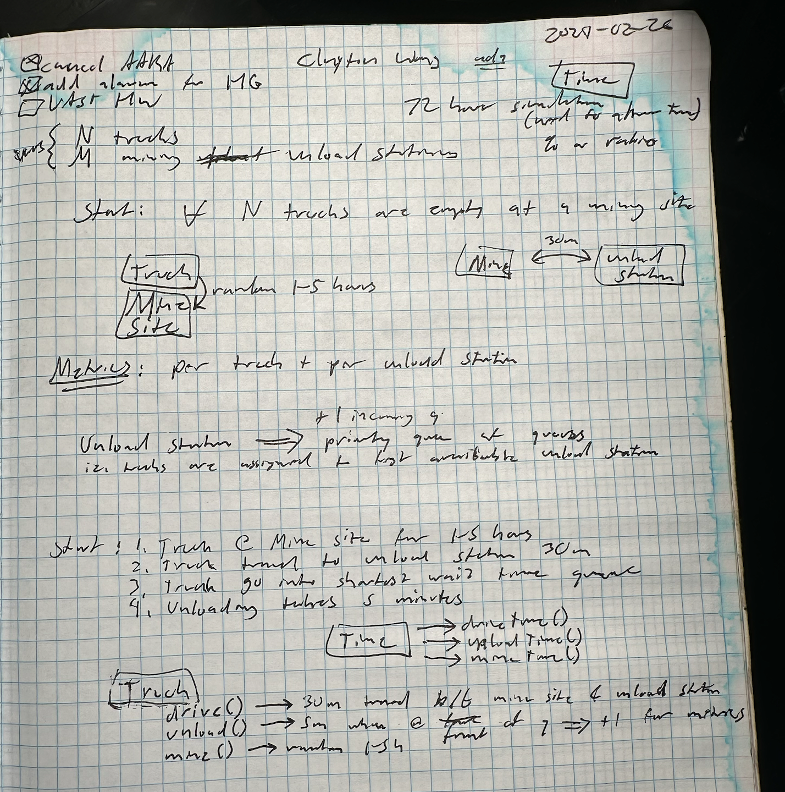
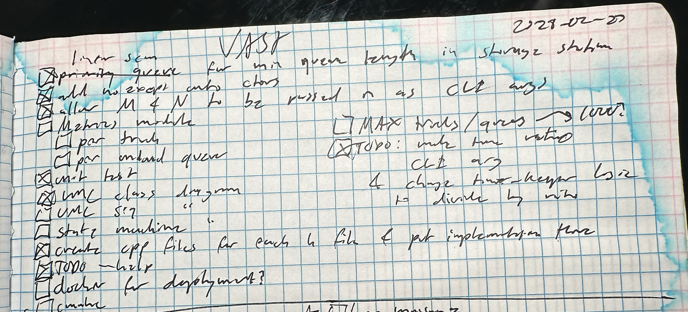
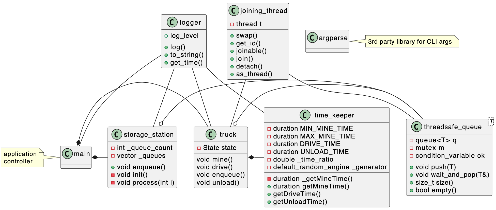

# Build + Run
```
bazel build :main && ./bazel-bin/main --trucks=100 --queues=3
```

# Unit Tests
```
bazel test --test_output=all //:all
```

# Cleanup
```
bazel clean --expunge --async
rm -f output.txt
```

# 3rd Party Dependencies

https://github.com/jamolnng/argparse

# First Try (Day 1) - 2024-02-26

## Whiteboard


```
➜  vast git:(main) bazel build :main && ./bazel-bin/main
INFO: Analyzed target //:main (0 packages loaded, 0 targets configured).
INFO: Found 1 target...
Target //:main up-to-date:
  bazel-bin/main
INFO: Elapsed time: 0.074s, Critical Path: 0.00s
INFO: 1 process: 1 internal.
INFO: Build completed successfully, 1 total action
LOW: Mon Feb 26 18:13:07 2024 - main - starting simulation
LOW: Mon Feb 26 18:13:07 2024 - storage_station - initializing storage station queues
LOW: Mon Feb 26 18:13:07 2024 - main - running thread for unload_queue_work
LOW: Mon Feb 26 18:13:07 2024 - main - joining thread for truck_work
LOW: Mon Feb 26 18:13:07 2024 - main - running thread for truck_work
LOW: Mon Feb 26 18:13:07 2024 - truck - mine() begin
LOW: Mon Feb 26 18:13:07 2024 - time_keeper - _getMineTime() = 2
LOW: Mon Feb 26 22:26:46 2024 - truck - mine() end
LOW: Mon Feb 26 22:26:46 2024 - truck - drive() begin
LOW: Tue Feb 27 00:11:03 2024 - truck - drive() end
LOW: Tue Feb 27 00:11:03 2024 - truck - enqueue() begin
libc++abi: terminating due to uncaught exception of type std::__1::bad_weak_ptr: bad_weak_ptr
[1]    51564 abort      ./bazel-bin/main
```

# Second Try (Day 2) - 2024-02-27



* Bug fix for `bad_weak_ptr`: in the `truck_work` thread function, the `Truck` was constructed on the stack rather than a `shared_ptr` on the heap, thus the reference count reached `0` when `shared_from_this()` was invoked.
  * https://github.com/claytonjwong/vast/commit/f3f3271240e6bbcc604046f9f2bb968e6a3416ca#diff-608d8de3fba954c50110b6d7386988f27295de845e9d7174e40095ba5efcf1bbR38
* Bug fix for `Truck` state machine getting "stuck" after unloading, which was due to missing notification for the condition variable.
  * https://github.com/claytonjwong/vast/commit/f3f3271240e6bbcc604046f9f2bb968e6a3416ca#diff-d8a3ca271a5803643a10c4f9c007adb5f746c0ea1e004672ec6f3863bc679590R32

```
LOW: Tue Feb 27 09:45:24 2024 - main - starting simulation
LOW: Tue Feb 27 09:45:24 2024 - storage_station - initializing storage station queues
LOW: Tue Feb 27 09:45:24 2024 - main - running thread for unload_queue_work
LOW: Tue Feb 27 09:45:24 2024 - main - running thread for truck_work
LOW: Tue Feb 27 09:45:24 2024 - truck - mine() begin
LOW: Tue Feb 27 09:45:24 2024 - time_keeper - _getMineTime() = 2
LOW: Tue Feb 27 09:45:24 2024 - time_keeper - getMineTime() raw time = 0.01
LOW: Tue Feb 27 09:45:24 2024 - time_keeper - getMineTime() = 0
LOW: Tue Feb 27 09:45:24 2024 - truck - mine() end
LOW: Tue Feb 27 09:45:24 2024 - truck - drive() begin
LOW: Tue Feb 27 09:45:24 2024 - time_keeper - getDriveTime() raw time = 0.15
LOW: Tue Feb 27 09:45:24 2024 - time_keeper - getDriveTime() = 0
LOW: Tue Feb 27 09:45:24 2024 - truck - drive() end
LOW: Tue Feb 27 09:45:24 2024 - truck - enqueue() begin
LOW: Tue Feb 27 09:45:24 2024 - truck - enqueue() end
LOW: Tue Feb 27 09:45:24 2024 - storage_station - enqueuing truck to storage station
LOW: Tue Feb 27 09:45:24 2024 - truck - wait_for_unload_ok() begin
LOW: Tue Feb 27 09:45:24 2024 - truck - unloading begin
LOW: Tue Feb 27 09:45:24 2024 - time_keeper - getUnloadTime() raw time = 0.025
LOW: Tue Feb 27 09:45:24 2024 - time_keeper - getUnloadTime() = 0
LOW: Tue Feb 27 09:45:24 2024 - truck - unloading end
LOW: Tue Feb 27 09:45:24 2024 - truck - wait_for_unload_ok() end
LOW: Tue Feb 27 09:45:24 2024 - truck - drive() begin
LOW: Tue Feb 27 09:45:24 2024 - time_keeper - getDriveTime() raw time = 0.15
LOW: Tue Feb 27 09:45:24 2024 - time_keeper - getDriveTime() = 0
LOW: Tue Feb 27 09:45:24 2024 - truck - drive() end
LOW: Tue Feb 27 09:45:24 2024 - truck - mine() begin
LOW: Tue Feb 27 09:45:24 2024 - time_keeper - _getMineTime() = 5
LOW: Tue Feb 27 09:45:24 2024 - time_keeper - getMineTime() raw time = 0.025
LOW: Tue Feb 27 09:45:24 2024 - time_keeper - getMineTime() = 0
LOW: Tue Feb 27 09:45:24 2024 - truck - mine() end
LOW: Tue Feb 27 09:45:24 2024 - truck - drive() begin
LOW: Tue Feb 27 09:45:24 2024 - time_keeper - getDriveTime() raw time = 0.15
LOW: Tue Feb 27 09:45:24 2024 - time_keeper - getDriveTime() = 0
LOW: Tue Feb 27 09:45:24 2024 - truck - drive() end
LOW: Tue Feb 27 09:45:24 2024 - truck - enqueue() begin
LOW: Tue Feb 27 09:45:24 2024 - truck - enqueue() end
LOW: Tue Feb 27 09:45:24 2024 - storage_station - enqueuing truck to storage station
LOW: Tue Feb 27 09:45:24 2024 - truck - wait_for_unload_ok() begin
LOW: Tue Feb 27 09:45:24 2024 - truck - unloading begin
LOW: Tue Feb 27 09:45:24 2024 - time_keeper - getUnloadTime() raw time = 0.025
LOW: Tue Feb 27 09:45:24 2024 - time_keeper - getUnloadTime() = 0
LOW: Tue Feb 27 09:45:24 2024 - truck - unloading end
LOW: Tue Feb 27 09:45:24 2024 - truck - wait_for_unload_ok() end
LOW: Tue Feb 27 09:45:24 2024 - truck - drive() begin
LOW: Tue Feb 27 09:45:24 2024 - time_keeper - getDriveTime() raw time = 0.15
LOW: Tue Feb 27 09:45:24 2024 - time_keeper - getDriveTime() = 0
LOW: Tue Feb 27 09:45:24 2024 - truck - drive() end
LOW: Tue Feb 27 09:45:24 2024 - truck - mine() begin
LOW: Tue Feb 27 09:45:24 2024 - time_keeper - _getMineTime() = 1
LOW: Tue Feb 27 09:45:24 2024 - time_keeper - getMineTime() raw time = 0.005
LOW: Tue Feb 27 09:45:24 2024 - time_keeper - getMineTime() = 0
LOW: Tue Feb 27 09:45:24 2024 - truck - mine() end
LOW: Tue Feb 27 09:45:24 2024 - truck - drive() begin
LOW: Tue Feb 27 09:45:24 2024 - time_keeper - getDriveTime() raw time = 0.15
LOW: Tue Feb 27 09:45:24 2024 - time_keeper - getDriveTime() = 0
LOW: Tue Feb 27 09:45:24 2024 - truck - drive() end
LOW: Tue Feb 27 09:45:24 2024 - truck - enqueue() begin
LOW: Tue Feb 27 09:45:24 2024 - truck - enqueue() end
LOW: Tue Feb 27 09:45:24 2024 - storage_station - enqueuing truck to storage station
LOW: Tue Feb 27 09:45:24 2024 - truck - wait_for_unload_ok() begin
LOW: Tue Feb 27 09:45:24 2024 - truck - unloading begin
LOW: Tue Feb 27 09:45:24 2024 - time_keeper - getUnloadTime() raw time = 0.025
LOW: Tue Feb 27 09:45:24 2024 - time_keeper - getUnloadTime() = 0
LOW: Tue Feb 27 09:45:24 2024 - truck - unloading end
LOW: Tue Feb 27 09:45:24 2024 - truck - wait_for_unload_ok() end
LOW: Tue Feb 27 09:45:24 2024 - truck - drive() begin
LOW: Tue Feb 27 09:45:24 2024 - time_keeper - getDriveTime() raw time = 0.15
LOW: Tue Feb 27 09:45:24 2024 - time_keeper - getDriveTime() = 0
LOW: Tue Feb 27 09:45:24 2024 - truck - drive() end
LOW: Tue Feb 27 09:45:24 2024 - truck - mine() begin
LOW: Tue Feb 27 09:45:24 2024 - time_keeper - _getMineTime() = 3
LOW: Tue Feb 27 09:45:24 2024 - time_keeper - getMineTime() raw time = 0.015
LOW: Tue Feb 27 09:45:24 2024 - time_keeper - getMineTime() = 0
LOW: Tue Feb 27 09:45:24 2024 - truck - mine() end
LOW: Tue Feb 27 09:45:24 2024 - truck - drive() begin
LOW: Tue Feb 27 09:45:24 2024 - time_keeper - getDriveTime() raw time = 0.15
LOW: Tue Feb 27 09:45:24 2024 - time_keeper - getDriveTime() = 0
LOW: Tue Feb 27 09:45:24 2024 - truck - drive() end
LOW: Tue Feb 27 09:45:24 2024 - truck - enqueue() begin
LOW: Tue Feb 27 09:45:24 2024 - truck - enqueue() end
LOW: Tue Feb 27 09:45:24 2024 - storage_station - enqueuing truck to storage station
LOW: Tue Feb 27 09:45:24 2024 - truck - wait_for_unload_ok() begin
LOW: Tue Feb 27 09:45:24 2024 - truck - unloading begin
LOW: Tue Feb 27 09:45:24 2024 - time_keeper - getUnloadTime() raw time = 0.025
LOW: Tue Feb 27 09:45:24 2024 - time_keeper - getUnloadTime() = 0
LOW: Tue Feb 27 09:45:24 2024 - truck - unloading end
LOW: Tue Feb 27 09:45:24 2024 - truck - wait_for_unload_ok() end
LOW: Tue Feb 27 09:45:24 2024 - truck - drive() begin
LOW: Tue Feb 27 09:45:24 2024 - time_keeper - getDriveTime() raw time = 0.15
LOW: Tue Feb 27 09:45:24 2024 - time_keeper - getDriveTime() = 0
LOW: Tue Feb 27 09:45:24 2024 - truck - drive() end
LOW: Tue Feb 27 09:45:24 2024 - truck - mine() begin
LOW: Tue Feb 27 09:45:24 2024 - time_keeper - _getMineTime() = 1
LOW: Tue Feb 27 09:45:24 2024 - time_keeper - getMineTime() raw time = 0.005
LOW: Tue Feb 27 09:45:24 2024 - time_keeper - getMineTime() = 0
LOW: Tue Feb 27 09:45:24 2024 - truck - mine() end
LOW: Tue Feb 27 09:45:24 2024 - truck - drive() begin
LOW: Tue Feb 27 09:45:24 2024 - time_keeper - getDriveTime() raw time = 0.15
LOW: Tue Feb 27 09:45:24 2024 - time_keeper - getDriveTime() = 0
LOW: Tue Feb 27 09:45:24 2024 - truck - drive() end
LOW: Tue Feb 27 09:45:24 2024 - truck - enqueue() begin
LOW: Tue Feb 27 09:45:24 2024 - truck - enqueue() end
LOW: Tue Feb 27 09:45:24 2024 - storage_station - enqueuing truck to storage station
LOW: Tue Feb 27 09:45:24 2024 - truck - wait_for_unload_ok() begin
LOW: Tue Feb 27 09:45:24 2024 - truck - unloading begin
LOW: Tue Feb 27 09:45:24 2024 - time_keeper - getUnloadTime() raw time = 0.025
LOW: Tue Feb 27 09:45:24 2024 - time_keeper - getUnloadTime() = 0
LOW: Tue Feb 27 09:45:24 2024 - truck - unloading end
LOW: Tue Feb 27 09:45:24 2024 - truck - wait_for_unload_ok() end
LOW: Tue Feb 27 09:45:24 2024 - truck - drive() begin
LOW: Tue Feb 27 09:45:24 2024 - time_keeper - getDriveTime() raw time = 0.15
LOW: Tue Feb 27 09:45:24 2024 - time_keeper - getDriveTime() = 0
LOW: Tue Feb 27 09:45:24 2024 - truck - drive() end
LOW: Tue Feb 27 09:45:24 2024 - truck - mine() begin
LOW: Tue Feb 27 09:45:24 2024 - time_keeper - _getMineTime() = 1
LOW: Tue Feb 27 09:45:24 2024 - time_keeper - getMineTime() raw time = 0.005
LOW: Tue Feb 27 09:45:24 2024 - time_keeper - getMineTime() = 0
LOW: Tue Feb 27 09:45:24 2024 - truck - mine() end
LOW: Tue Feb 27 09:45:24 2024 - truck - drive() begin
LOW: Tue Feb 27 09:45:24 2024 - time_keeper - getDriveTime() raw time = 0.15
LOW: Tue Feb 27 09:45:24 2024 - time_keeper - getDriveTime() = 0
LOW: Tue Feb 27 09:45:24 2024 - truck - drive() end
LOW: Tue Feb 27 09:45:24 2024 - truck - enqueue() begin
LOW: Tue Feb 27 09:45:24 2024 - truck - enqueue() end
LOW: Tue Feb 27 09:45:24 2024 - storage_station - enqueuing truck to storage station
LOW: Tue Feb 27 09:45:24 2024 - truck - wait_for_unload_ok() begin
LOW: Tue Feb 27 09:45:24 2024 - truck - unloading begin
LOW: Tue Feb 27 09:45:24 2024 - time_keeper - getUnloadTime() raw time = 0.025
LOW: Tue Feb 27 09:45:24 2024 - time_keeper - getUnloadTime() = 0
LOW: Tue Feb 27 09:45:24 2024 - truck - unloading end
LOW: Tue Feb 27 09:45:24 2024 - truck - wait_for_unload_ok() end
LOW: Tue Feb 27 09:45:24 2024 - truck - drive() begin
LOW: Tue Feb 27 09:45:24 2024 - time_keeper - getDriveTime() raw time = 0.15
LOW: Tue Feb 27 09:45:24 2024 - time_keeper - getDriveTime() = 0
LOW: Tue Feb 27 09:45:24 2024 - truck - drive() end
LOW: Tue Feb 27 09:45:24 2024 - truck - mine() begin
LOW: Tue Feb 27 09:45:24 2024 - time_keeper - _getMineTime() = 3
LOW: Tue Feb 27 09:45:24 2024 - time_keeper - getMineTime() raw time = 0.015
LOW: Tue Feb 27 09:45:24 2024 - time_keeper - getMineTime() = 0
LOW: Tue Feb 27 09:45:24 2024 - truck - mine() end
LOW: Tue Feb 27 09:45:24 2024 - truck - drive() begin
LOW: Tue Feb 27 09:45:24 2024 - time_keeper - getDriveTime() raw time = 0.15
LOW: Tue Feb 27 09:45:24 2024 - time_keeper - getDriveTime() = 0
LOW: Tue Feb 27 09:45:24 2024 - truck - drive() end
LOW: Tue Feb 27 09:45:24 2024 - truck - enqueue() begin
LOW: Tue Feb 27 09:45:24 2024 - truck - enqueue() end
LOW: Tue Feb 27 09:45:24 2024 - storage_station - enqueuing truck to storage station
LOW: Tue Feb 27 09:45:24 2024 - truck - wait_for_unload_ok() begin
LOW: Tue Feb 27 09:45:24 2024 - truck - unloading begin
LOW: Tue Feb 27 09:45:24 2024 - time_keeper - getUnloadTime() raw time = 0.025
LOW: Tue Feb 27 09:45:24 2024 - time_keeper - getUnloadTime() = 0
LOW: Tue Feb 27 09:45:24 2024 - truck - unloading end
LOW: Tue Feb 27 09:45:24 2024 - truck - wait_for_unload_ok() end
LOW: Tue Feb 27 09:45:24 2024 - truck - drive() begin
LOW: Tue Feb 27 09:45:24 2024 - time_keeper - getDriveTime() raw time = 0.15
LOW: Tue Feb 27 09:45:24 2024 - time_keeper - getDriveTime() = 0
LOW: Tue Feb 27 09:45:24 2024 - truck - drive() end
LOW: Tue Feb 27 09:45:24 2024 - truck - mine() begin
LOW: Tue Feb 27 09:45:24 2024 - time_keeper - _getMineTime() = 3
LOW: Tue Feb 27 09:45:24 2024 - time_keeper - getMineTime() raw time = 0.015
LOW: Tue Feb 27 09:45:24 2024 - time_keeper - getMineTime() = 0
LOW: Tue Feb 27 09:45:24 2024 - truck - mine() end
LOW: Tue Feb 27 09:45:24 2024 - truck - drive() begin
LOW: Tue Feb 27 09:45:24 2024 - time_keeper - getDriveTime() raw time = 0.15
LOW: Tue Feb 27 09:45:24 2024 - time_keeper - getDriveTime() = 0
LOW: Tue Feb 27 09:45:24 2024 - truck - drive() end
LOW: Tue Feb 27 09:45:24 2024 - truck - enqueue() begin
LOW: Tue Feb 27 09:45:24 2024 - truck - enqueue() end
LOW: Tue Feb 27 09:45:24 2024 - storage_station - enqueuing truck to storage station
LOW: Tue Feb 27 09:45:24 2024 - truck - wait_for_unload_ok() begin
LOW: Tue Feb 27 09:45:24 2024 - truck - unloading begin
LOW: Tue Feb 27 09:45:24 2024 - time_keeper - getUnloadTime() raw time = 0.025
LOW: Tue Feb 27 09:45:24 2024 - time_keeper - getUnloadTime() = 0
LOW: Tue Feb 27 09:45:24 2024 - truck - unloading end
LOW: Tue Feb 27 09:45:24 2024 - truck - wait_for_unload_ok() end
LOW: Tue Feb 27 09:45:24 2024 - truck - drive() begin
LOW: Tue Feb 27 09:45:24 2024 - time_keeper - getDriveTime() raw time = 0.15
LOW: Tue Feb 27 09:45:24 2024 - time_keeper - getDriveTime() = 0
LOW: Tue Feb 27 09:45:24 2024 - truck - drive() end
LOW: Tue Feb 27 09:45:24 2024 - truck - mine() begin
LOW: Tue Feb 27 09:45:24 2024 - time_keeper - _getMineTime() = 3
LOW: Tue Feb 27 09:45:24 2024 - time_keeper - getMineTime() raw time = 0.015
LOW: Tue Feb 27 09:45:24 2024 - time_keeper - getMineTime() = 0
LOW: Tue Feb 27 09:45:24 2024 - truck - mine() end
LOW: Tue Feb 27 09:45:24 2024 - truck - drive() begin
LOW: Tue Feb 27 09:45:24 2024 - time_keeper - getDriveTime() raw time = 0.15
LOW: Tue Feb 27 09:45:24 2024 - time_keeper - getDriveTime() = 0
LOW: Tue Feb 27 09:45:24 2024 - truck - drive() end
LOW: Tue Feb 27 09:45:24 2024 - truck - enqueue() begin
LOW: Tue Feb 27 09:45:24 2024 - truck - enqueue() end
LOW: Tue Feb 27 09:45:24 2024 - storage_station - enqueuing truck to storage station
LOW: Tue Feb 27 09:45:24 2024 - truck - wait_for_unload_ok() begin
LOW: Tue Feb 27 09:45:24 2024 - truck - unloading begin
LOW: Tue Feb 27 09:45:24 2024 - time_keeper - getUnloadTime() raw time = 0.025
LOW: Tue Feb 27 09:45:24 2024 - time_keeper - getUnloadTime() = 0
LOW: Tue Feb 27 09:45:24 2024 - truck - unloading end
LOW: Tue Feb 27 09:45:24 2024 - truck - wait_for_unload_ok() end
LOW: Tue Feb 27 09:45:24 2024 - truck - drive() begin
LOW: Tue Feb 27 09:45:24 2024 - time_keeper - getDriveTime() raw time = 0.15
LOW: Tue Feb 27 09:45:24 2024 - time_keeper - getDriveTime() = 0
LOW: Tue Feb 27 09:45:24 2024 - truck - drive() end
LOW: Tue Feb 27 09:45:24 2024 - truck - mine() begin
LOW: Tue Feb 27 09:45:24 2024 - time_keeper - _getMineTime() = 5
LOW: Tue Feb 27 09:45:24 2024 - time_keeper - getMineTime() raw time = 0.025
LOW: Tue Feb 27 09:45:24 2024 - time_keeper - getMineTime() = 0
LOW: Tue Feb 27 09:45:24 2024 - truck - mine() end
LOW: Tue Feb 27 09:45:24 2024 - truck - drive() begin
LOW: Tue Feb 27 09:45:24 2024 - time_keeper - getDriveTime() raw time = 0.15
LOW: Tue Feb 27 09:45:24 2024 - time_keeper - getDriveTime() = 0
LOW: Tue Feb 27 09:45:24 2024 - truck - drive() end
LOW: Tue Feb 27 09:45:24 2024 - truck - enqueue() begin
LOW: Tue Feb 27 09:45:24 2024 - truck - enqueue() end
LOW: Tue Feb 27 09:45:24 2024 - storage_station - enqueuing truck to storage station
LOW: Tue Feb 27 09:45:24 2024 - truck - wait_for_unload_ok() begin
LOW: Tue Feb 27 09:45:24 2024 - truck - unloading begin
LOW: Tue Feb 27 09:45:24 2024 - time_keeper - getUnloadTime() raw time = 0.025
LOW: Tue Feb 27 09:45:24 2024 - time_keeper - getUnloadTime() = 0
LOW: Tue Feb 27 09:45:24 2024 - truck - unloading end
LOW: Tue Feb 27 09:45:24 2024 - truck - wait_for_unload_ok() end
LOW: Tue Feb 27 09:45:24 2024 - truck - drive() begin
LOW: Tue Feb 27 09:45:24 2024 - time_keeper - getDriveTime() raw time = 0.15
LOW: Tue Feb 27 09:45:24 2024 - time_keeper - getDriveTime() = 0
LOW: Tue Feb 27 09:45:24 2024 - truck - drive() end
LOW: Tue Feb 27 09:45:24 2024 - truck - mine() begin
LOW: Tue Feb 27 09:45:24 2024 - time_keeper - _getMineTime() = 1
LOW: Tue Feb 27 09:45:24 2024 - time_keeper - getMineTime() raw time = 0.005
LOW: Tue Feb 27 09:45:24 2024 - time_keeper - getMineTime() = 0
LOW: Tue Feb 27 09:45:24 2024 - truck - mine() end
LOW: Tue Feb 27 09:45:24 2024 - truck - drive() begin
LOW: Tue Feb 27 09:45:24 2024 - time_keeper - getDriveTime() raw time = 0.15
LOW: Tue Feb 27 09:45:24 2024 - time_keeper - getDriveTime() = 0
LOW: Tue Feb 27 09:45:24 2024 - truck - drive() end
LOW: Tue Feb 27 09:45:24 2024 - truck - enqueue() begin
LOW: Tue Feb 27 09:45:24 2024 - truck - enqueue() end
LOW: Tue Feb 27 09:45:24 2024 - storage_station - enqueuing truck to storage station
LOW: Tue Feb 27 09:45:24 2024 - truck - wait_for_unload_ok() begin
LOW: Tue Feb 27 09:45:24 2024 - truck - unloading begin
LOW: Tue Feb 27 09:45:24 2024 - time_keeper - getUnloadTime() raw time = 0.025
LOW: Tue Feb 27 09:45:24 2024 - time_keeper - getUnloadTime() = 0
LOW: Tue Feb 27 09:45:24 2024 - truck - unloading end
LOW: Tue Feb 27 09:45:24 2024 - truck - wait_for_unload_ok() end
LOW: Tue Feb 27 09:45:24 2024 - truck - drive() begin
LOW: Tue Feb 27 09:45:24 2024 - time_keeper - getDriveTime() raw time = 0.15
LOW: Tue Feb 27 09:45:24 2024 - time_keeper - getDriveTime() = 0
LOW: Tue Feb 27 09:45:24 2024 - truck - drive() end
LOW: Tue Feb 27 09:45:24 2024 - truck - mine() begin
LOW: Tue Feb 27 09:45:24 2024 - time_keeper - _getMineTime() = 3
LOW: Tue Feb 27 09:45:24 2024 - time_keeper - getMineTime() raw time = 0.015
LOW: Tue Feb 27 09:45:24 2024 - time_keeper - getMineTime() = 0
LOW: Tue Feb 27 09:45:24 2024 - truck - mine() end
LOW: Tue Feb 27 09:45:24 2024 - truck - drive() begin
LOW: Tue Feb 27 09:45:24 2024 - time_keeper - getDriveTime() raw time = 0.15
LOW: Tue Feb 27 09:45:24 2024 - time_keeper - getDriveTime() = 0
LOW: Tue Feb 27 09:45:24 2024 - truck - drive() end
LOW: Tue Feb 27 09:45:24 2024 - truck - enqueue() begin
LOW: Tue Feb 27 09:45:24 2024 - truck - enqueue() end
LOW: Tue Feb 27 09:45:24 2024 - storage_station - enqueuing truck to storage station
LOW: Tue Feb 27 09:45:24 2024 - truck - wait_for_unload_ok() begin
LOW: Tue Feb 27 09:45:24 2024 - truck - unloading begin
LOW: Tue Feb 27 09:45:24 2024 - time_keeper - getUnloadTime() raw time = 0.025
LOW: Tue Feb 27 09:45:24 2024 - time_keeper - getUnloadTime() = 0
LOW: Tue Feb 27 09:45:24 2024 - truck - unloading end
LOW: Tue Feb 27 09:45:24 2024 - truck - wait_for_unload_ok() end
LOW: Tue Feb 27 09:45:24 2024 - truck - drive() begin
LOW: Tue Feb 27 09:45:24 2024 - time_keeper - getDriveTime() raw time = 0.15
LOW: Tue Feb 27 09:45:24 2024 - time_keeper - getDriveTime() = 0
LOW: Tue Feb 27 09:45:24 2024 - truck - drive() end
LOW: Tue Feb 27 09:45:24 2024 - truck - mine() begin
LOW: Tue Feb 27 09:45:24 2024 - time_keeper - _getMineTime() = 1
LOW: Tue Feb 27 09:45:24 2024 - time_keeper - getMineTime() raw time = 0.005
LOW: Tue Feb 27 09:45:24 2024 - time_keeper - getMineTime() = 0
LOW: Tue Feb 27 09:45:24 2024 - truck - mine() end
LOW: Tue Feb 27 09:45:24 2024 - truck - drive() begin
LOW: Tue Feb 27 09:45:24 2024 - time_keeper - getDriveTime() raw time = 0.15
LOW: Tue Feb 27 09:45:24 2024 - time_keeper - getDriveTime() = 0
LOW: Tue Feb 27 09:45:24 2024 - truck - drive() end
LOW: Tue Feb 27 09:45:24 2024 - truck - enqueue() begin
LOW: Tue Feb 27 09:45:24 2024 - truck - enqueue() end
LOW: Tue Feb 27 09:45:24 2024 - storage_station - enqueuing truck to storage station
LOW: Tue Feb 27 09:45:24 2024 - truck - wait_for_unload_ok() begin
LOW: Tue Feb 27 09:45:24 2024 - truck - unloading begin
LOW: Tue Feb 27 09:45:24 2024 - time_keeper - getUnloadTime() raw time = 0.025
LOW: Tue Feb 27 09:45:24 2024 - time_keeper - getUnloadTime() = 0
LOW: Tue Feb 27 09:45:24 2024 - truck - unloading end
LOW: Tue Feb 27 09:45:24 2024 - truck - wait_for_unload_ok() end
LOW: Tue Feb 27 09:45:24 2024 - truck - drive() begin
LOW: Tue Feb 27 09:45:24 2024 - time_keeper - getDriveTime() raw time = 0.15
LOW: Tue Feb 27 09:45:24 2024 - time_keeper - getDriveTime() = 0
LOW: Tue Feb 27 09:45:24 2024 - truck - drive() end
LOW: Tue Feb 27 09:45:24 2024 - truck - mine() begin
LOW: Tue Feb 27 09:45:24 2024 - time_keeper - _getMineTime() = 2
LOW: Tue Feb 27 09:45:24 2024 - time_keeper - getMineTime() raw time = 0.01
LOW: Tue Feb 27 09:45:24 2024 - time_keeper - getMineTime() = 0
LOW: Tue Feb 27 09:45:24 2024 - truck - mine() end
LOW: Tue Feb 27 09:45:24 2024 - truck - drive() begin
LOW: Tue Feb 27 09:45:24 2024 - time_keeper - getDriveTime() raw time = 0.15
LOW: Tue Feb 27 09:45:24 2024 - time_keeper - getDriveTime() = 0
LOW: Tue Feb 27 09:45:24 2024 - truck - drive() end
LOW: Tue Feb 27 09:45:24 2024 - truck - enqueue() begin
LOW: Tue Feb 27 09:45:24 2024 - truck - enqueue() end
LOW: Tue Feb 27 09:45:24 2024 - storage_station - enqueuing truck to storage station
LOW: Tue Feb 27 09:45:24 2024 - truck - wait_for_unload_ok() begin
LOW: Tue Feb 27 09:45:24 2024 - truck - unloading begin
LOW: Tue Feb 27 09:45:24 2024 - time_keeper - getUnloadTime() raw time = 0.025
LOW: Tue Feb 27 09:45:24 2024 - time_keeper - getUnloadTime() = 0
LOW: Tue Feb 27 09:45:24 2024 - truck - unloading end
LOW: Tue Feb 27 09:45:24 2024 - truck - wait_for_unload_ok() end
LOW: Tue Feb 27 09:45:24 2024 - truck - drive() begin
LOW: Tue Feb 27 09:45:24 2024 - time_keeper - getDriveTime() raw time = 0.15
LOW: Tue Feb 27 09:45:24 2024 - time_keeper - getDriveTime() = 0
LOW: Tue Feb 27 09:45:24 2024 - truck - drive() end
LOW: Tue Feb 27 09:45:24 2024 - truck - mine() begin
LOW: Tue Feb 27 09:45:24 2024 - time_keeper - _getMineTime() = 4
LOW: Tue Feb 27 09:45:24 2024 - time_keeper - getMineTime() raw time = 0.02
LOW: Tue Feb 27 09:45:24 2024 - time_keeper - getMineTime() = 0
LOW: Tue Feb 27 09:45:24 2024 - truck - mine() end
LOW: Tue Feb 27 09:45:24 2024 - truck - drive() begin
LOW: Tue Feb 27 09:45:24 2024 - time_keeper - getDriveTime() raw time = 0.15
LOW: Tue Feb 27 09:45:24 2024 - time_keeper - getDriveTime() = 0
LOW: Tue Feb 27 09:45:24 2024 - truck - drive() end
LOW: Tue Feb 27 09:45:24 2024 - truck - enqueue() begin
LOW: Tue Feb 27 09:45:24 2024 - truck - enqueue() end
LOW: Tue Feb 27 09:45:24 2024 - storage_station - enqueuing truck to storage station
LOW: Tue Feb 27 09:45:24 2024 - truck - wait_for_unload_ok() begin
LOW: Tue Feb 27 09:45:24 2024 - truck - unloading begin
LOW: Tue Feb 27 09:45:24 2024 - time_keeper - getUnloadTime() raw time = 0.025
LOW: Tue Feb 27 09:45:24 2024 - time_keeper - getUnloadTime() = 0
LOW: Tue Feb 27 09:45:24 2024 - truck - unloading end
LOW: Tue Feb 27 09:45:24 2024 - truck - wait_for_unload_ok() end
LOW: Tue Feb 27 09:45:24 2024 - truck - drive() begin
LOW: Tue Feb 27 09:45:24 2024 - time_keeper - getDriveTime() raw time = 0.15
LOW: Tue Feb 27 09:45:24 2024 - time_keeper - getDriveTime() = 0
LOW: Tue Feb 27 09:45:24 2024 - truck - drive() end
LOW: Tue Feb 27 09:45:24 2024 - truck - mine() begin
LOW: Tue Feb 27 09:45:24 2024 - time_keeper - _getMineTime() = 1
LOW: Tue Feb 27 09:45:24 2024 - time_keeper - getMineTime() raw time = 0.005
LOW: Tue Feb 27 09:45:24 2024 - time_keeper - getMineTime() = 0
LOW: Tue Feb 27 09:45:24 2024 - truck - mine() end
LOW: Tue Feb 27 09:45:24 2024 - truck - drive() begin
LOW: Tue Feb 27 09:45:24 2024 - time_keeper - getDriveTime() raw time = 0.15
LOW: Tue Feb 27 09:45:24 2024 - time_keeper - getDriveTime() = 0
LOW: Tue Feb 27 09:45:24 2024 - truck - drive() end
LOW: Tue Feb 27 09:45:24 2024 - truck - enqueue() begin
LOW: Tue Feb 27 09:45:24 2024 - truck - enqueue() end
LOW: Tue Feb 27 09:45:24 2024 - storage_station - enqueuing truck to storage station
LOW: Tue Feb 27 09:45:24 2024 - truck - wait_for_unload_ok() begin
LOW: Tue Feb 27 09:45:24 2024 - truck - unloading begin
LOW: Tue Feb 27 09:45:24 2024 - time_keeper - getUnloadTime() raw time = 0.025
LOW: Tue Feb 27 09:45:24 2024 - time_keeper - getUnloadTime() = 0
LOW: Tue Feb 27 09:45:24 2024 - truck - unloading end
LOW: Tue Feb 27 09:45:24 2024 - truck - wait_for_unload_ok() end
LOW: Tue Feb 27 09:45:24 2024 - truck - drive() begin
LOW: Tue Feb 27 09:45:24 2024 - time_keeper - getDriveTime() raw time = 0.15
LOW: Tue Feb 27 09:45:24 2024 - time_keeper - getDriveTime() = 0
LOW: Tue Feb 27 09:45:24 2024 - truck - drive() end
LOW: Tue Feb 27 09:45:24 2024 - truck - mine() begin
LOW: Tue Feb 27 09:45:24 2024 - time_keeper - _getMineTime() = 4
LOW: Tue Feb 27 09:45:24 2024 - time_keeper - getMineTime() raw time = 0.02
LOW: Tue Feb 27 09:45:24 2024 - time_keeper - getMineTime() = 0
LOW: Tue Feb 27 09:45:24 2024 - truck - mine() end
LOW: Tue Feb 27 09:45:24 2024 - truck - drive() begin
LOW: Tue Feb 27 09:45:24 2024 - time_keeper - getDriveTime() raw time = 0.15
LOW: Tue Feb 27 09:45:24 2024 - time_keeper - getDriveTime() = 0
LOW: Tue Feb 27 09:45:24 2024 - truck - drive() end
LOW: Tue Feb 27 09:45:24 2024 - truck - enqueue() begin
LOW: Tue Feb 27 09:45:24 2024 - truck - enqueue() end
LOW: Tue Feb 27 09:45:24 2024 - storage_station - enqueuing truck to storage station
LOW: Tue Feb 27 09:45:24 2024 - truck - wait_for_unload_ok() begin
LOW: Tue Feb 27 09:45:24 2024 - truck - unloading begin
LOW: Tue Feb 27 09:45:24 2024 - time_keeper - getUnloadTime() raw time = 0.025
LOW: Tue Feb 27 09:45:24 2024 - time_keeper - getUnloadTime() = 0
LOW: Tue Feb 27 09:45:24 2024 - truck - unloading end
LOW: Tue Feb 27 09:45:24 2024 - truck - wait_for_unload_ok() end
LOW: Tue Feb 27 09:45:24 2024 - truck - drive() begin
LOW: Tue Feb 27 09:45:24 2024 - time_keeper - getDriveTime() raw time = 0.15
LOW: Tue Feb 27 09:45:24 2024 - time_keeper - getDriveTime() = 0
LOW: Tue Feb 27 09:45:24 2024 - truck - drive() end
LOW: Tue Feb 27 09:45:24 2024 - truck - mine() begin
LOW: Tue Feb 27 09:45:24 2024 - time_keeper - _getMineTime() = 1
LOW: Tue Feb 27 09:45:24 2024 - time_keeper - getMineTime() raw time = 0.005
LOW: Tue Feb 27 09:45:24 2024 - time_keeper - getMineTime() = 0
LOW: Tue Feb 27 09:45:24 2024 - truck - mine() end
LOW: Tue Feb 27 09:45:24 2024 - truck - drive() begin
LOW: Tue Feb 27 09:45:24 2024 - time_keeper - getDriveTime() raw time = 0.15
LOW: Tue Feb 27 09:45:24 2024 - time_keeper - getDriveTime() = 0
LOW: Tue Feb 27 09:45:24 2024 - truck - drive() end
LOW: Tue Feb 27 09:45:24 2024 - truck - enqueue() begin
LOW: Tue Feb 27 09:45:24 2024 - truck - enqueue() end
LOW: Tue Feb 27 09:45:24 2024 - storage_station - enqueuing truck to storage station
LOW: Tue Feb 27 09:45:24 2024 - truck - wait_for_unload_ok() begin
LOW: Tue Feb 27 09:45:24 2024 - truck - unloading begin
LOW: Tue Feb 27 09:45:24 2024 - time_keeper - getUnloadTime() raw time = 0.025
LOW: Tue Feb 27 09:45:24 2024 - time_keeper - getUnloadTime() = 0
LOW: Tue Feb 27 09:45:24 2024 - truck - unloading end
LOW: Tue Feb 27 09:45:24 2024 - truck - wait_for_unload_ok() end
LOW: Tue Feb 27 09:45:24 2024 - truck - drive() begin
LOW: Tue Feb 27 09:45:24 2024 - time_keeper - getDriveTime() raw time = 0.15
LOW: Tue Feb 27 09:45:24 2024 - time_keeper - getDriveTime() = 0
LOW: Tue Feb 27 09:45:24 2024 - truck - drive() end
LOW: Tue Feb 27 09:45:24 2024 - truck - mine() begin
LOW: Tue Feb 27 09:45:24 2024 - time_keeper - _getMineTime() = 4
LOW: Tue Feb 27 09:45:24 2024 - time_keeper - getMineTime() raw time = 0.02
LOW: Tue Feb 27 09:45:24 2024 - time_keeper - getMineTime() = 0
LOW: Tue Feb 27 09:45:24 2024 - truck - mine() end
LOW: Tue Feb 27 09:45:24 2024 - truck - drive() begin
LOW: Tue Feb 27 09:45:24 2024 - time_keeper - getDriveTime() raw time = 0.15
LOW: Tue Feb 27 09:45:24 2024 - time_keeper - getDriveTime() = 0
LOW: Tue Feb 27 09:45:24 2024 - truck - drive() end
LOW: Tue Feb 27 09:45:24 2024 - truck - enqueue() begin
LOW: Tue Feb 27 09:45:24 2024 - truck - enqueue() end
LOW: Tue Feb 27 09:45:24 2024 - storage_station - enqueuing truck to storage station
LOW: Tue Feb 27 09:45:24 2024 - truck - wait_for_unload_ok() begin
LOW: Tue Feb 27 09:45:24 2024 - truck - unloading begin
LOW: Tue Feb 27 09:45:24 2024 - time_keeper - getUnloadTime() raw time = 0.025
LOW: Tue Feb 27 09:45:24 2024 - time_keeper - getUnloadTime() = 0
LOW: Tue Feb 27 09:45:24 2024 - truck - unloading end
LOW: Tue Feb 27 09:45:24 2024 - truck - wait_for_unload_ok() end
LOW: Tue Feb 27 09:45:24 2024 - truck - drive() begin
LOW: Tue Feb 27 09:45:24 2024 - time_keeper - getDriveTime() raw time = 0.15
LOW: Tue Feb 27 09:45:24 2024 - time_keeper - getDriveTime() = 0
LOW: Tue Feb 27 09:45:24 2024 - truck - drive() end
LOW: Tue Feb 27 09:45:24 2024 - truck - mine() begin
LOW: Tue Feb 27 09:45:24 2024 - time_keeper - _getMineTime() = 2
LOW: Tue Feb 27 09:45:24 2024 - time_keeper - getMineTime() raw time = 0.01
LOW: Tue Feb 27 09:45:24 2024 - time_keeper - getMineTime() = 0
LOW: Tue Feb 27 09:45:24 2024 - truck - mine() end
LOW: Tue Feb 27 09:45:24 2024 - truck - drive() begin
LOW: Tue Feb 27 09:45:24 2024 - time_keeper - getDriveTime() raw time = 0.15
LOW: Tue Feb 27 09:45:24 2024 - time_keeper - getDriveTime() = 0
LOW: Tue Feb 27 09:45:24 2024 - truck - drive() end
LOW: Tue Feb 27 09:45:24 2024 - truck - enqueue() begin
LOW: Tue Feb 27 09:45:24 2024 - truck - enqueue() end
LOW: Tue Feb 27 09:45:24 2024 - storage_station - enqueuing truck to storage station
LOW: Tue Feb 27 09:45:24 2024 - truck - wait_for_unload_ok() begin
LOW: Tue Feb 27 09:45:24 2024 - truck - unloading begin
LOW: Tue Feb 27 09:45:24 2024 - time_keeper - getUnloadTime() raw time = 0.025
LOW: Tue Feb 27 09:45:24 2024 - time_keeper - getUnloadTime() = 0
LOW: Tue Feb 27 09:45:24 2024 - truck - unloading end
LOW: Tue Feb 27 09:45:24 2024 - truck - wait_for_unload_ok() end
LOW: Tue Feb 27 09:45:24 2024 - truck - drive() begin
LOW: Tue Feb 27 09:45:24 2024 - time_keeper - getDriveTime() raw time = 0.15
LOW: Tue Feb 27 09:45:24 2024 - time_keeper - getDriveTime() = 0
LOW: Tue Feb 27 09:45:24 2024 - truck - drive() end
LOW: Tue Feb 27 09:45:24 2024 - truck - mine() begin
LOW: Tue Feb 27 09:45:24 2024 - time_keeper - _getMineTime() = 4
LOW: Tue Feb 27 09:45:24 2024 - time_keeper - getMineTime() raw time = 0.02
LOW: Tue Feb 27 09:45:24 2024 - time_keeper - getMineTime() = 0
LOW: Tue Feb 27 09:45:24 2024 - truck - mine() end
LOW: Tue Feb 27 09:45:24 2024 - truck - drive() begin
LOW: Tue Feb 27 09:45:24 2024 - time_keeper - getDriveTime() raw time = 0.15
LOW: Tue Feb 27 09:45:24 2024 - time_keeper - getDriveTime() = 0
LOW: Tue Feb 27 09:45:24 2024 - truck - drive() end
LOW: Tue Feb 27 09:45:24 2024 - truck - enqueue() begin
LOW: Tue Feb 27 09:45:24 2024 - truck - enqueue() end
LOW: Tue Feb 27 09:45:24 2024 - storage_station - enqueuing truck to storage station
LOW: Tue Feb 27 09:45:24 2024 - truck - wait_for_unload_ok() begin
LOW: Tue Feb 27 09:45:24 2024 - truck - unloading begin
LOW: Tue Feb 27 09:45:24 2024 - time_keeper - getUnloadTime() raw time = 0.025
LOW: Tue Feb 27 09:45:24 2024 - time_keeper - getUnloadTime() = 0
LOW: Tue Feb 27 09:45:24 2024 - truck - unloading end
LOW: Tue Feb 27 09:45:24 2024 - truck - wait_for_unload_ok() end
LOW: Tue Feb 27 09:45:24 2024 - truck - drive() begin
LOW: Tue Feb 27 09:45:24 2024 - time_keeper - getDriveTime() raw time = 0.15
LOW: Tue Feb 27 09:45:24 2024 - time_keeper - getDriveTime() = 0
LOW: Tue Feb 27 09:45:24 2024 - truck - drive() end
LOW: Tue Feb 27 09:45:24 2024 - truck - mine() begin
LOW: Tue Feb 27 09:45:24 2024 - time_keeper - _getMineTime() = 3
LOW: Tue Feb 27 09:45:24 2024 - time_keeper - getMineTime() raw time = 0.015
LOW: Tue Feb 27 09:45:24 2024 - time_keeper - getMineTime() = 0
LOW: Tue Feb 27 09:45:24 2024 - truck - mine() end
LOW: Tue Feb 27 09:45:24 2024 - truck - drive() begin
LOW: Tue Feb 27 09:45:24 2024 - time_keeper - getDriveTime() raw time = 0.15
LOW: Tue Feb 27 09:45:24 2024 - time_keeper - getDriveTime() = 0
LOW: Tue Feb 27 09:45:24 2024 - truck - drive() end
LOW: Tue Feb 27 09:45:24 2024 - truck - enqueue() begin
LOW: Tue Feb 27 09:45:24 2024 - truck - enqueue() end
LOW: Tue Feb 27 09:45:24 2024 - storage_station - enqueuing truck to storage station
LOW: Tue Feb 27 09:45:24 2024 - truck - wait_for_unload_ok() begin
LOW: Tue Feb 27 09:45:24 2024 - truck - unloading begin
LOW: Tue Feb 27 09:45:24 2024 - time_keeper - getUnloadTime() raw time = 0.025
LOW: Tue Feb 27 09:45:24 2024 - time_keeper - getUnloadTime() = 0
LOW: Tue Feb 27 09:45:24 2024 - truck - unloading end
LOW: Tue Feb 27 09:45:24 2024 - truck - wait_for_unload_ok() end
LOW: Tue Feb 27 09:45:24 2024 - truck - drive() begin
LOW: Tue Feb 27 09:45:24 2024 - time_keeper - getDriveTime() raw time = 0.15
LOW: Tue Feb 27 09:45:24 2024 - time_keeper - getDriveTime() = 0
LOW: Tue Feb 27 09:45:24 2024 - truck - drive() end
LOW: Tue Feb 27 09:45:24 2024 - truck - mine() begin
LOW: Tue Feb 27 09:45:24 2024 - time_keeper - _getMineTime() = 3
LOW: Tue Feb 27 09:45:24 2024 - time_keeper - getMineTime() raw time = 0.015
LOW: Tue Feb 27 09:45:24 2024 - time_keeper - getMineTime() = 0
LOW: Tue Feb 27 09:45:24 2024 - truck - mine() end
LOW: Tue Feb 27 09:45:24 2024 - truck - drive() begin
LOW: Tue Feb 27 09:45:24 2024 - time_keeper - getDriveTime() raw time = 0.15
LOW: Tue Feb 27 09:45:24 2024 - time_keeper - getDriveTime() = 0
LOW: Tue Feb 27 09:45:24 2024 - truck - drive() end
LOW: Tue Feb 27 09:45:24 2024 - truck - enqueue() begin
LOW: Tue Feb 27 09:45:24 2024 - truck - enqueue() end
LOW: Tue Feb 27 09:45:24 2024 - truck - wait_for_unload_ok() begin
LOW: Tue Feb 27 09:45:24 2024 - storage_station - enqueuing truck to storage station
LOW: Tue Feb 27 09:45:24 2024 - truck - unloading begin
LOW: Tue Feb 27 09:45:24 2024 - time_keeper - getUnloadTime() raw time = 0.025
LOW: Tue Feb 27 09:45:24 2024 - time_keeper - getUnloadTime() = 0
LOW: Tue Feb 27 09:45:24 2024 - truck - unloading end
LOW: Tue Feb 27 09:45:24 2024 - truck - wait_for_unload_ok() end
LOW: Tue Feb 27 09:45:24 2024 - truck - drive() begin
LOW: Tue Feb 27 09:45:24 2024 - time_keeper - getDriveTime() raw time = 0.15
LOW: Tue Feb 27 09:45:24 2024 - time_keeper - getDriveTime() = 0
LOW: Tue Feb 27 09:45:24 2024 - truck - drive() end
LOW: Tue Feb 27 09:45:24 2024 - truck - mine() begin
LOW: Tue Feb 27 09:45:24 2024 - time_keeper - _getMineTime() = 5
LOW: Tue Feb 27 09:45:24 2024 - time_keeper - getMineTime() raw time = 0.025
LOW: Tue Feb 27 09:45:24 2024 - time_keeper - getMineTime() = 0
LOW: Tue Feb 27 09:45:24 2024 - truck - mine() end
LOW: Tue Feb 27 09:45:24 2024 - truck - drive() begin
LOW: Tue Feb 27 09:45:24 2024 - time_keeper - getDriveTime() raw time = 0.15
LOW: Tue Feb 27 09:45:24 2024 - time_keeper - getDriveTime() = 0
LOW: Tue Feb 27 09:45:24 2024 - truck - drive() end
LOW: Tue Feb 27 09:45:24 2024 - truck - enqueue() begin
LOW: Tue Feb 27 09:45:24 2024 - truck - enqueue() end
LOW: Tue Feb 27 09:45:24 2024 - storage_station - enqueuing truck to storage station
LOW: Tue Feb 27 09:45:24 2024 - truck - wait_for_unload_ok() begin
LOW: Tue Feb 27 09:45:24 2024 - truck - unloading begin
LOW: Tue Feb 27 09:45:24 2024 - time_keeper - getUnloadTime() raw time = 0.025
LOW: Tue Feb 27 09:45:24 2024 - time_keeper - getUnloadTime() = 0
LOW: Tue Feb 27 09:45:24 2024 - truck - unloading end
LOW: Tue Feb 27 09:45:24 2024 - truck - wait_for_unload_ok() end
LOW: Tue Feb 27 09:45:24 2024 - truck - drive() begin
LOW: Tue Feb 27 09:45:24 2024 - time_keeper - getDriveTime() raw time = 0.15
LOW: Tue Feb 27 09:45:24 2024 - time_keeper - getDriveTime() = 0
LOW: Tue Feb 27 09:45:24 2024 - truck - drive() end
LOW: Tue Feb 27 09:45:24 2024 - truck - mine() begin
LOW: Tue Feb 27 09:45:24 2024 - time_keeper - _getMineTime() = 4
LOW: Tue Feb 27 09:45:24 2024 - time_keeper - getMineTime() raw time = 0.02
LOW: Tue Feb 27 09:45:24 2024 - time_keeper - getMineTime() = 0
LOW: Tue Feb 27 09:45:24 2024 - truck - mine() end
LOW: Tue Feb 27 09:45:24 2024 - truck - drive() begin
LOW: Tue Feb 27 09:45:24 2024 - time_keeper - getDriveTime() raw time = 0.15
LOW: Tue Feb 27 09:45:24 2024 - time_keeper - getDriveTime() = 0
LOW: Tue Feb 27 09:45:24 2024 - truck - drive() end
LOW: Tue Feb 27 09:45:24 2024 - truck - enqueue() begin
LOW: Tue Feb 27 09:45:24 2024 - truck - enqueue() end
LOW: Tue Feb 27 09:45:24 2024 - storage_station - enqueuing truck to storage station
LOW: Tue Feb 27 09:45:24 2024 - truck - wait_for_unload_ok() begin
LOW: Tue Feb 27 09:45:24 2024 - truck - unloading begin
LOW: Tue Feb 27 09:45:24 2024 - time_keeper - getUnloadTime() raw time = 0.025
LOW: Tue Feb 27 09:45:24 2024 - time_keeper - getUnloadTime() = 0
LOW: Tue Feb 27 09:45:24 2024 - truck - unloading end
LOW: Tue Feb 27 09:45:24 2024 - truck - wait_for_unload_ok() end
LOW: Tue Feb 27 09:45:24 2024 - truck - drive() begin
LOW: Tue Feb 27 09:45:24 2024 - time_keeper - getDriveTime() raw time = 0.15
LOW: Tue Feb 27 09:45:24 2024 - time_keeper - getDriveTime() = 0
LOW: Tue Feb 27 09:45:24 2024 - truck - drive() end
LOW: Tue Feb 27 09:45:24 2024 - truck - mine() begin
LOW: Tue Feb 27 09:45:24 2024 - time_keeper - _getMineTime() = 3
LOW: Tue Feb 27 09:45:24 2024 - time_keeper - getMineTime() raw time = 0.015
LOW: Tue Feb 27 09:45:24 2024 - time_keeper - getMineTime() = 0
LOW: Tue Feb 27 09:45:24 2024 - truck - mine() end
LOW: Tue Feb 27 09:45:24 2024 - truck - drive() begin
LOW: Tue Feb 27 09:45:24 2024 - time_keeper - getDriveTime() raw time = 0.15
LOW: Tue Feb 27 09:45:24 2024 - time_keeper - getDriveTime() = 0
LOW: Tue Feb 27 09:45:24 2024 - truck - drive() end
LOW: Tue Feb 27 09:45:24 2024 - truck - enqueue() begin
LOW: Tue Feb 27 09:45:24 2024 - truck - enqueue() end
LOW: Tue Feb 27 09:45:24 2024 - truck - wait_for_unload_ok() begin
LOW: Tue Feb 27 09:45:24 2024 - storage_station - enqueuing truck to storage station
LOW: Tue Feb 27 09:45:24 2024 - truck - unloading begin
LOW: Tue Feb 27 09:45:24 2024 - time_keeper - getUnloadTime() raw time = 0.025
LOW: Tue Feb 27 09:45:24 2024 - time_keeper - getUnloadTime() = 0
LOW: Tue Feb 27 09:45:24 2024 - truck - unloading end
LOW: Tue Feb 27 09:45:24 2024 - truck - wait_for_unload_ok() end
LOW: Tue Feb 27 09:45:24 2024 - truck - drive() begin
LOW: Tue Feb 27 09:45:24 2024 - time_keeper - getDriveTime() raw time = 0.15
LOW: Tue Feb 27 09:45:24 2024 - time_keeper - getDriveTime() = 0
LOW: Tue Feb 27 09:45:24 2024 - truck - drive() end
LOW: Tue Feb 27 09:45:24 2024 - truck - mine() begin
LOW: Tue Feb 27 09:45:24 2024 - time_keeper - _getMineTime() = 4
LOW: Tue Feb 27 09:45:24 2024 - time_keeper - getMineTime() raw time = 0.02
LOW: Tue Feb 27 09:45:24 2024 - time_keeper - getMineTime() = 0
LOW: Tue Feb 27 09:45:24 2024 - truck - mine() end
LOW: Tue Feb 27 09:45:24 2024 - truck - drive() begin
LOW: Tue Feb 27 09:45:24 2024 - time_keeper - getDriveTime() raw time = 0.15
LOW: Tue Feb 27 09:45:24 2024 - time_keeper - getDriveTime() = 0
LOW: Tue Feb 27 09:45:24 2024 - truck - drive() end
LOW: Tue Feb 27 09:45:24 2024 - truck - enqueue() begin
LOW: Tue Feb 27 09:45:24 2024 - truck - enqueue() end
LOW: Tue Feb 27 09:45:24 2024 - storage_station - enqueuing truck to storage station
LOW: Tue Feb 27 09:45:24 2024 - truck - wait_for_unload_ok() begin
LOW: Tue Feb 27 09:45:24 2024 - truck - unloading begin
LOW: Tue Feb 27 09:45:24 2024 - time_keeper - getUnloadTime() raw time = 0.025
LOW: Tue Feb 27 09:45:24 2024 - time_keeper - getUnloadTime() = 0
LOW: Tue Feb 27 09:45:24 2024 - truck - unloading end
LOW: Tue Feb 27 09:45:24 2024 - truck - wait_for_unload_ok() end
LOW: Tue Feb 27 09:45:24 2024 - truck - drive() begin
LOW: Tue Feb 27 09:45:24 2024 - time_keeper - getDriveTime() raw time = 0.15
LOW: Tue Feb 27 09:45:24 2024 - time_keeper - getDriveTime() = 0
LOW: Tue Feb 27 09:45:24 2024 - truck - drive() end
LOW: Tue Feb 27 09:45:24 2024 - truck - mine() begin
LOW: Tue Feb 27 09:45:24 2024 - time_keeper - _getMineTime() = 5
LOW: Tue Feb 27 09:45:24 2024 - time_keeper - getMineTime() raw time = 0.025
LOW: Tue Feb 27 09:45:24 2024 - time_keeper - getMineTime() = 0
LOW: Tue Feb 27 09:45:24 2024 - truck - mine() end
LOW: Tue Feb 27 09:45:24 2024 - truck - drive() begin
LOW: Tue Feb 27 09:45:24 2024 - time_keeper - getDriveTime() raw time = 0.15
LOW: Tue Feb 27 09:45:24 2024 - time_keeper - getDriveTime() = 0
LOW: Tue Feb 27 09:45:24 2024 - truck - drive() end
LOW: Tue Feb 27 09:45:24 2024 - truck - enqueue() begin
LOW: Tue Feb 27 09:45:24 2024 - truck - enqueue() end
LOW: Tue Feb 27 09:45:24 2024 - storage_station - enqueuing truck to storage station
LOW: Tue Feb 27 09:45:24 2024 - truck - wait_for_unload_ok() begin
LOW: Tue Feb 27 09:45:24 2024 - truck - unloading begin
LOW: Tue Feb 27 09:45:24 2024 - time_keeper - getUnloadTime() raw time = 0.025
LOW: Tue Feb 27 09:45:24 2024 - time_keeper - getUnloadTime() = 0
LOW: Tue Feb 27 09:45:24 2024 - truck - unloading end
LOW: Tue Feb 27 09:45:24 2024 - truck - wait_for_unload_ok() end
LOW: Tue Feb 27 09:45:24 2024 - truck - drive() begin
LOW: Tue Feb 27 09:45:24 2024 - time_keeper - getDriveTime() raw time = 0.15
LOW: Tue Feb 27 09:45:24 2024 - time_keeper - getDriveTime() = 0
LOW: Tue Feb 27 09:45:24 2024 - truck - drive() end
LOW: Tue Feb 27 09:45:24 2024 - truck - mine() begin
LOW: Tue Feb 27 09:45:24 2024 - time_keeper - _getMineTime() = 3
LOW: Tue Feb 27 09:45:24 2024 - time_keeper - getMineTime() raw time = 0.015
LOW: Tue Feb 27 09:45:24 2024 - time_keeper - getMineTime() = 0
LOW: Tue Feb 27 09:45:24 2024 - truck - mine() end
LOW: Tue Feb 27 09:45:24 2024 - truck - drive() begin
LOW: Tue Feb 27 09:45:24 2024 - time_keeper - getDriveTime() raw time = 0.15
LOW: Tue Feb 27 09:45:24 2024 - time_keeper - getDriveTime() = 0
LOW: Tue Feb 27 09:45:24 2024 - truck - drive() end
LOW: Tue Feb 27 09:45:24 2024 - truck - enqueue() begin
LOW: Tue Feb 27 09:45:24 2024 - truck - enqueue() end
LOW: Tue Feb 27 09:45:24 2024 - storage_station - enqueuing truck to storage station
LOW: Tue Feb 27 09:45:24 2024 - truck - wait_for_unload_ok() begin
LOW: Tue Feb 27 09:45:24 2024 - truck - unloading begin
LOW: Tue Feb 27 09:45:24 2024 - time_keeper - getUnloadTime() raw time = 0.025
LOW: Tue Feb 27 09:45:24 2024 - time_keeper - getUnloadTime() = 0
LOW: Tue Feb 27 09:45:24 2024 - truck - unloading end
LOW: Tue Feb 27 09:45:24 2024 - truck - wait_for_unload_ok() end
LOW: Tue Feb 27 09:45:24 2024 - truck - drive() begin
LOW: Tue Feb 27 09:45:24 2024 - time_keeper - getDriveTime() raw time = 0.15
LOW: Tue Feb 27 09:45:24 2024 - time_keeper - getDriveTime() = 0
LOW: Tue Feb 27 09:45:24 2024 - truck - drive() end
LOW: Tue Feb 27 09:45:24 2024 - truck - mine() begin
LOW: Tue Feb 27 09:45:24 2024 - time_keeper - _getMineTime() = 1
LOW: Tue Feb 27 09:45:24 2024 - time_keeper - getMineTime() raw time = 0.005
LOW: Tue Feb 27 09:45:24 2024 - time_keeper - getMineTime() = 0
LOW: Tue Feb 27 09:45:24 2024 - truck - mine() end
LOW: Tue Feb 27 09:45:24 2024 - truck - drive() begin
LOW: Tue Feb 27 09:45:24 2024 - time_keeper - getDriveTime() raw time = 0.15
LOW: Tue Feb 27 09:45:24 2024 - time_keeper - getDriveTime() = 0
LOW: Tue Feb 27 09:45:24 2024 - truck - drive() end
LOW: Tue Feb 27 09:45:24 2024 - truck - enqueue() begin
LOW: Tue Feb 27 09:45:24 2024 - truck - enqueue() end
LOW: Tue Feb 27 09:45:24 2024 - storage_station - enqueuing truck to storage station
LOW: Tue Feb 27 09:45:24 2024 - truck - wait_for_unload_ok() begin
LOW: Tue Feb 27 09:45:24 2024 - truck - unloading begin
LOW: Tue Feb 27 09:45:24 2024 - time_keeper - getUnloadTime() raw time = 0.025
LOW: Tue Feb 27 09:45:24 2024 - time_keeper - getUnloadTime() = 0
LOW: Tue Feb 27 09:45:24 2024 - truck - unloading end
LOW: Tue Feb 27 09:45:24 2024 - truck - wait_for_unload_ok() end
LOW: Tue Feb 27 09:45:24 2024 - truck - drive() begin
LOW: Tue Feb 27 09:45:24 2024 - time_keeper - getDriveTime() raw time = 0.15
LOW: Tue Feb 27 09:45:24 2024 - time_keeper - getDriveTime() = 0
LOW: Tue Feb 27 09:45:24 2024 - truck - drive() end
LOW: Tue Feb 27 09:45:24 2024 - truck - mine() begin
LOW: Tue Feb 27 09:45:24 2024 - time_keeper - _getMineTime() = 3
LOW: Tue Feb 27 09:45:24 2024 - time_keeper - getMineTime() raw time = 0.015
LOW: Tue Feb 27 09:45:24 2024 - time_keeper - getMineTime() = 0
LOW: Tue Feb 27 09:45:24 2024 - truck - mine() end
LOW: Tue Feb 27 09:45:24 2024 - truck - drive() begin
LOW: Tue Feb 27 09:45:24 2024 - time_keeper - getDriveTime() raw time = 0.15
LOW: Tue Feb 27 09:45:24 2024 - time_keeper - getDriveTime() = 0
LOW: Tue Feb 27 09:45:24 2024 - truck - drive() end
LOW: Tue Feb 27 09:45:24 2024 - truck - enqueue() begin
LOW: Tue Feb 27 09:45:24 2024 - truck - enqueue() end
LOW: Tue Feb 27 09:45:24 2024 - truck - wait_for_unload_ok() begin
LOW: Tue Feb 27 09:45:24 2024 - storage_station - enqueuing truck to storage station
LOW: Tue Feb 27 09:45:24 2024 - truck - unloading begin
LOW: Tue Feb 27 09:45:24 2024 - time_keeper - getUnloadTime() raw time = 0.025
LOW: Tue Feb 27 09:45:24 2024 - time_keeper - getUnloadTime() = 0
LOW: Tue Feb 27 09:45:24 2024 - truck - unloading end
LOW: Tue Feb 27 09:45:24 2024 - truck - wait_for_unload_ok() end
LOW: Tue Feb 27 09:45:24 2024 - truck - drive() begin
LOW: Tue Feb 27 09:45:24 2024 - time_keeper - getDriveTime() raw time = 0.15
LOW: Tue Feb 27 09:45:24 2024 - time_keeper - getDriveTime() = 0
LOW: Tue Feb 27 09:45:24 2024 - truck - drive() end
LOW: Tue Feb 27 09:45:24 2024 - truck - mine() begin
LOW: Tue Feb 27 09:45:24 2024 - time_keeper - _getMineTime() = 1
LOW: Tue Feb 27 09:45:24 2024 - time_keeper - getMineTime() raw time = 0.005
LOW: Tue Feb 27 09:45:24 2024 - time_keeper - getMineTime() = 0
LOW: Tue Feb 27 09:45:24 2024 - truck - mine() end
LOW: Tue Feb 27 09:45:24 2024 - truck - drive() begin
LOW: Tue Feb 27 09:45:24 2024 - time_keeper - getDriveTime() raw time = 0.15
LOW: Tue Feb 27 09:45:24 2024 - time_keeper - getDriveTime() = 0
LOW: Tue Feb 27 09:45:24 2024 - truck - drive() end
LOW: Tue Feb 27 09:45:24 2024 - truck - enqueue() begin
LOW: Tue Feb 27 09:45:24 2024 - truck - enqueue() end
LOW: Tue Feb 27 09:45:24 2024 - storage_station - enqueuing truck to storage station
LOW: Tue Feb 27 09:45:24 2024 - truck - wait_for_unload_ok() begin
LOW: Tue Feb 27 09:45:24 2024 - truck - unloading begin
LOW: Tue Feb 27 09:45:24 2024 - time_keeper - getUnloadTime() raw time = 0.025
LOW: Tue Feb 27 09:45:24 2024 - time_keeper - getUnloadTime() = 0
LOW: Tue Feb 27 09:45:24 2024 - truck - unloading end
LOW: Tue Feb 27 09:45:24 2024 - truck - wait_for_unload_ok() end
LOW: Tue Feb 27 09:45:24 2024 - truck - drive() begin
LOW: Tue Feb 27 09:45:24 2024 - time_keeper - getDriveTime() raw time = 0.15
LOW: Tue Feb 27 09:45:24 2024 - time_keeper - getDriveTime() = 0
LOW: Tue Feb 27 09:45:24 2024 - truck - drive() end
LOW: Tue Feb 27 09:45:24 2024 - truck - mine() begin
LOW: Tue Feb 27 09:45:24 2024 - time_keeper - _getMineTime() = 3
LOW: Tue Feb 27 09:45:24 2024 - time_keeper - getMineTime() raw time = 0.015
LOW: Tue Feb 27 09:45:24 2024 - time_keeper - getMineTime() = 0
LOW: Tue Feb 27 09:45:24 2024 - truck - mine() end
LOW: Tue Feb 27 09:45:24 2024 - truck - drive() begin
LOW: Tue Feb 27 09:45:24 2024 - time_keeper - getDriveTime() raw time = 0.15
LOW: Tue Feb 27 09:45:24 2024 - time_keeper - getDriveTime() = 0
LOW: Tue Feb 27 09:45:24 2024 - truck - drive() end
LOW: Tue Feb 27 09:45:24 2024 - truck - enqueue() begin
LOW: Tue Feb 27 09:45:24 2024 - truck - enqueue() end
LOW: Tue Feb 27 09:45:24 2024 - truck - wait_for_unload_ok() begin
LOW: Tue Feb 27 09:45:24 2024 - storage_station - enqueuing truck to storage station
LOW: Tue Feb 27 09:45:24 2024 - truck - unloading begin
LOW: Tue Feb 27 09:45:24 2024 - time_keeper - getUnloadTime() raw time = 0.025
LOW: Tue Feb 27 09:45:24 2024 - time_keeper - getUnloadTime() = 0
LOW: Tue Feb 27 09:45:24 2024 - truck - unloading end
LOW: Tue Feb 27 09:45:24 2024 - truck - wait_for_unload_ok() end
LOW: Tue Feb 27 09:45:24 2024 - truck - drive() begin
LOW: Tue Feb 27 09:45:24 2024 - time_keeper - getDriveTime() raw time = 0.15
LOW: Tue Feb 27 09:45:24 2024 - time_keeper - getDriveTime() = 0
LOW: Tue Feb 27 09:45:24 2024 - truck - drive() end
LOW: Tue Feb 27 09:45:24 2024 - truck - mine() begin
LOW: Tue Feb 27 09:45:24 2024 - time_keeper - _getMineTime() = 5
LOW: Tue Feb 27 09:45:24 2024 - time_keeper - getMineTime() raw time = 0.025
LOW: Tue Feb 27 09:45:24 2024 - time_keeper - getMineTime() = 0
LOW: Tue Feb 27 09:45:24 2024 - truck - mine() end
LOW: Tue Feb 27 09:45:24 2024 - truck - drive() begin
LOW: Tue Feb 27 09:45:24 2024 - time_keeper - getDriveTime() raw time = 0.15
LOW: Tue Feb 27 09:45:24 2024 - time_keeper - getDriveTime() = 0
LOW: Tue Feb 27 09:45:24 2024 - truck - drive() end
LOW: Tue Feb 27 09:45:24 2024 - truck - enqueue() begin
LOW: Tue Feb 27 09:45:24 2024 - truck - enqueue() end
LOW: Tue Feb 27 09:45:24 2024 - truck - wait_for_unload_ok() begin
LOW: Tue Feb 27 09:45:24 2024 - storage_station - enqueuing truck to storage station
LOW: Tue Feb 27 09:45:24 2024 - truck - unloading begin
LOW: Tue Feb 27 09:45:24 2024 - time_keeper - getUnloadTime() raw time = 0.025
LOW: Tue Feb 27 09:45:24 2024 - time_keeper - getUnloadTime() = 0
LOW: Tue Feb 27 09:45:24 2024 - truck - unloading end
LOW: Tue Feb 27 09:45:24 2024 - truck - wait_for_unload_ok() end
LOW: Tue Feb 27 09:45:24 2024 - truck - drive() begin
LOW: Tue Feb 27 09:45:24 2024 - time_keeper - getDriveTime() raw time = 0.15
LOW: Tue Feb 27 09:45:24 2024 - time_keeper - getDriveTime() = 0
LOW: Tue Feb 27 09:45:24 2024 - truck - drive() end
LOW: Tue Feb 27 09:45:24 2024 - truck - mine() begin
LOW: Tue Feb 27 09:45:24 2024 - time_keeper - _getMineTime() = 4
LOW: Tue Feb 27 09:45:24 2024 - time_keeper - getMineTime() raw time = 0.02
LOW: Tue Feb 27 09:45:24 2024 - time_keeper - getMineTime() = 0
LOW: Tue Feb 27 09:45:24 2024 - truck - mine() end
LOW: Tue Feb 27 09:45:24 2024 - truck - drive() begin
LOW: Tue Feb 27 09:45:24 2024 - time_keeper - getDriveTime() raw time = 0.15
LOW: Tue Feb 27 09:45:24 2024 - time_keeper - getDriveTime() = 0
LOW: Tue Feb 27 09:45:24 2024 - truck - drive() end
LOW: Tue Feb 27 09:45:24 2024 - truck - enqueue() begin
LOW: Tue Feb 27 09:45:24 2024 - truck - enqueue() end
LOW: Tue Feb 27 09:45:24 2024 - storage_station - enqueuing truck to storage station
LOW: Tue Feb 27 09:45:24 2024 - truck - wait_for_unload_ok() begin
LOW: Tue Feb 27 09:45:24 2024 - truck - unloading begin
LOW: Tue Feb 27 09:45:24 2024 - time_keeper - getUnloadTime() raw time = 0.025
LOW: Tue Feb 27 09:45:24 2024 - time_keeper - getUnloadTime() = 0
LOW: Tue Feb 27 09:45:24 2024 - truck - unloading end
LOW: Tue Feb 27 09:45:24 2024 - truck - wait_for_unload_ok() end
LOW: Tue Feb 27 09:45:24 2024 - truck - drive() begin
LOW: Tue Feb 27 09:45:24 2024 - time_keeper - getDriveTime() raw time = 0.15
LOW: Tue Feb 27 09:45:24 2024 - time_keeper - getDriveTime() = 0
LOW: Tue Feb 27 09:45:24 2024 - truck - drive() end
LOW: Tue Feb 27 09:45:24 2024 - truck - mine() begin
LOW: Tue Feb 27 09:45:24 2024 - time_keeper - _getMineTime() = 1
LOW: Tue Feb 27 09:45:24 2024 - time_keeper - getMineTime() raw time = 0.005
LOW: Tue Feb 27 09:45:24 2024 - time_keeper - getMineTime() = 0
LOW: Tue Feb 27 09:45:24 2024 - truck - mine() end
LOW: Tue Feb 27 09:45:24 2024 - truck - drive() begin
LOW: Tue Feb 27 09:45:24 2024 - time_keeper - getDriveTime() raw time = 0.15
LOW: Tue Feb 27 09:45:24 2024 - time_keeper - getDriveTime() = 0
LOW: Tue Feb 27 09:45:24 2024 - truck - drive() end
LOW: Tue Feb 27 09:45:24 2024 - truck - enqueue() begin
LOW: Tue Feb 27 09:45:24 2024 - truck - enqueue() end
LOW: Tue Feb 27 09:45:24 2024 - storage_station - enqueuing truck to storage station
LOW: Tue Feb 27 09:45:24 2024 - truck - unloading begin
LOW: Tue Feb 27 09:45:24 2024 - truck - wait_for_unload_ok() begin
LOW: Tue Feb 27 09:45:24 2024 - time_keeper - getUnloadTime() raw time = 0.025
LOW: Tue Feb 27 09:45:24 2024 - time_keeper - getUnloadTime() = 0
LOW: Tue Feb 27 09:45:24 2024 - truck - unloading end
LOW: Tue Feb 27 09:45:24 2024 - truck - wait_for_unload_ok() end
LOW: Tue Feb 27 09:45:24 2024 - truck - drive() begin
LOW: Tue Feb 27 09:45:24 2024 - time_keeper - getDriveTime() raw time = 0.15
LOW: Tue Feb 27 09:45:24 2024 - time_keeper - getDriveTime() = 0
LOW: Tue Feb 27 09:45:24 2024 - truck - drive() end
LOW: Tue Feb 27 09:45:24 2024 - truck - mine() begin
LOW: Tue Feb 27 09:45:24 2024 - time_keeper - _getMineTime() = 4
LOW: Tue Feb 27 09:45:24 2024 - time_keeper - getMineTime() raw time = 0.02
LOW: Tue Feb 27 09:45:24 2024 - time_keeper - getMineTime() = 0
LOW: Tue Feb 27 09:45:24 2024 - truck - mine() end
LOW: Tue Feb 27 09:45:24 2024 - truck - drive() begin
LOW: Tue Feb 27 09:45:24 2024 - time_keeper - getDriveTime() raw time = 0.15
LOW: Tue Feb 27 09:45:24 2024 - time_keeper - getDriveTime() = 0
LOW: Tue Feb 27 09:45:24 2024 - truck - drive() end
LOW: Tue Feb 27 09:45:24 2024 - truck - enqueue() begin
LOW: Tue Feb 27 09:45:24 2024 - truck - enqueue() end
LOW: Tue Feb 27 09:45:24 2024 - storage_station - enqueuing truck to storage station
LOW: Tue Feb 27 09:45:24 2024 - truck - wait_for_unload_ok() begin
LOW: Tue Feb 27 09:45:24 2024 - truck - unloading begin
LOW: Tue Feb 27 09:45:24 2024 - time_keeper - getUnloadTime() raw time = 0.025
LOW: Tue Feb 27 09:45:24 2024 - time_keeper - getUnloadTime() = 0
LOW: Tue Feb 27 09:45:24 2024 - truck - unloading end
LOW: Tue Feb 27 09:45:24 2024 - truck - wait_for_unload_ok() end
LOW: Tue Feb 27 09:45:24 2024 - truck - drive() begin
LOW: Tue Feb 27 09:45:24 2024 - time_keeper - getDriveTime() raw time = 0.15
LOW: Tue Feb 27 09:45:24 2024 - time_keeper - getDriveTime() = 0
LOW: Tue Feb 27 09:45:24 2024 - truck - drive() end
LOW: Tue Feb 27 09:45:24 2024 - truck - mine() begin
LOW: Tue Feb 27 09:45:24 2024 - time_keeper - _getMineTime() = 5
LOW: Tue Feb 27 09:45:24 2024 - time_keeper - getMineTime() raw time = 0.025
LOW: Tue Feb 27 09:45:24 2024 - time_keeper - getMineTime() = 0
LOW: Tue Feb 27 09:45:24 2024 - truck - mine() end
LOW: Tue Feb 27 09:45:24 2024 - truck - drive() begin
LOW: Tue Feb 27 09:45:24 2024 - time_keeper - getDriveTime() raw time = 0.15
LOW: Tue Feb 27 09:45:24 2024 - time_keeper - getDriveTime() = 0
LOW: Tue Feb 27 09:45:24 2024 - truck - drive() end
LOW: Tue Feb 27 09:45:24 2024 - truck - enqueue() begin
LOW: Tue Feb 27 09:45:24 2024 - truck - enqueue() end
LOW: Tue Feb 27 09:45:24 2024 - storage_station - enqueuing truck to storage station
LOW: Tue Feb 27 09:45:24 2024 - truck - wait_for_unload_ok() begin
LOW: Tue Feb 27 09:45:24 2024 - truck - unloading begin
LOW: Tue Feb 27 09:45:24 2024 - time_keeper - getUnloadTime() raw time = 0.025
LOW: Tue Feb 27 09:45:24 2024 - time_keeper - getUnloadTime() = 0
LOW: Tue Feb 27 09:45:24 2024 - truck - unloading end
LOW: Tue Feb 27 09:45:24 2024 - truck - wait_for_unload_ok() end
LOW: Tue Feb 27 09:45:24 2024 - truck - drive() begin
LOW: Tue Feb 27 09:45:24 2024 - time_keeper - getDriveTime() raw time = 0.15
LOW: Tue Feb 27 09:45:24 2024 - time_keeper - getDriveTime() = 0
LOW: Tue Feb 27 09:45:24 2024 - truck - drive() end
LOW: Tue Feb 27 09:45:24 2024 - truck - mine() begin
LOW: Tue Feb 27 09:45:24 2024 - time_keeper - _getMineTime() = 3
LOW: Tue Feb 27 09:45:24 2024 - time_keeper - getMineTime() raw time = 0.015
LOW: Tue Feb 27 09:45:24 2024 - time_keeper - getMineTime() = 0
LOW: Tue Feb 27 09:45:24 2024 - truck - mine() end
LOW: Tue Feb 27 09:45:24 2024 - truck - drive() begin
LOW: Tue Feb 27 09:45:24 2024 - time_keeper - getDriveTime() raw time = 0.15
LOW: Tue Feb 27 09:45:24 2024 - time_keeper - getDriveTime() = 0
LOW: Tue Feb 27 09:45:24 2024 - truck - drive() end
LOW: Tue Feb 27 09:45:24 2024 - truck - enqueue() begin
LOW: Tue Feb 27 09:45:24 2024 - truck - enqueue() end
LOW: Tue Feb 27 09:45:24 2024 - storage_station - enqueuing truck to storage station
LOW: Tue Feb 27 09:45:24 2024 - truck - unloading begin
LOW: Tue Feb 27 09:45:24 2024 - time_keeper - getUnloadTime() raw time = 0.025
LOW: Tue Feb 27 09:45:24 2024 - truck - wait_for_unload_ok() begin
LOW: Tue Feb 27 09:45:24 2024 - time_keeper - getUnloadTime() = 0
LOW: Tue Feb 27 09:45:24 2024 - truck - unloading end
LOW: Tue Feb 27 09:45:24 2024 - truck - wait_for_unload_ok() end
LOW: Tue Feb 27 09:45:24 2024 - truck - drive() begin
LOW: Tue Feb 27 09:45:24 2024 - time_keeper - getDriveTime() raw time = 0.15
LOW: Tue Feb 27 09:45:24 2024 - time_keeper - getDriveTime() = 0
LOW: Tue Feb 27 09:45:24 2024 - truck - drive() end
LOW: Tue Feb 27 09:45:24 2024 - truck - mine() begin
LOW: Tue Feb 27 09:45:24 2024 - time_keeper - _getMineTime() = 4
LOW: Tue Feb 27 09:45:24 2024 - time_keeper - getMineTime() raw time = 0.02
LOW: Tue Feb 27 09:45:24 2024 - time_keeper - getMineTime() = 0
LOW: Tue Feb 27 09:45:24 2024 - truck - mine() end
LOW: Tue Feb 27 09:45:24 2024 - truck - drive() begin
LOW: Tue Feb 27 09:45:24 2024 - time_keeper - getDriveTime() raw time = 0.15
LOW: Tue Feb 27 09:45:24 2024 - time_keeper - getDriveTime() = 0
LOW: Tue Feb 27 09:45:24 2024 - truck - drive() end
LOW: Tue Feb 27 09:45:24 2024 - truck - enqueue() begin
LOW: Tue Feb 27 09:45:24 2024 - truck - enqueue() end
LOW: Tue Feb 27 09:45:24 2024 - storage_station - enqueuing truck to storage station
LOW: Tue Feb 27 09:45:24 2024 - truck - unloading begin
LOW: Tue Feb 27 09:45:24 2024 - truck - wait_for_unload_ok() begin
LOW: Tue Feb 27 09:45:24 2024 - time_keeper - getUnloadTime() raw time = 0.025
LOW: Tue Feb 27 09:45:24 2024 - time_keeper - getUnloadTime() = 0
LOW: Tue Feb 27 09:45:24 2024 - truck - unloading end
LOW: Tue Feb 27 09:45:24 2024 - truck - wait_for_unload_ok() end
LOW: Tue Feb 27 09:45:24 2024 - truck - drive() begin
LOW: Tue Feb 27 09:45:24 2024 - time_keeper - getDriveTime() raw time = 0.15
LOW: Tue Feb 27 09:45:24 2024 - time_keeper - getDriveTime() = 0
LOW: Tue Feb 27 09:45:24 2024 - truck - drive() end
LOW: Tue Feb 27 09:45:24 2024 - truck - mine() begin
LOW: Tue Feb 27 09:45:24 2024 - time_keeper - _getMineTime() = 3
LOW: Tue Feb 27 09:45:24 2024 - time_keeper - getMineTime() raw time = 0.015
LOW: Tue Feb 27 09:45:24 2024 - time_keeper - getMineTime() = 0
LOW: Tue Feb 27 09:45:24 2024 - truck - mine() end
LOW: Tue Feb 27 09:45:24 2024 - truck - drive() begin
LOW: Tue Feb 27 09:45:24 2024 - time_keeper - getDriveTime() raw time = 0.15
LOW: Tue Feb 27 09:45:24 2024 - time_keeper - getDriveTime() = 0
LOW: Tue Feb 27 09:45:24 2024 - truck - drive() end
LOW: Tue Feb 27 09:45:24 2024 - truck - enqueue() begin
LOW: Tue Feb 27 09:45:24 2024 - truck - enqueue() end
LOW: Tue Feb 27 09:45:24 2024 - truck - wait_for_unload_ok() begin
LOW: Tue Feb 27 09:45:24 2024 - storage_station - enqueuing truck to storage station
LOW: Tue Feb 27 09:45:24 2024 - truck - unloading begin
LOW: Tue Feb 27 09:45:24 2024 - time_keeper - getUnloadTime() raw time = 0.025
LOW: Tue Feb 27 09:45:24 2024 - time_keeper - getUnloadTime() = 0
LOW: Tue Feb 27 09:45:24 2024 - truck - unloading end
LOW: Tue Feb 27 09:45:24 2024 - truck - wait_for_unload_ok() end
LOW: Tue Feb 27 09:45:24 2024 - truck - drive() begin
LOW: Tue Feb 27 09:45:24 2024 - time_keeper - getDriveTime() raw time = 0.15
LOW: Tue Feb 27 09:45:24 2024 - time_keeper - getDriveTime() = 0
LOW: Tue Feb 27 09:45:24 2024 - truck - drive() end
LOW: Tue Feb 27 09:45:24 2024 - truck - mine() begin
LOW: Tue Feb 27 09:45:24 2024 - time_keeper - _getMineTime() = 3
LOW: Tue Feb 27 09:45:24 2024 - time_keeper - getMineTime() raw time = 0.015
LOW: Tue Feb 27 09:45:24 2024 - time_keeper - getMineTime() = 0
LOW: Tue Feb 27 09:45:24 2024 - truck - mine() end
LOW: Tue Feb 27 09:45:24 2024 - truck - drive() begin
LOW: Tue Feb 27 09:45:24 2024 - time_keeper - getDriveTime() raw time = 0.15
LOW: Tue Feb 27 09:45:24 2024 - time_keeper - getDriveTime() = 0
LOW: Tue Feb 27 09:45:24 2024 - truck - drive() end
LOW: Tue Feb 27 09:45:24 2024 - truck - enqueue() begin
LOW: Tue Feb 27 09:45:24 2024 - truck - enqueue() end
LOW: Tue Feb 27 09:45:24 2024 - storage_station - enqueuing truck to storage station
LOW: Tue Feb 27 09:45:24 2024 - truck - wait_for_unload_ok() begin
LOW: Tue Feb 27 09:45:24 2024 - truck - unloading begin
LOW: Tue Feb 27 09:45:24 2024 - time_keeper - getUnloadTime() raw time = 0.025
LOW: Tue Feb 27 09:45:24 2024 - time_keeper - getUnloadTime() = 0
LOW: Tue Feb 27 09:45:24 2024 - truck - unloading end
LOW: Tue Feb 27 09:45:24 2024 - truck - wait_for_unload_ok() end
LOW: Tue Feb 27 09:45:24 2024 - truck - drive() begin
LOW: Tue Feb 27 09:45:24 2024 - time_keeper - getDriveTime() raw time = 0.15
LOW: Tue Feb 27 09:45:24 2024 - time_keeper - getDriveTime() = 0
LOW: Tue Feb 27 09:45:24 2024 - truck - drive() end
LOW: Tue Feb 27 09:45:24 2024 - truck - mine() begin
LOW: Tue Feb 27 09:45:24 2024 - time_keeper - _getMineTime() = 5
LOW: Tue Feb 27 09:45:24 2024 - time_keeper - getMineTime() raw time = 0.025
LOW: Tue Feb 27 09:45:24 2024 - time_keeper - getMineTime() = 0
LOW: Tue Feb 27 09:45:24 2024 - truck - mine() end
LOW: Tue Feb 27 09:45:24 2024 - truck - drive() begin
LOW: Tue Feb 27 09:45:24 2024 - time_keeper - getDriveTime() raw time = 0.15
LOW: Tue Feb 27 09:45:24 2024 - time_keeper - getDriveTime() = 0
LOW: Tue Feb 27 09:45:24 2024 - truck - drive() end
LOW: Tue Feb 27 09:45:24 2024 - truck - enqueue() begin
LOW: Tue Feb 27 09:45:24 2024 - truck - enqueue() end
LOW: Tue Feb 27 09:45:24 2024 - storage_station - enqueuing truck to storage station
LOW: Tue Feb 27 09:45:24 2024 - truck - wait_for_unload_ok() begin
LOW: Tue Feb 27 09:45:24 2024 - truck - unloading begin
LOW: Tue Feb 27 09:45:24 2024 - time_keeper - getUnloadTime() raw time = 0.025
LOW: Tue Feb 27 09:45:24 2024 - time_keeper - getUnloadTime() = 0
LOW: Tue Feb 27 09:45:24 2024 - truck - unloading end
LOW: Tue Feb 27 09:45:24 2024 - truck - wait_for_unload_ok() end
LOW: Tue Feb 27 09:45:24 2024 - truck - drive() begin
LOW: Tue Feb 27 09:45:24 2024 - time_keeper - getDriveTime() raw time = 0.15
LOW: Tue Feb 27 09:45:24 2024 - time_keeper - getDriveTime() = 0
LOW: Tue Feb 27 09:45:24 2024 - truck - drive() end
LOW: Tue Feb 27 09:45:24 2024 - truck - mine() begin
LOW: Tue Feb 27 09:45:24 2024 - time_keeper - _getMineTime() = 1
LOW: Tue Feb 27 09:45:24 2024 - time_keeper - getMineTime() raw time = 0.005
LOW: Tue Feb 27 09:45:24 2024 - time_keeper - getMineTime() = 0
LOW: Tue Feb 27 09:45:24 2024 - truck - mine() end
LOW: Tue Feb 27 09:45:24 2024 - truck - drive() begin
LOW: Tue Feb 27 09:45:24 2024 - time_keeper - getDriveTime() raw time = 0.15
LOW: Tue Feb 27 09:45:24 2024 - time_keeper - getDriveTime() = 0
LOW: Tue Feb 27 09:45:24 2024 - truck - drive() end
LOW: Tue Feb 27 09:45:24 2024 - truck - enqueue() begin
LOW: Tue Feb 27 09:45:24 2024 - truck - enqueue() end
LOW: Tue Feb 27 09:45:24 2024 - storage_station - enqueuing truck to storage station
LOW: Tue Feb 27 09:45:24 2024 - truck - wait_for_unload_ok() begin
LOW: Tue Feb 27 09:45:24 2024 - truck - unloading begin
LOW: Tue Feb 27 09:45:24 2024 - time_keeper - getUnloadTime() raw time = 0.025
LOW: Tue Feb 27 09:45:24 2024 - time_keeper - getUnloadTime() = 0
LOW: Tue Feb 27 09:45:24 2024 - truck - unloading end
LOW: Tue Feb 27 09:45:24 2024 - truck - wait_for_unload_ok() end
LOW: Tue Feb 27 09:45:24 2024 - truck - drive() begin
LOW: Tue Feb 27 09:45:24 2024 - time_keeper - getDriveTime() raw time = 0.15
LOW: Tue Feb 27 09:45:24 2024 - time_keeper - getDriveTime() = 0
LOW: Tue Feb 27 09:45:24 2024 - truck - drive() end
LOW: Tue Feb 27 09:45:24 2024 - truck - mine() begin
LOW: Tue Feb 27 09:45:24 2024 - time_keeper - _getMineTime() = 4
LOW: Tue Feb 27 09:45:24 2024 - time_keeper - getMineTime() raw time = 0.02
LOW: Tue Feb 27 09:45:24 2024 - time_keeper - getMineTime() = 0
LOW: Tue Feb 27 09:45:24 2024 - truck - mine() end
LOW: Tue Feb 27 09:45:24 2024 - truck - drive() begin
LOW: Tue Feb 27 09:45:24 2024 - time_keeper - getDriveTime() raw time = 0.15
LOW: Tue Feb 27 09:45:24 2024 - time_keeper - getDriveTime() = 0
LOW: Tue Feb 27 09:45:24 2024 - truck - drive() end
LOW: Tue Feb 27 09:45:24 2024 - truck - enqueue() begin
LOW: Tue Feb 27 09:45:24 2024 - truck - enqueue() end
LOW: Tue Feb 27 09:45:24 2024 - storage_station - enqueuing truck to storage station
LOW: Tue Feb 27 09:45:24 2024 - truck - wait_for_unload_ok() begin
LOW: Tue Feb 27 09:45:24 2024 - truck - unloading begin
LOW: Tue Feb 27 09:45:24 2024 - time_keeper - getUnloadTime() raw time = 0.025
LOW: Tue Feb 27 09:45:24 2024 - time_keeper - getUnloadTime() = 0
LOW: Tue Feb 27 09:45:24 2024 - truck - unloading end
LOW: Tue Feb 27 09:45:24 2024 - truck - wait_for_unload_ok() end
LOW: Tue Feb 27 09:45:24 2024 - truck - drive() begin
LOW: Tue Feb 27 09:45:24 2024 - time_keeper - getDriveTime() raw time = 0.15
LOW: Tue Feb 27 09:45:24 2024 - time_keeper - getDriveTime() = 0
LOW: Tue Feb 27 09:45:24 2024 - truck - drive() end
LOW: Tue Feb 27 09:45:24 2024 - truck - mine() begin
LOW: Tue Feb 27 09:45:24 2024 - time_keeper - _getMineTime() = 5
LOW: Tue Feb 27 09:45:24 2024 - time_keeper - getMineTime() raw time = 0.025
LOW: Tue Feb 27 09:45:24 2024 - time_keeper - getMineTime() = 0
LOW: Tue Feb 27 09:45:24 2024 - truck - mine() end
LOW: Tue Feb 27 09:45:24 2024 - truck - drive() begin
```

# Add CLI Args w/ Help

```
➜  vast git:(main) ✗ bazel build :main && ./bazel-bin/main --help
INFO: Analyzed target //:main (0 packages loaded, 0 targets configured).
INFO: Found 1 target...
Target //:main up-to-date:
  bazel-bin/main
INFO: Elapsed time: 0.087s, Critical Path: 0.00s
INFO: 1 process: 1 internal.
INFO: Build completed successfully, 1 total action
Usage: main [options...]
Options:
    -t, --trucks           quantity of mining trucks (Required)
    -q, --queues           quantity of unloading queues (Required)
    -h, --help             Shows this page
```

# Add Unit Tests (Boilerplate Code)

```
➜  vast git:(main) ✗ ./run_tests.sh
Starting local Bazel server and connecting to it...
DEBUG: Rule 'com_google_googletest' indicated that a canonical reproducible form can be obtained by modifying arguments integrity = "sha256-dV+aObxyBfWgxCjpIN2tCSwzyKG0aZfe8/HUqCre1uE="
DEBUG: Repository com_google_googletest instantiated at:
  /Users/claytonjwong/sandbox/vast/WORKSPACE:12:13: in <toplevel>
Repository rule http_archive defined at:
  /private/var/tmp/_bazel_claytonjwong/ef3314588ed3eae01c340496a8fa31fe/external/bazel_tools/tools/build_defs/repo/http.bzl:381:31: in <toplevel>
INFO: Analyzed 13 targets (72 packages loaded, 460 targets configured).
INFO: From Compiling main.cpp:
In file included from main.cpp:9:
./logger.h:10:5: warning: 'static' is not permitted on a declaration of a type [-Wmissing-declarations]
    static enum class log_level {
    ^
1 warning generated.
INFO: From Testing //:time_keeper_test:
==================== Test output for //:time_keeper_test:
Running main() from gmock_main.cc
[==========] Running 1 test from 1 test suite.
[----------] Global test environment set-up.
[----------] 1 test from TimeKeeperTest
[ RUN      ] TimeKeeperTest.BasicAssertions
[       OK ] TimeKeeperTest.BasicAssertions (0 ms)
[----------] 1 test from TimeKeeperTest (0 ms total)

[----------] Global test environment tear-down
[==========] 1 test from 1 test suite ran. (0 ms total)
[  PASSED  ] 1 test.
================================================================================
INFO: From Testing //:joining_thread_test:
==================== Test output for //:joining_thread_test:
Running main() from gmock_main.cc
[==========] Running 1 test from 1 test suite.
[----------] Global test environment set-up.
[----------] 1 test from TimeKeeperTest
[ RUN      ] TimeKeeperTest.BasicAssertions
[       OK ] TimeKeeperTest.BasicAssertions (0 ms)
[----------] 1 test from TimeKeeperTest (0 ms total)

[----------] Global test environment tear-down
[==========] 1 test from 1 test suite ran. (0 ms total)
[  PASSED  ] 1 test.
================================================================================
INFO: From Testing //:logger_test:
==================== Test output for //:logger_test:
Running main() from gmock_main.cc
[==========] Running 1 test from 1 test suite.
[----------] Global test environment set-up.
[----------] 1 test from TimeKeeperTest
[ RUN      ] TimeKeeperTest.BasicAssertions
[       OK ] TimeKeeperTest.BasicAssertions (0 ms)
[----------] 1 test from TimeKeeperTest (0 ms total)

[----------] Global test environment tear-down
[==========] 1 test from 1 test suite ran. (0 ms total)
[  PASSED  ] 1 test.
================================================================================
INFO: From Testing //:storage_station_test:
==================== Test output for //:storage_station_test:
Running main() from gmock_main.cc
[==========] Running 1 test from 1 test suite.
[----------] Global test environment set-up.
[----------] 1 test from TimeKeeperTest
[ RUN      ] TimeKeeperTest.BasicAssertions
[       OK ] TimeKeeperTest.BasicAssertions (0 ms)
[----------] 1 test from TimeKeeperTest (0 ms total)

[----------] Global test environment tear-down
[==========] 1 test from 1 test suite ran. (0 ms total)
[  PASSED  ] 1 test.
================================================================================
INFO: From Testing //:threadsafe_queue_test:
==================== Test output for //:threadsafe_queue_test:
Running main() from gmock_main.cc
[==========] Running 1 test from 1 test suite.
[----------] Global test environment set-up.
[----------] 1 test from TimeKeeperTest
[ RUN      ] TimeKeeperTest.BasicAssertions
[       OK ] TimeKeeperTest.BasicAssertions (0 ms)
[----------] 1 test from TimeKeeperTest (0 ms total)

[----------] Global test environment tear-down
[==========] 1 test from 1 test suite ran. (0 ms total)
[  PASSED  ] 1 test.
================================================================================
INFO: Found 8 targets and 5 test targets...
INFO: Elapsed time: 8.622s, Critical Path: 2.37s
INFO: 61 processes: 27 internal, 34 darwin-sandbox.
INFO: Build completed successfully, 61 total actions
//:joining_thread_test                                                   PASSED in 0.2s
//:logger_test                                                           PASSED in 0.3s
//:storage_station_test                                                  PASSED in 0.3s
//:threadsafe_queue_test                                                 PASSED in 0.4s
//:time_keeper_test                                                      PASSED in 0.2s

Executed 5 out of 5 tests: 5 tests pass.
```

# Storage Station: Enqueue to Shortest Queue

```
vast git:(main) ✗ bazel build :main && ./bazel-bin/main --trucks=1000 --queues=3
```

These logs provide anecdotal evidence that the shortest of the 3 queues is "cherry-picked" by the storage station for enqueue with a bias towards the minimum queue index, ie. the first best of a linear scan of all queue possibilities "breaks ties."

```
LOW: Tue Feb 27 15:11:40 2024 - storage_station - enqueuing truck to storage station -> shortest queue[0] of size 0
LOW: Tue Feb 27 15:11:40 2024 - time_keeper - _getMineTime() = 3
LOW: Tue Feb 27 15:11:40 2024 - truck - mine() begin
LOW: Tue Feb 27 15:11:40 2024 - storage_station - enqueuing truck to storage station
LOW: Tue Feb 27 15:11:40 2024 - truck - drive() end
LOW: Tue Feb 27 15:11:40 2024 - storage_station - enqueuing truck to storage station -> shortest queue[1] of size 0
LOW: Tue Feb 27 15:11:40 2024 - storage_station - enqueuing truck to storage station
LOW: Tue Feb 27 15:11:40 2024 - truck - enqueue() begin
LOW: Tue Feb 27 15:11:40 2024 - storage_station - enqueuing truck to storage station -> shortest queue[2] of size 0
LOW: Tue Feb 27 15:11:40 2024 - truck - drive() begin
LOW: Tue Feb 27 15:11:40 2024 - time_keeper - getUnloadTime() = 0
LOW: Tue Feb 27 15:11:40 2024 - storage_station - enqueuing truck to storage station
LOW: Tue Feb 27 15:11:40 2024 - storage_station - enqueuing truck to storage station -> shortest queue[0] of size 1
```

# UML Class Diagram



# Third Try (Day 3) - 2024-02-28

* Bug fixes for wait durations!  `std::chrono::duration<Rep,Period>`
  * The duration casts `Rep = Long`, so the fractional values are lost! (that's why we see `0` printed in the Second Try above)
    * https://github.com/claytonjwong/vast/commit/a332d1fff2d85d60afbb595ecba17aa3bf790bb3#diff-de0e471ae9d6dfac2c4f12116db7b78011b3e43b295287562c33179299ad4e61L10
    * https://github.com/claytonjwong/vast/commit/a332d1fff2d85d60afbb595ecba17aa3bf790bb3#diff-de0e471ae9d6dfac2c4f12116db7b78011b3e43b295287562c33179299ad4e61L18
    * https://github.com/claytonjwong/vast/commit/a332d1fff2d85d60afbb595ecba17aa3bf790bb3#diff-de0e471ae9d6dfac2c4f12116db7b78011b3e43b295287562c33179299ad4e61L26
  * Also, each truck is single-threaded, so we only need to notify_one, not notify_all
    * https://github.com/claytonjwong/vast/commit/a332d1fff2d85d60afbb595ecba17aa3bf790bb3#diff-d8a3ca271a5803643a10c4f9c007adb5f746c0ea1e004672ec6f3863bc679590L32

Note: we can use `-h` or `--help` to know what these abbreviated CLI args stand for:

```
➜  vast git:(main) ✗ ./bazel-bin/main -h
Usage: main [options...]
Options:
    -t, --trucks           quantity of mining trucks (Required)
    -q, --queues           quantity of unloading queues (Required)
    -r, --ratio            time warp ratio         (Required)
    -h, --help             Shows this page
```

We can clearly validate these bug fixes via post-processed log analysis.  When the time warp ratio is set to `30`, the simulation is a slow pace, ie. a maximum `5` hour mining time time-warps to `10` minutes, ie. convert `5` hours to `5 * 60 = 300` minutes and divide by the time warp ratio: `300 / 30 = 10`

```
➜  vast git:(main) ✗ bazel build :main && ./bazel-bin/main -t 1 -q 1 -r 30
INFO: Analyzed target //:main (0 packages loaded, 0 targets configured).
INFO: Found 1 target...
Target //:main up-to-date:
  bazel-bin/main
INFO: Elapsed time: 0.992s, Critical Path: 0.90s
INFO: 5 processes: 1 internal, 4 darwin-sandbox.
INFO: Build completed successfully, 5 total actions
LOW: Wed Feb 28 06:52:39 2024 - main - starting simulation with 1 truck(s) and 1 unloading queue(s) using time warp ratio 30
LOW: Wed Feb 28 06:52:39 2024 - storage_station - initializing storage station queues
LOW: Wed Feb 28 06:52:39 2024 - storage_station - process storage station queue 0
LOW: Wed Feb 28 06:52:39 2024 - main - running thread for truck_work
LOW: Wed Feb 28 06:52:39 2024 - truck - mine() begin
LOW: Wed Feb 28 06:52:39 2024 - main - running thread for unload_queue_work
LOW: Wed Feb 28 06:52:39 2024 - time_keeper - _getMineTime() = 2
LOW: Wed Feb 28 06:52:39 2024 - time_keeper - getMineTime() = 0.0666667 hours = 240 seconds
LOW: Wed Feb 28 06:56:39 2024 - truck - mine() end
LOW: Wed Feb 28 06:56:39 2024 - truck - drive() begin
LOW: Wed Feb 28 06:56:39 2024 - time_keeper - getDriveTime() = 1 minutes = 60 seconds
LOW: Wed Feb 28 06:57:39 2024 - truck - drive() end
LOW: Wed Feb 28 06:57:39 2024 - truck - enqueue() begin
LOW: Wed Feb 28 06:57:39 2024 - truck - enqueue() end
LOW: Wed Feb 28 06:57:39 2024 - truck - wait_for_unload_ok() begin
LOW: Wed Feb 28 06:57:39 2024 - storage_station - enqueuing truck to storage station
LOW: Wed Feb 28 06:57:39 2024 - storage_station - enqueuing truck to storage station -> shortest queue[0] of size 0
LOW: Wed Feb 28 06:57:39 2024 - truck - unloading begin
LOW: Wed Feb 28 06:57:39 2024 - time_keeper - getUnloadTime() = 0.166667 minutes = 10 seconds
LOW: Wed Feb 28 06:57:49 2024 - truck - unloading end
LOW: Wed Feb 28 06:57:49 2024 - truck - wait_for_unload_ok() end
LOW: Wed Feb 28 06:57:49 2024 - truck - drive() begin
LOW: Wed Feb 28 06:57:49 2024 - time_keeper - getDriveTime() = 1 minutes = 60 seconds
LOW: Wed Feb 28 06:58:49 2024 - truck - drive() end
LOW: Wed Feb 28 06:58:49 2024 - truck - mine() begin
LOW: Wed Feb 28 06:58:49 2024 - time_keeper - _getMineTime() = 5
LOW: Wed Feb 28 06:58:49 2024 - time_keeper - getMineTime() = 0.166667 hours = 600 seconds
LOW: Wed Feb 28 07:08:49 2024 - truck - mine() end
LOW: Wed Feb 28 07:08:49 2024 - truck - drive() begin
LOW: Wed Feb 28 07:08:49 2024 - time_keeper - getDriveTime() = 1 minutes = 60 seconds
LOW: Wed Feb 28 07:09:49 2024 - truck - drive() end
LOW: Wed Feb 28 07:09:49 2024 - truck - enqueue() begin
LOW: Wed Feb 28 07:09:49 2024 - truck - enqueue() end
LOW: Wed Feb 28 07:09:49 2024 - truck - wait_for_unload_ok() begin
LOW: Wed Feb 28 07:09:49 2024 - storage_station - enqueuing truck to storage station
LOW: Wed Feb 28 07:09:49 2024 - storage_station - enqueuing truck to storage station -> shortest queue[0] of size 0
LOW: Wed Feb 28 07:09:49 2024 - truck - unloading begin
LOW: Wed Feb 28 07:09:49 2024 - time_keeper - getUnloadTime() = 0.166667 minutes = 10 seconds
LOW: Wed Feb 28 07:09:59 2024 - truck - unloading end
LOW: Wed Feb 28 07:09:59 2024 - truck - wait_for_unload_ok() end
LOW: Wed Feb 28 07:09:59 2024 - truck - drive() begin
LOW: Wed Feb 28 07:09:59 2024 - time_keeper - getDriveTime() = 1 minutes = 60 seconds
LOW: Wed Feb 28 07:10:59 2024 - truck - drive() end
LOW: Wed Feb 28 07:10:59 2024 - truck - mine() begin
LOW: Wed Feb 28 07:10:59 2024 - time_keeper - _getMineTime() = 1
LOW: Wed Feb 28 07:10:59 2024 - time_keeper - getMineTime() = 0.0333333 hours = 120 seconds
LOW: Wed Feb 28 07:12:59 2024 - truck - mine() end
LOW: Wed Feb 28 07:12:59 2024 - truck - drive() begin
LOW: Wed Feb 28 07:12:59 2024 - time_keeper - getDriveTime() = 1 minutes = 60 seconds
LOW: Wed Feb 28 07:13:59 2024 - truck - drive() end
LOW: Wed Feb 28 07:13:59 2024 - truck - enqueue() begin
LOW: Wed Feb 28 07:13:59 2024 - truck - enqueue() end
LOW: Wed Feb 28 07:13:59 2024 - truck - wait_for_unload_ok() begin
LOW: Wed Feb 28 07:13:59 2024 - storage_station - enqueuing truck to storage station
LOW: Wed Feb 28 07:13:59 2024 - storage_station - enqueuing truck to storage station -> shortest queue[0] of size 0
LOW: Wed Feb 28 07:13:59 2024 - truck - unloading begin
LOW: Wed Feb 28 07:13:59 2024 - time_keeper - getUnloadTime() = 0.166667 minutes = 10 seconds
LOW: Wed Feb 28 07:14:09 2024 - truck - unloading end
LOW: Wed Feb 28 07:14:09 2024 - truck - wait_for_unload_ok() end
LOW: Wed Feb 28 07:14:09 2024 - truck - drive() begin
LOW: Wed Feb 28 07:14:09 2024 - time_keeper - getDriveTime() = 1 minutes = 60 seconds
LOW: Wed Feb 28 07:15:09 2024 - truck - drive() end
LOW: Wed Feb 28 07:15:09 2024 - truck - mine() begin
LOW: Wed Feb 28 07:15:09 2024 - time_keeper - _getMineTime() = 3
LOW: Wed Feb 28 07:15:09 2024 - time_keeper - getMineTime() = 0.1 hours = 360 seconds
LOW: Wed Feb 28 07:21:09 2024 - truck - mine() end
LOW: Wed Feb 28 07:21:09 2024 - truck - drive() begin
LOW: Wed Feb 28 07:21:09 2024 - time_keeper - getDriveTime() = 1 minutes = 60 seconds
LOW: Wed Feb 28 07:22:09 2024 - truck - drive() end
LOW: Wed Feb 28 07:22:09 2024 - truck - enqueue() begin
LOW: Wed Feb 28 07:22:09 2024 - truck - enqueue() end
LOW: Wed Feb 28 07:22:09 2024 - truck - wait_for_unload_ok() begin
LOW: Wed Feb 28 07:22:09 2024 - storage_station - enqueuing truck to storage station
LOW: Wed Feb 28 07:22:09 2024 - storage_station - enqueuing truck to storage station -> shortest queue[0] of size 0
LOW: Wed Feb 28 07:22:09 2024 - truck - unloading begin
LOW: Wed Feb 28 07:22:09 2024 - time_keeper - getUnloadTime() = 0.166667 minutes = 10 seconds
LOW: Wed Feb 28 07:22:19 2024 - truck - unloading end
LOW: Wed Feb 28 07:22:19 2024 - truck - wait_for_unload_ok() end
LOW: Wed Feb 28 07:22:19 2024 - truck - drive() begin
LOW: Wed Feb 28 07:22:19 2024 - time_keeper - getDriveTime() = 1 minutes = 60 seconds
LOW: Wed Feb 28 07:23:19 2024 - truck - drive() end
LOW: Wed Feb 28 07:23:19 2024 - truck - mine() begin
LOW: Wed Feb 28 07:23:19 2024 - time_keeper - _getMineTime() = 1
LOW: Wed Feb 28 07:23:19 2024 - time_keeper - getMineTime() = 0.0333333 hours = 120 seconds
LOW: Wed Feb 28 07:25:19 2024 - truck - mine() end
LOW: Wed Feb 28 07:25:19 2024 - truck - drive() begin
LOW: Wed Feb 28 07:25:19 2024 - time_keeper - getDriveTime() = 1 minutes = 60 seconds
LOW: Wed Feb 28 07:26:19 2024 - truck - drive() end
LOW: Wed Feb 28 07:26:19 2024 - truck - enqueue() begin
LOW: Wed Feb 28 07:26:19 2024 - truck - enqueue() end
LOW: Wed Feb 28 07:26:19 2024 - truck - wait_for_unload_ok() begin
LOW: Wed Feb 28 07:26:19 2024 - storage_station - enqueuing truck to storage station
LOW: Wed Feb 28 07:26:19 2024 - storage_station - enqueuing truck to storage station -> shortest queue[0] of size 0
LOW: Wed Feb 28 07:26:19 2024 - truck - unloading begin
LOW: Wed Feb 28 07:26:19 2024 - time_keeper - getUnloadTime() = 0.166667 minutes = 10 seconds
LOW: Wed Feb 28 07:26:29 2024 - truck - unloading end
LOW: Wed Feb 28 07:26:29 2024 - truck - wait_for_unload_ok() end
LOW: Wed Feb 28 07:26:29 2024 - truck - drive() begin
LOW: Wed Feb 28 07:26:29 2024 - time_keeper - getDriveTime() = 1 minutes = 60 seconds
LOW: Wed Feb 28 07:27:29 2024 - truck - drive() end
LOW: Wed Feb 28 07:27:29 2024 - truck - mine() begin
LOW: Wed Feb 28 07:27:29 2024 - time_keeper - _getMineTime() = 1
LOW: Wed Feb 28 07:27:29 2024 - time_keeper - getMineTime() = 0.0333333 hours = 120 seconds
```